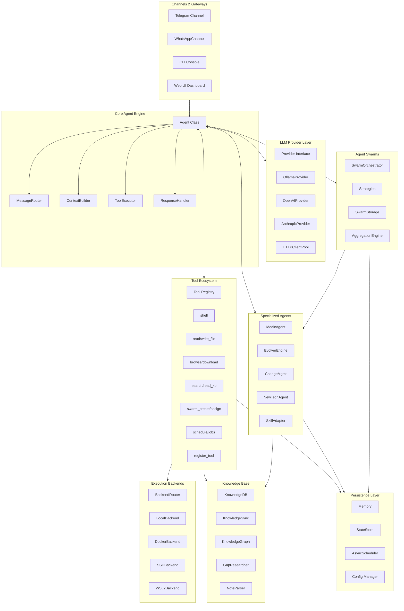

# ZenSynora (ZenSynora)

**Privacy-first personal AI agent framework.** Runs locally or in the cloud, integrates with Telegram, WhatsApp, and the Web — with persistent memory, multi-agent swarms, and a dynamic tool-building ecosystem.

**License:** AGPL-3.0 | Dual licensing available for enterprise  
**Version:** 0.4.1 | **Python:** 3.11+ | **Author:** Adrian Petrescu

[](https://github.com/adrianx26/zensynora/actions/workflows/ci.yml)
[](LICENSE)
[](https://github.com/adrianx26/zensynora/actions/workflows/ci.yml)
[](#-docker)

---

## What is ZenSynora?

ZenSynora is a high-performance AI agent framework built for developers and power users who want full control over their AI stack. It connects to any LLM provider (local or cloud), persists conversation history and knowledge across sessions, and can coordinate multiple specialized agents to work together on complex tasks.

> *"ZenSynora doesn't just execute tasks; it evolves with you, refining its models of your projects and its own capabilities."*

---

## Key Features

### LLM Agnostic
Connect to any provider — **Ollama**, **OpenAI**, **Anthropic**, **Google Gemini**, **Groq**, **OpenRouter** — or mix and match. An intelligent router automatically selects the right model for each task.

### Persistent Memory & Knowledge
- **SQLite-backed memory** with per-user isolation, semantic retrieval, and BM25 ranking
- **Knowledge base** with FTS5 full-text search, entity graph, and automatic relation mapping
- **Gap Researcher** — a background agent that fills information gaps via web search

### Multi-Agent Swarms
Coordinate 136+ specialized agents across 10 categories using **Parallel**, **Sequential**, **Hierarchical**, or **Voting** strategies.

### Dynamic Tool Ecosystem
- Agent can **create, test, and register new Python tools at runtime**
- Built-in tools: filesystem, shell (sandboxed), hardware telemetry, knowledge management, scheduling
- **MCP Client & Server** — works with Cursor, Claude Desktop, ClawHub.ai

### Channels
Connect to **Telegram**, **WhatsApp**, **Web UI**, and **CLI** simultaneously via a unified gateway.

### System Resilience
- **Medic Agent** — self-healing health monitoring, integrity verification, change management with approval workflows
- **Task Timer** — 300-second timeout with progressive status updates and automatic failure handling

### Security
Command sandboxing, path validation, SSRF protection, HMAC-signed audit logs, and MFA for admin endpoints.

---

## Architecture




Full architecture details are documented in [`docs/architecture_with_optimizations.md`](docs/architecture_with_optimizations.md).

---

## Quick Start

### Prerequisites
- Python 3.11+
- At least one LLM provider (Ollama for local, or API keys for cloud)

### Install

```bash
git clone https://github.com/adrianx26/zensynora.git
cd zensynora

# Core + all LLM providers
pip install -e ".[all]"

# Run the setup wizard
zensynora onboard
```

### Run

| Command | Description |
|---------|-------------|
| `zensynora agent` | Interactive CLI chat |
| `zensynora gateway` | Start Telegram/WhatsApp bots |
| `zensynora webui` | Launch the browser dashboard |
| `zensynora benchmark` | Test model latency and accuracy |

### Docker

```bash
cp .env.example .env
# Edit .env with your API keys
docker compose up -d --build
```

---

## Built-in Tools

| Tool | Description |
|------|-------------|
| `read_file` / `write_file` / `download_file` | Filesystem operations |
| `shell` | Securely sandboxed command execution |
| `hardware` | CPU/GPU/NPU telemetry |
| `search_knowledge` / `write_to_knowledge` / `sync_knowledge_base` | Knowledge base management |
| `delegate` / `swarm_create` / `swarm_assign` | Multi-agent collaboration |
| `schedule` / `list_schedules` / `cancel_schedule` | Task scheduling |
| `nlp_schedule` | Natural language scheduling ("in 5 minutes", "every Monday at 9pm") |
| `browse` | Web content fetching with Wayback Machine fallback |

See [`docs/agent_catalog.md`](docs/agent_catalog.md) for the 136+ specialized agent registry.

---

## Agent Swarms

Enable complex collaboration between specialized agents:

```python
from myclaw.swarm import SwarmConfig, SwarmStrategy

swarm = SwarmConfig(
    name="api-development-team",
    strategy=SwarmStrategy.HIERARCHICAL,
    workers=["api-designer", "backend-developer", "code-reviewer"],
    coordinator="fullstack-developer"
)
```

Strategies:
- **Sequential** — Pipeline workflows (Draft → Edit → Publish)
- **Parallel** — Multi-perspective brainstorming
- **Voting** — Consensus-driven decision making
- **Hierarchical** — Coordinator + specialized workers

---

## Configuration

ZenSynora is configured via `~/.myclaw/config.yaml` or environment variables:

```bash
MYCLAW_DEFAULT_PROVIDER=ollama
MYCLAW_DEFAULT_MODEL=llama3.2
MYCLAW_TELEGRAM_TOKEN=your-token
MYCLAW_OPENAI_API_KEY=your-key
```

See [`.env.example`](.env.example) for all 50+ configurable variables.

---

## Project Structure

```
zensynora/
├── myclaw/                    # Core Python package
│   ├── agent.py               # Main agent logic (think, think_stream)
│   ├── provider.py            # LLM provider abstraction
│   ├── memory.py              # SQLite-backed conversation memory
│   ├── config.py              # Configuration management
│   ├── gateway.py             # Telegram/WhatsApp gateway
│   ├── tools/                 # Tool system (decomposed from tools.py)
│   ├── agents/                # Specialized agents (medic, newtech, skill_adapter)
│   ├── agent_profiles/       # Agent personality & role definitions
│   ├── knowledge/            # Knowledge base (db, graph, storage, sync)
│   ├── swarm/                # Multi-agent swarm orchestration
│   ├── channels/              # Telegram, WhatsApp implementations
│   ├── backends/             # SSH, Docker, WSL2, hardware probes
│   └── mcp/                   # MCP client & server
├── webui/                     # FastAPI + React browser dashboard
├── docs/                      # User & developer documentation
│   └── dev/                   # Development plans & analysis
├── eval/                      # Evaluation & benchmarking scripts
├── tests/                     # Unit & integration tests
├── cli.py                     # CLI entry point
├── onboard.py                # Setup wizard
└── pyproject.toml             # Python packaging config
```

---

## Roadmap

| Phase | Status | Description |
|-------|--------|-------------|
| v0.4.1 | ✅ | Security hardening, Async migration, Performance overhaul |
| Phase 7 | 🔄 | Plugin system, streaming tool execution, webhook mode |
| Phase 8 | ⏳ | Discord & Slack integration, Enterprise RBAC |
| Phase 9 | ⏳ | Multi-tenancy, Advanced analytics dashboard |

See [`CHANGELOG.md`](CHANGELOG.md) for full release history.

---

## Contributing

Contributions are welcome! See [`CONTRIBUTING.md`](CONTRIBUTING.md) for setup instructions, coding standards, testing guide, and commit conventions.

```bash
# Install dev dependencies
pip install -e ".[dev]"
pre-commit install

# Run tests
pytest

# Lint & format
ruff check . --fix
ruff format .
```

---

## License

Distributed under **AGPL-3.0**. Dual-licensing available for commercial use. See [`LICENSE`](LICENSE).

**Developed by Adrian Petrescu**  
[GitHub](https://github.com/adrianx26) · [Website](https://zensynora.com) *(Coming Soon)*