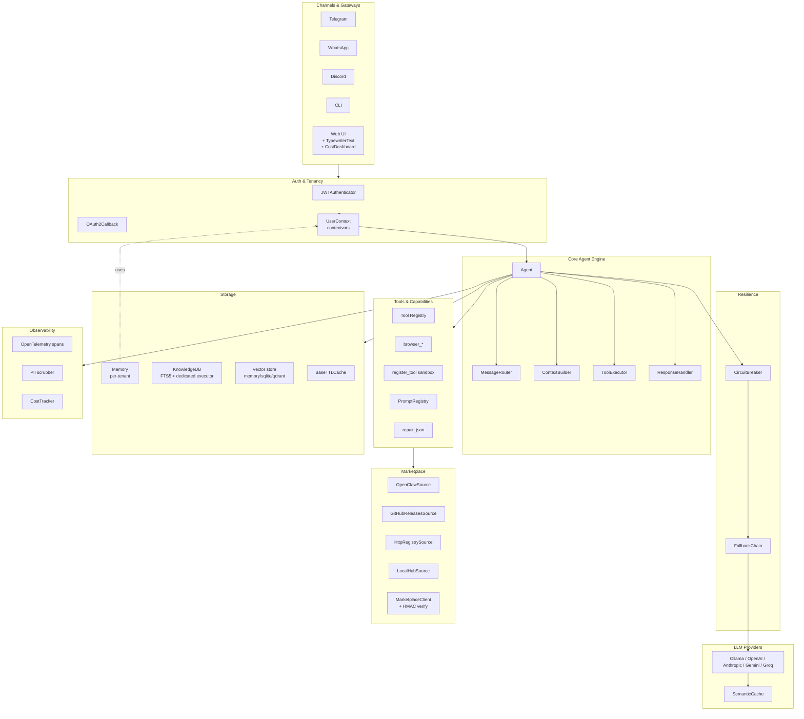

# ZenSynora

**Privacy-first personal AI agent framework.** Runs locally or in the cloud, integrates with Telegram, WhatsApp, Discord, and the Web — with persistent memory, multi-agent swarms, a dynamic tool-building ecosystem, and a complete observability/resilience/marketplace stack.

**License:** AGPL-3.0 (dual licensing available for enterprise) · **Python:** 3.11+ · **Author:** Adrian Petrescu

[](https://github.com/adrianx26/zensynora/actions/workflows/ci.yml)
[](LICENSE)
[](#testing)
[](#docker)

---

## What is ZenSynora?

A high-performance AI agent framework for developers who want full control over their AI stack. It connects to any LLM provider (local or cloud), persists conversation history and knowledge across sessions, coordinates multiple specialized agents to work together, and ships with the production primitives (tracing, circuit breakers, multi-tenancy, signed plugin marketplace, structured-output validation) most frameworks make you build yourself.

> *"ZenSynora doesn't just execute tasks; it evolves with you, refining its models of your projects and its own capabilities."*

---

## Highlights — what's new across the recent sprints

| Area | Module | Sprint |
|---|---|---|
| Distributed tracing (OpenTelemetry, no-op when disabled) | [`myclaw/observability/`](myclaw/observability/) | 2 |
| Circuit breaker + provider fallback chain | [`myclaw/resilience/`](myclaw/resilience/) | 2 + 10 (wired) |
| PII scrubber for log records (default-on) | [`myclaw/logging_config.py`](myclaw/logging_config.py) | 2 |
| Headless browser tools (Playwright) | [`myclaw/tools/browser.py`](myclaw/tools/browser.py) | 3 |
| Versioned prompt template registry | [`myclaw/prompts/`](myclaw/prompts/) | 3 |
| Structured-output validation + LLM repair | [`myclaw/structured_output/`](myclaw/structured_output/) | 3 |
| Cost dashboard (backend + WebUI) | [`myclaw/cost_tracker.py`](myclaw/cost_tracker.py) + [`webui/.../CostDashboard.tsx`](webui/src/components/CostDashboard.tsx) | 3 |
| Pluggable vector store (memory / sqlite / qdrant) | [`myclaw/vector/`](myclaw/vector/) | 4 |
| `Agent.complete_structured(messages, schema)` helper | [`agent.py`](myclaw/agent.py) | 4 |
| `agent.py` decomposition (free-fns + classes + ResponseHandler) | [`myclaw/agent_internals/`](myclaw/agent_internals/) | 5 + 9 |
| JWT verification + OAuth callback (PKCE) | [`myclaw/auth/`](myclaw/auth/) | 6 |
| Multi-tenancy primitives + storage wiring | [`myclaw/tenancy/`](myclaw/tenancy/) | 6 + 11 |
| Discord channel adapter | [`myclaw/channels/discord.py`](myclaw/channels/discord.py) | 6 |
| Eval harness (datasets + 5 metrics + runner) | [`myclaw/evals/`](myclaw/evals/) | 7 |
| Inter-agent message broker (asyncio + envelope protocol) | [`myclaw/messaging/`](myclaw/messaging/) | 7 |
| Knowledge-graph path reasoning (`find_paths`) | [`myclaw/knowledge/path_reasoning.py`](myclaw/knowledge/path_reasoning.py) | 7 |
| Plugin marketplace (OpenClaw / GitHub / HTTP / Local) | [`myclaw/marketplace/`](myclaw/marketplace/) | 9 |
| Dedicated KB-search executor | [`agent.py`](myclaw/agent.py) | 10 |
| `myclaw/defaults.py` — single source of truth | [`myclaw/defaults.py`](myclaw/defaults.py) | 10 |
| Shared cache primitives (`BaseTTLCache` + `PersistentCacheMixin`) | [`myclaw/caching/`](myclaw/caching/) | 11 |
| WebUI token-level streaming | [`webui/.../TypewriterText.tsx`](webui/src/components/TypewriterText.tsx) | 11 |
| Agent registry → YAML data file (137 agents) | [`myclaw/agents/data/agents.yaml`](myclaw/agents/data/agents.yaml) | 12 |

The full per-sprint changelog lives in [`CHANGELOG.md`](CHANGELOG.md). The condensed narrative is in [`docs/SPRINTS_SUMMARY.md`](docs/SPRINTS_SUMMARY.md).

---

## Key features

### LLM agnostic
Connect to any provider — **Ollama**, **OpenAI**, **Anthropic**, **Google Gemini**, **Groq**, **OpenRouter** — or mix and match. An intelligent router automatically selects the right model for each task. Per-provider circuit breakers stop hammering flapping endpoints and fall through to local fallbacks.

### Persistent memory & knowledge
- **SQLite-backed memory** with per-user isolation, auto-cleanup, FTS5 full-text search, and a composite `(role, timestamp)` index for fast role-filtered queries.
- **Knowledge base** with FTS5 + entity graph, batched-parallel note reads (7-10× faster searches), dedicated thread-pool executor for FTS5 queries.
- **Knowledge-graph path reasoning** — `find_paths(a, b, max_hops=3)` for "how is X connected to Y?" queries.
- **Pluggable vector store** — pick `sqlite` (zero-dep), `qdrant` (production HNSW), or `memory` (tests) via config.
- **Gap Researcher** — background agent fills information gaps via web search.

### Multi-agent swarms
Coordinate **137 specialized agents** across 10 categories using **Parallel**, **Sequential**, **Hierarchical**, or **Voting** strategies. Agent definitions live in [`myclaw/agents/data/agents.yaml`](myclaw/agents/data/agents.yaml) — adding a new agent is a data PR, not a code PR. Inter-agent messaging via [`myclaw/messaging/`](myclaw/messaging/) for distributed swarms.

### Dynamic tool ecosystem
- Agent can **create, test, and register new Python tools at runtime** through an AST-validated sandbox (forbids `os`, `sys`, `subprocess`, `pathlib`, `ctypes`, `cffi`, `mmap`, `importlib`, `__builtins__` access).
- Built-in tools: filesystem, shell (sandboxed allow-list, newline-injection blocked), hardware telemetry, knowledge management, scheduling.
- **Headless browser tools** — Playwright-backed `navigate`, `screenshot`, `fill_form`, `extract_text`, `wait_for`, `close_session` for JS-heavy sites.
- **MCP Client & Server** — interop with Cursor, Claude Desktop, ClawHub.ai.
- **Plugin marketplace** with HMAC-signed manifests + multi-source discovery (OpenClaw, GitHub Releases, custom HTTP registries, local hub).

### Channels
Connect to **Telegram**, **WhatsApp**, **Discord**, **Web UI**, and **CLI** simultaneously through a unified gateway. WebUI streams responses with **character-by-character typewriter reveal**.

### Auth & multi-tenancy
- **JWT verification** with HS256 secrets *or* JWKS endpoint for RS256/ES256 (issuer/audience/scope claim handling).
- **OAuth 2.0 authorization-code flow** with PKCE — pre-baked for GitHub & Google, custom providers via `OAuth2Config`.
- **`UserContext` primitive** propagated via `contextvars.ContextVar` so concurrent asyncio tasks each see their own identity.
- **Memory** transparently picks up the active user from `UserContext` when available, falls back to legacy single-user mode otherwise.

### Observability & resilience
- **Medic Agent** — self-healing health monitoring, integrity verification, change management with approval workflows.
- **Task Timer** — 300-second timeout with progressive status updates and automatic failure handling.
- **OpenTelemetry tracing** wired into `Agent.think`, `provider.chat`, `kb.search`, `provider.fallback_chat` — no-op when SDK absent.
- **Circuit breaker** wraps every provider call; configurable thresholds per agent.
- **Cost dashboard** — per-provider, per-model, and 30-day timeline views via `/api/v1/costs/*` and a self-contained React component (no chart-lib dep).

### Structured output & prompts
- **`Agent.complete_structured(messages, MyPydanticModel)`** returns a validated instance, automatically asking the model to fix invalid JSON (configurable retry count). Provider-agnostic.
- **Versioned prompt registry** — JSONL-backed at `~/.myclaw/prompts.jsonl`. Jinja2 when installed (`{{ var }}`), `string.Template` fallback (`$var`).

### Eval harness
Dataset-driven evals with 5 built-in metrics (`exact_match`, `contains`, `regex_match`, `length_within`, `json_subset`) plus user-defined callables. Runner reports `metric_means`, `latency_p50/p95`, `failure_count`, and `overall_score`.

### Security
Command sandboxing (allow-list, newline-injection blocked, per-token re-validation), path validation, SSRF protection, **HMAC-signed audit logs**, MFA for admin endpoints, AST-validated dynamic-tool sandbox, explicit CORS allow-list, admin-permission gating on key endpoints, **PII scrubber** for log records (emails, phones, JWTs, API keys redacted; user IDs hashed) on by default. See [`docs/SECURITY_FIXES_2026_04_29.md`](docs/SECURITY_FIXES_2026_04_29.md) for the latest audit round.

---

## Optional dependency posture

Every advanced feature degrades gracefully when its package isn't installed (no crash, just a logged warning or a structured error response):

```bash
pip install zensynora[tracing]      # OpenTelemetry SDK + OTLP exporter
pip install zensynora[browser]      # Playwright headless browser tools
pip install zensynora[prompts]      # Jinja2 templates (else string.Template)
pip install zensynora[jsonschema]   # JSON-schema validation (else Pydantic only)
pip install zensynora[qdrant]       # Qdrant vector backend (else SQLite)
pip install zensynora[auth]         # PyJWT[crypto] for OAuth/JWT
pip install zensynora[discord]      # discord.py adapter
pip install zensynora[slack]        # slack-bolt (adapter coming next)
pip install zensynora[all]          # Everything above
```

| Feature | Optional package | Without it |
|---|---|---|
| Distributed tracing | `opentelemetry-sdk` | All `@traced` / `span()` are no-ops |
| Headless browser | `playwright` | Tools return `{"ok": False, "error": ...}` |
| Jinja2 templates | `jinja2` | Falls back to `string.Template` |
| JSON-schema dicts | `jsonschema` | Pass Pydantic models instead |
| Qdrant vector store | `qdrant-client` | Factory falls back to `SQLiteBackend` |
| JWT verification | `PyJWT[crypto]` | First `.verify()` call raises `RuntimeError` |
| Discord channel | `discord.py` | `DiscordChannel.run()` raises `RuntimeError` |

---

## Architecture



Detailed module map: [`docs/ARCHITECTURE.md`](docs/ARCHITECTURE.md). Visual flow: [`docs/architecture_diagram.md`](docs/architecture_diagram.md).

---

## Quick start

### Prerequisites
- Python 3.11+
- At least one LLM provider (Ollama for local, or API keys for cloud)

### Install

```bash
git clone https://github.com/adrianx26/zensynora.git
cd zensynora

# Core + all LLM providers + every optional feature
pip install -e ".[all]"

# Run the setup wizard
zensynora onboard
```

### Run

| Command | Description |
|---|---|
| `zensynora agent` | Interactive CLI chat |
| `zensynora gateway` | Start Telegram / WhatsApp / Discord bots |
| `zensynora webui` | Launch the browser dashboard |
| `zensynora benchmark` | Test model latency and accuracy |

### Docker

```bash
cp .env.example .env
# Edit .env with your API keys
docker compose up -d --build
```

---

## Quick recipes

### Structured output with auto-repair

```python
from pydantic import BaseModel
from myclaw.agent import Agent

class Issue(BaseModel):
    title: str
    severity: int  # 1-5

agent = Agent(config)
result = await agent.complete_structured(
    messages=[{"role": "user", "content": "Summarize this bug as an Issue"}],
    schema=Issue,
    max_repair_attempts=2,
)
if result.ok:
    issue: Issue = result.data
    print(issue.title, issue.severity)
```

### Pluggable vector store

```python
from myclaw.vector import make_backend, VectorRecord

backend = make_backend("qdrant", {
    "collection": "my-docs", "url": "http://localhost:6333", "vector_size": 1536,
})
await backend.upsert([
    VectorRecord(id="doc-1", vector=[...], metadata={"category": "design"}),
])
hits = await backend.search([...], limit=10, filter_metadata={"category": "design"})
```

### Plugin marketplace

```python
from myclaw.marketplace import (
    MarketplaceClient, OpenClawSource, GitHubReleasesSource, LocalHubSource,
)

client = MarketplaceClient(
    sources=[
        OpenClawSource(api_key=os.environ["OPENCLAW_KEY"]),
        GitHubReleasesSource("acme/acme-plugins"),
        LocalHubSource(),
    ],
    hmac_secret=b"shared-secret",  # rejects unsigned manifests by default
)
results = await client.search("redis")
path = await client.install("redis-cache", source_name="openclaw")
```

### Multi-tenant request handling

```python
from myclaw.tenancy import UserContext, async_user_scope
from myclaw.memory import Memory

async with async_user_scope(UserContext("alice", scopes={"kb.read"})):
    mem = Memory()  # automatically resolves to memory_alice.db
    await mem.add("user", "Hi")
```

### Eval harness

```python
from myclaw.evals import Evaluator, EvalCase, exact_match

cases = [EvalCase(case_id=f"c{i}", input=q, expected={"em": a})
         for i, (q, a) in enumerate(my_dataset)]

ev = Evaluator(target=my_agent_call, metrics={"em": exact_match}, concurrency=4)
report = await ev.run(cases)
print(f"Score: {report.overall_score:.3f}, p95={report.latency_p95_ms:.0f}ms")
```

---

## Built-in tools

| Tool | Description |
|---|---|
| `read_file` / `write_file` / `download_file` | Filesystem operations |
| `shell` | Sandboxed command execution (allow-list + newline-injection blocked) |
| `hardware` | CPU/GPU/NPU telemetry |
| `search_knowledge` / `write_to_knowledge` / `sync_knowledge_base` | Knowledge base management |
| `delegate` / `swarm_create` / `swarm_assign` | Multi-agent collaboration |
| `schedule` / `list_schedules` / `cancel_schedule` | Task scheduling |
| `nlp_schedule` | Natural-language scheduling ("in 5 minutes", "every Monday at 9pm") |
| `browse` | Static web fetch with Wayback Machine fallback |
| `browser_navigate` / `browser_screenshot` / `browser_fill_form` / `browser_extract_text` / `browser_wait_for` | Headless browser (Playwright) |

See [`docs/agent_catalog.md`](docs/agent_catalog.md) for the 137-agent registry. Add a new agent by editing [`myclaw/agents/data/agents.yaml`](myclaw/agents/data/agents.yaml).

---

## Agent swarms

```python
from myclaw.swarm import SwarmConfig, SwarmStrategy

swarm = SwarmConfig(
    name="api-development-team",
    strategy=SwarmStrategy.HIERARCHICAL,
    workers=["api-designer", "backend-developer", "code-reviewer"],
    coordinator="fullstack-developer",
)
```

Strategies:
- **Sequential** — pipeline workflows (Draft → Edit → Publish)
- **Parallel** — multi-perspective brainstorming
- **Voting** — consensus-driven decisions
- **Hierarchical** — coordinator + specialized workers

For distributed swarms across processes, use [`myclaw/messaging/`](myclaw/messaging/) — `AgentMessage` + `InProcessBroker` (or roll your own broker against the abstract base).

---

## Configuration

ZenSynora is configured via `~/.myclaw/config.yaml` or environment variables.

Common operator knobs (full list: [`myclaw/defaults.py`](myclaw/defaults.py) — every constant has a parallel `MYCLAW_*` env var):

```bash
# Provider defaults
MYCLAW_DEFAULT_PROVIDER=ollama
MYCLAW_DEFAULT_MODEL=llama3.2
MYCLAW_OPENAI_API_KEY=sk-...

# Channel tokens
MYCLAW_TELEGRAM_TOKEN=...
MYCLAW_DISCORD_BOT_TOKEN=...

# Tracing
ZENSYNORA_TRACING_ENABLED=true
OTEL_EXPORTER_OTLP_ENDPOINT=http://collector:4317

# Resilience
MYCLAW_PROVIDER_CB_FAILURE_THRESHOLD=5
MYCLAW_PROVIDER_CB_RESET_TIMEOUT=60.0

# Performance
MYCLAW_KB_SEARCH_WORKERS=8
MYCLAW_HTTP_TIMEOUT=60

# Privacy
MYCLAW_LOG_SCRUB_PII=true
```

See [`.env.example`](.env.example) for all 50+ configurable variables.

---

## Project structure

```
zensynora/
├── myclaw/                     # Core Python package
│   ├── agent.py                # Agent class (think, complete_structured, stream_think)
│   ├── agent_internals/        # Phase helpers — free fns + classes (ResponseHandler)
│   ├── agents/                 # Specialized agents
│   │   ├── data/agents.yaml    # 137 agent definitions (canonical source)
│   │   └── registry.py         # YAML loader + embedded literal fallback
│   ├── auth/                   # JWT + OAuth2 callback (PKCE)
│   ├── caching/                # BaseTTLCache + PersistentCacheMixin
│   ├── channels/               # Telegram / WhatsApp / Discord adapters
│   ├── cost_tracker.py         # SQLite cost accumulator + dashboard queries
│   ├── defaults.py             # Single source of truth for tunable constants
│   ├── evals/                  # Dataset-driven eval harness
│   ├── knowledge/              # KB DB, graph, path reasoning, batched reads
│   ├── logging_config.py       # Structured logger + PII scrubber
│   ├── marketplace/            # Plugin marketplace (OpenClaw / GH / HTTP / Local)
│   ├── memory.py               # Per-tenant SQLite memory (UserContext-aware)
│   ├── messaging/              # Inter-agent envelope + broker
│   ├── observability/          # OpenTelemetry tracing
│   ├── prompts/                # Versioned Jinja2 prompt registry
│   ├── provider.py             # LLM provider abstraction + Message TypedDict
│   ├── resilience/             # Circuit breaker + fallback chain
│   ├── structured_output/      # extract_json / validate / repair_json
│   ├── swarm/                  # Multi-agent orchestrator
│   ├── tenancy/                # UserContext + scoping helpers
│   ├── tools/                  # Tool system (incl. Playwright browser)
│   ├── vector/                 # Pluggable backends: memory / sqlite / qdrant
│   └── ...                     # mcp/, backends/, etc.
├── webui/                      # FastAPI + React dashboard
│   └── src/components/
│       ├── CostDashboard.tsx   # Sprint 3
│       └── TypewriterText.tsx  # Sprint 11
├── docs/
│   ├── ARCHITECTURE.md         # Module map + request lifecycle
│   ├── SPRINTS_SUMMARY.md      # Condensed per-sprint narrative
│   ├── SECURITY_FIXES_2026_04_29.md
│   └── dev/DECOMPOSITION_PLAN.md
├── tests/                      # 415 tests across all sprint modules
├── pyproject.toml
└── README.md                   # this file
```

---

## Testing

```bash
# All tests for the new modules (415 passing)
pytest tests/test_resilience.py tests/test_observability.py tests/test_registry.py \
       tests/test_prompts.py tests/test_structured_output.py tests/test_cost_tracker.py \
       tests/test_vector_backends.py tests/test_agent_internals.py tests/test_auth.py \
       tests/test_tenancy.py tests/test_tenancy_scoping.py tests/test_discord_channel.py \
       tests/test_evals.py tests/test_messaging.py tests/test_sprint8_perf_quality.py \
       tests/test_marketplace.py tests/test_agent_classes.py \
       tests/test_sprint10_integrations.py tests/test_caching_base.py \
       tests/test_registry_yaml.py
```

Per-module test counts in [`docs/ARCHITECTURE.md`](docs/ARCHITECTURE.md). The full sprint narrative is in [`docs/SPRINTS_SUMMARY.md`](docs/SPRINTS_SUMMARY.md).

---

## Roadmap

| Phase | Status | Description |
|---|---|---|
| v0.4.1 → 0.5.x | ✅ | Security audit, perf overhaul, observability, resilience, marketplace, decomposition, multi-tenancy |
| Open | 🔄 | Slack channel adapter, LoRA adapter loader, agent_internals explicit DI |
| Future | ⏳ | Enterprise RBAC, multi-tenant audit log row filters, advanced analytics |

See [`CHANGELOG.md`](CHANGELOG.md) for the full release history and [`docs/SPRINTS_SUMMARY.md`](docs/SPRINTS_SUMMARY.md) for a condensed overview.

---

## Contributing

Contributions are welcome! See [`CONTRIBUTING.md`](CONTRIBUTING.md) for setup, coding standards, testing guide, and commit conventions.

```bash
# Install dev dependencies
pip install -e ".[dev]"
pre-commit install

# Run tests
pytest

# Lint & format
ruff check . --fix
ruff format .
```

**Adding a new agent:** edit [`myclaw/agents/data/agents.yaml`](myclaw/agents/data/agents.yaml). The sync-invariant test will tell you if the embedded literal is now out of date.

**Adding a new vector backend:** subclass `VectorBackend` in [`myclaw/vector/`](myclaw/vector/), then teach `factory.make_backend` about its name.

**Adding a new marketplace source:** subclass `MarketplaceSource` in [`myclaw/marketplace/sources.py`](myclaw/marketplace/sources.py); the existing `MarketplaceClient` aggregates without changes.

---

## License

Distributed under **AGPL-3.0**. Dual-licensing available for commercial use. See [`LICENSE`](LICENSE).

**Developed by Adrian Petrescu** · [GitHub](https://github.com/adrianx26)
