# ZenSynora (MyClaw)

**License:** AGPL-3.0 (open-source)  
**Dual Licensing available** for commercial / enterprise use.

Copyright © 2026 Adrian Petrescu. All rights reserved.

A powerful personal AI agent that runs locally or in the cloud using various LLM providers, featuring Telegram and WhatsApp integration, persistent SQLite memory, multi-agent support, dynamic tool building, and task scheduling.

[](https://www.python.org/downloads/)
[](LICENSE)
[](https://github.com/adrianx26/zensynora/actions/workflows/ci.yml)
[](https://github.com/adrianx26/zensynora/stargazers)
[](https://github.com/adrianx26/zensynora/commits/main)
[](#option-2--docker-recommended-for-production)
[](CONTRIBUTING.md#testing)

> ZenSynora doesn't just "execute" tasks; it treats every interaction as data to refine its internal models of you, the project, and its own code.


## ✨ Features

### Core Capabilities
- **Flexible LLM Providers** — Run locally using [Ollama](https://github.com/ollama/ollama), LM Studio, or llama.cpp, or connect to cloud providers like OpenAI, Anthropic, Gemini, Groq, and OpenRouter. Complete flexibility to choose your model and privacy level.
- **Persistent Memory** — SQLite-backed conversation history with per-user isolation. Your chats are stored securely.
- **Tool System** — Execute shell commands, read/write files, and more—all within a secure workspace.

### Advanced Features
- **Natively Integrated Web UI** — Boot up an interactive beautiful web dashboard utilizing glassmorphism and FastAPI WebSockets with `zensynora webui`.
- **Advanced Click CLI Platform** — Perform administrative tasks on your AI memory blocks, knowledge graphs, and skills locally using a beautiful integrated command line interface. 
- **Full MCP Support (Model Context Protocol)** — Natively act as an MCP Client (to consume external tools like SQLite via npx) and an MCP Server (to expose ZenSynora's shell and codebase to clients like Cursor or Claude). This also enables compatibility with external skill registries like ClawHub.ai, which adhere to the AgentSkill specification. ZenSynora provides tools to analyze, convert, and register external skills.
- **Multi-Agent Support** — Create and manage multiple named agents with custom prompts and models
- **Per-Agent Prompt Profiles** — Manage individual agent system prompts using dedicated Markdown files (`~/.myclaw/profiles/{name}.md`)
- **Agent Delegation** — Delegate tasks to specialized agents (e.g., `@coder write a function`)
- **🐝 Agent Swarms** — Coordinate multiple agents using parallel, sequential, hierarchical, or voting strategies for complex tasks
- **Dynamic Tool Building** — The agent can create and register new Python tools at runtime
- **Task Scheduling** — Schedule one-shot or recurring tasks with notifications via Telegram or WhatsApp
- **Telegram Gateway** — Full-featured Telegram bot with commands: `/remind`, `/jobs`, `/cancel`, `/agents`
- **WhatsApp Gateway** — Full-featured WhatsApp Business Cloud API integration with webhook server, all commands, and agent routing
- **SSH Deployment & Remote Control** — Seamlessly deploy, configure, and communicate with remote agents via secure SSH connections (Key/Password).
- **Hardware Awareness (v1.0)** — Deep system telemetry (CPU temps, GPU load, NPU, Net lag) with intelligence-driven optimization suggestions.
- **Intelligent LLM Routing** — Automatically upgrades to premium models for complex reasoning or coding tasks, optimizing for both performance and cost.
- **Automated Knowledge Gap Filling** — Proactively identifies missing info in the KB and performs background web research using Scrapling during idle time.
- **LLM Benchmarking Suite** — Built-in tools to benchmark latency, accuracy, and token usage of your local and cloud providers with `zensynora benchmark`.
- **🏥 Medic Agent** — Self-healing system health monitoring with deterministic log analysis (capability-evolver inspired), unified health scoring, file integrity verification, syntax error detection, GitHub/local recovery, change management with approval workflows, and structured evolution planning.

### Security
- Command allowlist/blocklist for shell execution
- Path validation to prevent directory traversal attacks
- Per-user memory isolation
- Configurable Telegram access control (whitelist by user ID)
- Configurable WhatsApp access control (whitelist by phone number)
- **API-key authentication** for all admin endpoints (`/api/admin/*`, `/api/mfa/*`, `/api/spaces/*`)
- **CORS hardened** — origins loaded from config instead of wildcard `*`
- **MFA secret protection** — TOTP secrets never exposed in API responses
- **SSH host-key validation** — `RejectPolicy` with `known_hosts` verification
- **SSRF protection** — private IPs and localhost blocked in web tools
- **Tamper-evident audit logs** — HMAC-SHA256 signed entries
- **Config encryption** — supports `ZENSYNORA_CONFIG_KEY` env variable

---

## 📸 Screenshots & Demo

<!-- TODO: Replace placeholder descriptions with actual screenshots/GIFs -->

| WebUI Dashboard | Telegram Chat | Agent Swarm |
|---|---|---|
| *Glassmorphism Web UI with real-time WebSockets* | *Full-featured Telegram bot with commands* | *Multi-agent swarm coordination* |

### Quick Demo GIFs

<!-- TODO: Add 1-2 demo GIFs showing: -->
<!-- 1. `zensynora webui` launching the dashboard -->
<!-- 2. A Telegram conversation with @BotFather setup and /remind command -->
<!-- 3. A swarm execution: `@coordinator research AI trends` -->

**Video Walkthrough:** [YouTube Demo](#) *(Coming soon — subscribe to be notified!)*

---

## 🏗️ Architecture

```mermaid
flowchart TB
    %% Styling
    classDef core fill:#2a507a,stroke:#4477aa,stroke-width:2px,color:#fff
    classDef channel fill:#1a4d2e,stroke:#2d7a4a,stroke-width:2px,color:#fff
    classDef data fill:#6a3a14,stroke:#9c5822,stroke-width:2px,color:#fff
    classDef llm fill:#4a1e50,stroke:#863990,stroke-width:2px,color:#fff
    classDef intelligence fill:#7a5a2a,stroke:#aa7744,stroke-width:2px,color:#fff
    classDef infra fill:#3a3a3a,stroke:#666666,stroke-width:2px,color:#fff

    %% Channels / Interfaces
    subgraph Interfaces [External Interfaces]
        direction LR
        CLI(["🖥️ CLI"])
        TG(["📱 Telegram Bot"])
        WA(["💬 WhatsApp API"])
        WebUI(["🌐 Web UI"])
        API(["🔌 REST API / WS"])
        MCP(["🔌 MCP Client/Server"])
    end

    %% Core Application
    subgraph MyClaw [ZenSynora Platform]
        GW{"Gateway Router"}

        Agent("🧠 Core Agent")

        subgraph Capabilities [Agent Capabilities]
            direction LR
            ToolsPkg["🛠️ Tools Package"]
            Profiles("📝 Profiles System")
            Sched("⏱️ Task Scheduler")
        end

        subgraph ToolModules ["Tools Package (decomposed)"]
            direction TB
            TCore["core — registry/hooks"]
            TShell["shell — sandbox"]
            TFiles["files — I/O"]
            TWeb["web — httpx"]
            TKB["kb — search"]
            TSwarm["swarm — delegation"]
            TSSH["ssh — remote"]
            TToolbox["toolbox — skills"]
        end

        subgraph AdvancedSystems [Multi-Agent System]
            direction TB
            Swarm("🐝 Swarm Orchestrator")
            Spec("🤖 Specialized Agents")
        end

        subgraph Intelligence ["🧠 Intelligence Platform"]
            GapRes("🔍 Gap Researcher")
            Bench("📊 Benchmark Runner")
            Router("🛤️ Intelligent Router")
        end

        subgraph Infra ["🏗️ Infrastructure (Phase 6)"]
            StateStore["🗄️ State Store<br/>(state_store.py)"]
            AsyncSched["⏰ Async Scheduler<br/>(async_scheduler.py)"]
            Medic["🏥 Medic Agent<br/>(medic_agent.py)"]
        end
    end

    %% Data Layer
    subgraph Storage [Persistent SQLite Storage]
        direction LR
        Mem[("💾 Memory")]
        KB[("📚 Knowledge Base")]
        Lib[("📖 LLM Library")]
        Toolbox[("🔧 ToolBox")]
        Jobs[("📋 Scheduled Jobs")]
    end

    %% LLM Providers
    subgraph Providers [AI Providers]
        direction LR
        Local("💻 Local<br/>Ollama/LMStudio")
        Cloud("☁️ Cloud<br/>OpenAI/Anthropic/Gemini")
    end

    %% Connections
    CLI --> GW
    TG --> GW
    WA --> GW
    WebUI --> API
    API --> Agent
    MCP <--> ToolsPkg

    GW ==> Agent

    Agent <--> ToolsPkg
    Agent <--> Profiles
    Agent <--> AdvancedSystems
    Agent <--> Sched
    Agent <--> Intelligence

    ToolsPkg --> ToolModules

    Agent <--> Router
    Agent <--> KB
    Agent <--> Toolbox
    Sched <--> Jobs
    GapRes <--> KB

    %% Phase 6 infrastructure
    Agent -.-> StateStore
    Sched -.-> StateStore
    AsyncSched --> GapRes
    Medic --> Agent
    Medic --> Storage
    Infra <--> Storage

    Agent ==> Providers
    Intelligence ==> Providers

    %% Apply Classes
    class CLI,TG,WA,WebUI,API,MCP channel
    class GW,Agent,ToolsPkg,Profiles,Sched,Swarm,Spec core
    class Mem,KB,Lib,Toolbox,Jobs data
    class Local,Cloud llm
    class GapRes,Bench,Router intelligence
    class StateStore,AsyncSched,Medic infra
    class TCore,TShell,TFiles,TWeb,TKB,TSwarm,TSSH,TToolbox core
```



---

## 🚀 Quick Start

### Prerequisites
- Python 3.11+ (3.10 works, 3.11+ recommended)
- [Optional] [Ollama](https://github.com/ollama/ollama), LM Studio, or API keys for cloud providers

### Option 1 — One-Command Install (Recommended)

```bash
git clone https://github.com/adrianx26/zensynora.git
cd zensynora

# Core only (~15 deps)
pip install -e .

# With specific LLM providers
pip install -e ".[openai,anthropic]"

# Everything included
pip install -e ".[all]"

zensynora --help        # or: myclaw --help
```

**Optional extras:**
| Extra | Installs | Use case |
|-------|----------|----------|
| `openai` | `openai>=1.0` | OpenAI / Groq / OpenRouter |
| `anthropic` | `anthropic>=0.25` | Claude |
| `google` | `google-generativeai>=0.5` | Gemini |
| `semantic-cache` | `sentence-transformers>=2.2.2` | Semantic similarity caching |
| `voice` | `vosk>=0.3.45` | Offline speech-to-text |
| `redis` | `redis>=4.0` | Multi-worker state sharing |
| `metrics` | `prometheus-client>=0.20.0` | Metrics export |
| `security` | `cryptography>=42.0.0`, `keyring>=25.0.0` | Config encryption |
| `mfa` | `pyotp>=2.9.0`, `qrcode>=7.4` | TOTP MFA |
| `ssh` | `paramiko>=3.4.0` | SSH remote execution |
| `all` | All of the above | Full feature set |
| `dev` | `pytest`, `ruff`, `black`, `mypy` | Development |

### Option 2 — Docker (Recommended for Production)

```bash
git clone https://github.com/adrianx26/zensynora.git
cd zensynora

# Copy environment template
cp .env.example .env
# Edit .env with your API keys and tokens

# Build and start
docker compose up --build

# Or start in background
docker compose up -d

# View logs
docker compose logs -f
```

**Docker features:**
- Multi-stage build for a minimal runtime image (~200 MB)
- Persistent volumes for config, SQLite memory, knowledge base, and TOOLBOX
- Health checks built-in
- Optional Redis and Ollama sidecar services (uncomment in `docker-compose.yml`)
- Runs as non-root user for security

**Run different modes via Docker:**
```bash
# Interactive console
docker compose run --rm zensynora zensynora agent

# Telegram/WhatsApp gateway
docker compose run --rm zensynora zensynora gateway

# WebUI only (default)
docker compose up -d
```

> 🐳 **Pre-built image** (optional): `ghcr.io/adrianx26/zensynora:latest` *(coming soon)*

### Option 3 — Automated Install (Linux)

```bash
git clone https://github.com/adrianx26/zensynora.git
cd zensynora
chmod +x install.sh
./install.sh
```

Handles system deps, venv, pip packages, optional Ollama, systemd service, and import verification.

### Option 4 — Manual Install

```bash
git clone https://github.com/adrianx26/zensynora.git
cd zensynora
python -m venv venv
source venv/bin/activate   # Windows: venv\Scripts\activate
pip install -r requirements.txt
```

### Initial Setup

```bash
# Run the onboarding wizard
zensynora onboard        # or: python cli.py onboard
```

Then edit `~/.myclaw/config.json`:
- **Telegram** — bot token from [@BotFather](https://t.me/botfather) + your user ID from [@userinfobot](https://t.me/userinfobot)
- **WhatsApp** — Business Cloud API credentials ([setup guide](docs/dev/plans/whatsapp_implementation_plan.md#step-1-create-a-meta-developer-account))
- **Providers** — Ollama, OpenAI, Anthropic, Gemini, Groq, OpenRouter, LM Studio, or llama.cpp

### Run

| Mode | Command |
|------|---------|
| 🖥️ Console | `zensynora agent` |
| 📱 Telegram | `zensynora gateway` |
| 💬 WhatsApp | `zensynora gateway` *(requires public webhook URL — use ngrok for dev)* |
| 🌐 Web UI | `zensynora webui` |

### 🤖 Intelligence & Benchmarking

ZenSynora now includes a proactive Intelligence Platform that grows automatically and optimizes itself based on task requirements.

#### 🖥️ Hardware Awareness & Optimization
ZenSynora monitors your system resources to ensure optimal agent performance.
- **Telemetry**: CPU (specs/temp), RAM (size/usage), GPU (model/vram/load), NPU, and Network latency.
- **Diagnostics**: Run `zensynora hardware` for a full diagnostic report.
- **Auto-Suggestions**: The agent proactively warns if your selected model exceeds physical RAM or VRAM limits.

#### 🛤️ Intelligent Routing
ZenSynora now features a sophisticated dynamic dispatch system that selects the best model for ogni task.
- **Intent Analysis**: Automatically detects if a query requires deep reasoning, coding, or just a quick chat.
- **Free-First Logic**: Prioritize local hardware (Ollama) or zero-cost APIs (Groq/Gemini Flash) to minimize your wallet impact.
- **Provider Allowlists**: Complete control over which models and providers are allowed to participate in auto-routing.
- **Auto-Disable**: Overlays zero overhead when only a single model is configured.
- **Hardware-Aware**: Integrates with system telemetry to avoid heavy local models on RAM-constrained machines.

#### 🔍 Automatic Knowledge Research
When the agent detects a "knowledge gap" during a user query, it logs it for background research. A worker runs every 6 hours (configurable) and uses the `scrapling` engine to find information on the web, synthesizing it into a new Knowledge Base entry.
*   **Idle Check**: Research only runs when the system has been idle for 15+ minutes to ensure zero performance impact while you work.

#### 📊 Performance Benchmarking
You can evaluate how different models perform on accuracy, latency, and token usage tasks:
```bash
# Run full benchmark suite
zensynora benchmark

# Benchmark a specific model
zensynora benchmark --model gpt-4o --provider openai
```

---

---

## 📖 Usage

### Console Commands

```
You: Hello
Claw: [response]

You: @agentname message  # Route to specific agent
You: exit                # Quit
```

### Available Tools

| Tool | Description |
|------|-------------|
| `shell(cmd)` | Execute allowed shell commands |
| `read_file(path)` | Read a file from workspace |
| `write_file(path, content)` | Write a file to workspace |
| `browse(url, max_length)` | Browse a URL, strip HTML and return plain text |
| `download_file(url, path)` | Download a file from URL to workspace |
| `delegate(agent_name, task)` | Delegate to another agent |
| `list_tools()` | List all available tools |
| `register_tool(name, code, documentation)` | Create a new Python tool in TOOLBOX |
| `list_toolbox()` | List all tools stored in TOOLBOX |
| `get_tool_documentation(name)` | Get documentation for a TOOLBOX tool |
| `schedule(task, delay, every)` | Schedule a task |
| `edit_schedule(job_id, ...)` | Edit active schedule task/delay |
| `split_schedule(job_id, tasks)` | Split job into sub-tasks (JSON array) |
| `suspend_schedule(job_id)` | Pause an active scheduled job |
| `resume_schedule(job_id)` | Resume a suspended job |
| `cancel_schedule(job_id)` | Cancel a scheduled job |
| `list_schedules()` | List active scheduled jobs |
| `write_to_knowledge(title, content)` | Save note to knowledge base |
| `search_knowledge(query)` | Search knowledge with FTS5 |
| `read_knowledge(permalink)` | Read a knowledge note |
| `get_knowledge_context(permalink, depth)` | Get related knowledge |
| `list_knowledge()` | List all knowledge notes |
| `sync_knowledge_base()` | Sync knowledge with files |
| `list_knowledge_tags()` | List all knowledge tags |
| `swarm_message(swarm_id, message, from_agent, to_agent)` | Send message to agents in a swarm |

### Telegram Commands

| Command | Description |
|---------|-------------|
| `/remind <seconds> <message>` | Set a one-shot reminder |
| `/remind every <seconds> <message>` | Set a recurring reminder |
| `/jobs` | List all scheduled jobs |
| `/cancel <job_id>` | Cancel a job |
| `/agents` | List available agents |
| `@agentname <message>` | Route to specific agent |
| `/knowledge_search <query>` | Search knowledge base |
| `/knowledge_list` | List all knowledge notes |
| `/knowledge_read <permalink>` | Read a specific note |
| `/knowledge_write <title> | <content>` | Create a new note |
| `/knowledge_sync` | Sync knowledge with files |
| `/knowledge_tags` | List all tags |

### WhatsApp Commands

All the same commands are available on WhatsApp using the `/` prefix:

| Command | Description |
|---------|-------------|
| `/remind <seconds> <message>` | Set a one-shot reminder |
| `/remind every <seconds> <message>` | Set a recurring reminder |
| `/jobs` | List all scheduled jobs |
| `/cancel <job_id>` | Cancel a job |
| `/agents` | List available agents |
| `@agentname <message>` | Route to specific agent |
| `/knowledge_search <query>` | Search knowledge base |
| `/knowledge_list` | List all knowledge notes |
| `/knowledge_read <permalink>` | Read a specific note |
| `/knowledge_write <title> \| <content>` | Create a new note |
| `/knowledge_sync` | Sync knowledge with files |
| `/knowledge_tags` | List all tags |

> **Note:** WhatsApp uses the WhatsApp Business Cloud API. See [docs/dev/plans/whatsapp_implementation_plan.md](docs/dev/plans/whatsapp_implementation_plan.md) for setup instructions.

---

## 📚 Knowledge Base

MyClaw includes a powerful **knowledge storage system** inspired by [MemoPad](https://github.com/adrianx26/memopad), using Markdown files with SQLite indexing.

### Features

- **Markdown-first**: All notes are stored as plain Markdown files
- **Full-text search**: SQLite FTS5 for fast searching
- **Knowledge graph**: Relations between entities
- **Observations**: Structured facts with categories and tags
- **Multi-user**: Per-user isolation with separate directories

### Storage Location

Knowledge files are stored in:
```
~/.myclaw/knowledge/{user_id}/
```

Each user has their own:
- Directory: `~/.myclaw/knowledge/{user_id}/`
- Database: `~/.myclaw/knowledge_{user_id}.db`

### Markdown Format

```markdown
---
title: "Project Phoenix"
permalink: project-phoenix
tags: [work, urgent]
created: 2026-03-08T10:00:00
updated: 2026-03-08T15:30:00
---

# Project Phoenix

## Observations
- [status] Active development phase #work
- [milestone] Backend API completed on March 5th
- [risk] Database migration needs testing

## Relations
- leads [[team-backend]]
- depends_on [[infrastructure-v2]]
- blocks [[mobile-app-v3]]
```

### CLI Commands

```bash
# Search knowledge
zensynora knowledge search "project phoenix"

# Create a new note (interactive)
zensynora knowledge write

# Read a specific note
zensynora knowledge read project-phoenix

# List all notes
zensynora knowledge list

# Sync database with files
zensynora knowledge sync

# List all tags
zensynora knowledge tags
```

### Using in Conversations

The agent automatically searches the knowledge base when processing messages. You can also reference knowledge explicitly:

```
You: Tell me about memory://project-phoenix
Claw: [Searches knowledge and responds with relevant info]

You: Save this: Project Phoenix is now in testing phase
Claw: [Uses write_to_knowledge tool to save the note]
```

---

## 🐝 Agent Swarms

Agent Swarms enable multiple AI agents to collaborate on complex tasks using different coordination strategies.

### Swarm Strategies

| Strategy | Description | Best For |
|----------|-------------|----------|
| **Parallel** | All agents work simultaneously | Multi-perspective analysis, brainstorming |
| **Sequential** | Pipeline execution | Content creation workflows |
| **Hierarchical** | Coordinator + workers | Complex multi-part tasks |
| **Voting** | Consensus-based decisions | Decision making, quality validation |

### Quick Example

```
# Create a research swarm with 3 agents
You: Create a swarm named "ai_research" with strategy parallel using agents researcher1, researcher2, researcher3

Claw: ✅ Swarm created successfully!
   ID: swarm_abc123def456
   Name: ai_research
   Strategy: parallel

# Assign a task
You: Assign task to swarm_abc123def456: Research the latest AI developments in 2024

Claw: 🐝 Swarm Execution Complete
   Confidence: 0.85
   Execution Time: 12.34s

🎯 Final Result:
[Combined insights from all 3 researchers]
```

### Swarm Tools

- `swarm_create(name, strategy, workers, coordinator, aggregation)` - Create swarm
- `swarm_assign(swarm_id, task)` - Execute task
- `swarm_status(swarm_id)` - Check status
- `swarm_result(swarm_id)` - Get results
- `swarm_terminate(swarm_id)` - Stop execution
- `swarm_list(status)` - List swarms
- `swarm_stats()` - View statistics

### Configuration

```json
{
  "swarm": {
    "enabled": true,
    "max_concurrent_swarms": 3,
    "default_strategy": "parallel",
    "default_aggregation": "synthesis",
    "timeout_seconds": 300
  }
}
```

See [docs/agent_swarm_guide.md](docs/agent_swarm_guide.md) for detailed documentation.

---

## 🤖 Specialized Agent System (136+ Agents)

MyClaw includes a comprehensive registry of **136+ specialized agents** modeled after the VoltAgent Codex subagents. These agents are organized across 10 categories and can be discovered and delegated to for specialized tasks.

### Agent Categories

| Category | Count | Examples |
|----------|-------|----------|
| Core Development | 12 | `backend-developer`, `frontend-developer`, `api-designer` |
| Language Specialists | 27 | `python-pro`, `typescript-pro`, `golang-pro` |
| Infrastructure | 16 | `devops-engineer`, `kubernetes-specialist`, `terraform-engineer` |
| Quality & Security | 16 | `code-reviewer`, `security-auditor`, `penetration-tester` |
| Data & AI | 12 | `llm-architect`, `ml-engineer`, `data-engineer` |
| Developer Experience | 13 | `documentation-engineer`, `git-workflow-manager` |
| Specialized Domains | 12 | `fintech-engineer`, `payment-integration` |
| Business & Product | 11 | `product-manager`, `scrum-master` |
| Meta & Orchestration | 12 | `multi-agent-coordinator`, `workflow-orchestrator` |
| Research & Analysis | 7 | `competitive-analyst`, `trend-analyst` |

### Using Specialized Agents

```python
from myclaw.agents import (
    get_agent,
    list_agents,
    AgentDiscovery,
    AgentCategory,
)

# Get a specific agent
agent = get_agent("backend-developer")

# Find agents for a task
discovery = AgentDiscovery()
matches = discovery.find_agents_for_task("I need to build a REST API")

# List all agents in a category
backend_agents = list_agents(category=AgentCategory.CORE_DEVELOPMENT)

# Search agents by capability
security_agents = list_agents(capability=AgentCapability.SECURITY)
```

### Agent Profiles

Agent profiles are stored in `myclaw/agent_profiles/{category}/` and include:
- Core competencies and guidelines
- Best practices and checklists
- Code patterns and examples
- Model routing recommendations

### Discovery & Integration

The Agent Discovery system provides:
- **Task-based matching**: Find best agents for specific tasks
- **Swarm composition**: Suggest agent combinations for complex tasks
- **Capability mapping**: Match required capabilities to agent skills

See [docs/agent_catalog.md](docs/agent_catalog.md) for the complete agent catalog.

---

## 🆕 What's New in v0.4.1

A comprehensive security, stability, and quality overhaul:

### 🔒 Security Hardening
- **Fixed infinite recursion** in chat provider delegation (`agent.py`)
- **Eliminated shell command injection** — switched from `subprocess_shell` to `subprocess_exec`; removed `python`, `pip`, `curl`, `wget` from allowlist
- **Fixed CORS misconfiguration** — origins now loaded from config; no more wildcard `*` with credentials
- **Added API-key authentication** for all admin endpoints via `require_admin_api_key` FastAPI dependency
- **Fixed MFA secret exposure** — raw TOTP secrets no longer returned in API responses
- **Fixed SSH MITM vulnerability** — `RejectPolicy` + `known_hosts` verification replaces `AutoAddPolicy`
- **Added SSRF protection** — private IPs, localhost, and non-HTTP schemes blocked in `browse()` and `download_file()`
- **Hardened AST validation** — blocked `getattr`, `importlib`, and `open()` in dynamically registered tools
- **Fixed MCP error disclosure** — both server and client now return generic errors; full traces logged server-side
- **Added MCP reconnect resilience** — exponential-backoff reconnect with tracked background tasks
- **Added HMAC-SHA256 audit log signing** — prevents tampering with audit trail
- **Improved config key storage** — `ZENSYNORA_CONFIG_KEY` env variable support with OS keyring fallback

### ⚡ Performance & Stability
- **Migrated to async OpenAI client** — `AsyncOpenAI` replaces sync `OpenAI`; event loop no longer blocks during LLM calls
- **Fixed broken AsyncSQLitePool** — proper checkout tracking by `id(conn)` prevents double-release and DB lock errors
- **Fixed rate limiter race condition** — dual `threading.Lock` + `asyncio.Lock` for sync and async contexts
- **Fixed HTTPClientPool crashes** — per-loop-id client storage instead of global singleton
- **Fixed scheduler thundering herd** — `max_concurrency` semaphore (default 10) around job execution
- **Fixed LRU cache collisions** — cache key now includes ALL arguments
- **Fixed hardware probe blocking** — `get_system_metrics()` deferred to background daemon thread
- **Fixed unbounded memory leak** — `_pending_preloads` capped at 100 with automatic pruning
- **Fixed semantic cache latency** — scan limited to 64 newest entries instead of full O(n) traversal
- **Fixed FTS5 Cartesian product** — `UNION` of independent subqueries replaces LEFT JOIN chain
- **Improved token counting** — `tiktoken` for OpenAI models; per-provider tokenizer mapping; better fallback heuristic

### 🏗️ Architecture & Quality
- **Restructured dependencies** — core reduced to ~15 packages; providers and features moved to optional extras
- **Added comprehensive test suite** — `tests/test_infrastructure.py` covers AsyncSQLitePool, RateLimiter, HTTPClientPool, SemanticCache, AsyncScheduler
- **Fixed broken memory tests** — aligned AsyncSQLitePool tests with real checkout-tracking API
- **Fixed DELETE LIMIT syntax error** — SQLite-compatible rowid subquery
- **Fixed pool lock event-loop binding** — per-loop lock storage
- **Created exception hierarchy** — `ZenSynoraError` base with `ConfigError`, `ProviderError`, `SecurityError`, `ToolError`
- **Refactored global mutable state** — `_HOOKS` extracted into `HookRegistry` class with backwards-compatible alias
- **Started Agent decomposition** — `myclaw/agent/` package with `MessageRouter`, `ContextBuilder`, `ToolExecutor`, `ResponseHandler`

---

## 📁 Project Structure

```
myclaw/
├── myclaw/
│   ├── __init__.py          # Package init
│   ├── agent.py             # Core agent logic
│   ├── agent/               # 🧠 Agent decomposition (Phase 4.7)
│   │   ├── __init__.py
│   │   ├── message_router.py   # Route messages to handlers
│   │   ├── context_builder.py  # Assemble conversation context
│   │   ├── tool_executor.py    # Execute tools with sandboxing
│   │   └── response_handler.py # Stream/format responses
│   ├── agent_profiles/      # 🤖 Specialized agent profiles
│   │   ├── core-development/
│   │   │   ├── backend-developer.md
│   │   │   └── frontend-developer.md
│   │   ├── language-specialists/
│   │   │   └── python-pro.md
│   │   ├── infrastructure/
│   │   │   └── devops-engineer.md
│   │   ├── quality-security/
│   │   │   └── code-reviewer.md
│   │   ├── data-ai/
│   │   │   └── llm-architect.md
│   │   └── meta-orchestration/
│   │       └── multi-agent-coordinator.md
│   ├── agents/              # 🤖 Agent system
│   │   ├── __init__.py
│   │   ├── registry.py      # 136+ agent definitions
│   │   ├── discovery.py    # Agent discovery
│   │   ├── medic_agent.py  # Health monitoring
│   │   ├── newtech_agent.py # Tech tracking
│   │   └── skill_adapter.py # Skill adaptation
│   ├── config.py            # Configuration management
│   ├── exceptions.py        # 🚨 Exception hierarchy (ZenSynoraError)
│   ├── gateway.py           # Channel routing
│   ├── memory.py            # SQLite persistence
│   ├── provider.py          # LLM Provider abstraction
│   ├── tools/               # 🛠️ Tool definitions (decomposed package)
│   │   ├── __init__.py      # Package exports & lazy imports
│   │   ├── core.py          # Registry, hooks, rate limiter, validation
│   │   ├── shell.py         # Shell execution
│   │   ├── files.py         # File I/O
│   │   ├── web.py           # Browse & download
│   │   ├── kb.py            # Knowledge base tools
│   │   ├── scheduler.py     # Task scheduling
│   │   ├── session.py       # Session insights
│   │   ├── toolbox.py       # TOOLBOX skill management
│   │   └── management.py    # System management
│   ├── web/                 # 🌐 Web API
│   │   ├── api.py           # FastAPI endpoints
│   │   └── auth.py          # API-key authentication
│   ├── state_store.py       # 🗄️ Multi-worker state store (Phase 6.1)
│   ├── async_scheduler.py   # ⏰ Async job queue (Phase 6.2)
│   ├── swarm/               # 🐝 Agent Swarm system
│   │   ├── __init__.py
│   │   ├── models.py        # Data models
│   │   ├── storage.py       # SQLite persistence
│   │   ├── strategies.py    # Execution strategies
│   │   └── orchestrator.py  # Coordination logic
│   ├── channels/
│   │   ├── __init__.py
│   │   ├── telegram.py      # Telegram bot
│   │   └── whatsapp.py      # WhatsApp Business Cloud API bot
│   ├── knowledge/           # Knowledge storage system
│   └── profiles/            # Agent profile templates
│       ├── default.md       # Default agent profile
│       ├── agent.md         # Core capabilities
│       ├── soul.md          # Ethical guidelines
│       ├── identity.md      # Personality definition
│       ├── user.md          # User preferences
│       ├── heartbeat.md     # System monitoring
│       ├── bootstrap.md     # Initialization
│       └── memory.md        # Memory management
│       ├── __init__.py
│       ├── db.py            # SQLite database
│       ├── parser.py        # Markdown parsing
│       ├── storage.py       # File operations
│       ├── graph.py         # Graph traversal
│       └── sync.py          # File-DB sync
├── tests/                   # 🧪 Test suite
│   ├── test_infrastructure.py  # Pool, limiter, cache, scheduler
│   ├── test_memory.py       # Memory & AsyncSQLitePool
│   ├── test_security.py     # Shell security tests
│   ├── test_agent.py        # Agent logic
│   ├── test_knowledge.py    # Knowledge base
│   └── test_tools.py        # Tool definitions
├── docs/                    # Documentation
│   └── agent_swarm_guide.md # Swarm documentation
├── ACTION_PLAN.md           # 📋 Security & quality roadmap
├── onboard.py               # Setup wizard
├── cli.py                   # CLI entry point
├── requirements.txt         # Dependencies
└── README.md                # This file
```

---

## ⚙️ Configuration

Configuration is stored in `~/.myclaw/config.json`:

```json
{
  "providers": {
    "ollama": {
      "base_url": "http://localhost:11434"
    },
    "openai": {
      "api_key": "YOUR_OPENAI_KEY"
    },
    "anthropic": {
      "api_key": "YOUR_ANTHROPIC_KEY"
    }
  },
  "agents": {
    "defaults": {
      "provider": "ollama",
      "model": "llama3.2"
    },
    "named": [
      {
        "name": "coder",
        "provider": "openai",
        "model": "gpt-4o",
        "system_prompt": "You are a coding assistant..."
      }
    ]
  },
  "channels": {
    "telegram": {
      "enabled": true,
      "token": "YOUR_BOT_TOKEN",
      "allowFrom": ["YOUR_USER_ID"]
    },
    "whatsapp": {
      "enabled": false,
      "phone_number_id": "YOUR_PHONE_NUMBER_ID",
      "business_account_id": "YOUR_BUSINESS_ACCOUNT_ID",
      "access_token": "YOUR_ACCESS_TOKEN",
      "verify_token": "YOUR_VERIFY_TOKEN",
      "allowFrom": ["PHONE_NUMBER"]
    }
  }
}
```

### Supported Providers
- **Local**: `ollama`, `lmstudio`, `llamacpp`
- **Cloud**: `openai`, `anthropic`, `gemini`, `groq`, `openrouter`
- **Hybrid/Remote**: `ollama` (can run on remote servers via `base_url` configuration)

### LM Studio Configuration

For LM Studio integration (running on a remote server):

```json
{
  "providers": {
    "lmstudio": {
      "base_url": "http://localhost:1234/v1",
      "api_key": "test123"
    }
  },
  "agents": {
    "defaults": {
      "model": "llama-3.2-3b-instruct-uncensored@q4_k_s",
      "provider": "lmstudio"
    }
  }
}
```

**Note**: LM Studio API token can be any non-empty string for testing purposes.

### Ollama Cloud/Remote Configuration

Ollama can be deployed on cloud servers or remote machines. Configure the `base_url` to point to your Ollama instance:

```json
{
  "providers": {
    "ollama": {
      "base_url": "https://your-ollama-server.com:11434"
    }
  },
  "agents": {
    "defaults": {
      "provider": "ollama",
      "model": "llama3.2"
    }
  }
}
```

**Cloud Deployment Options:**
- **Self-hosted**: Run Ollama on your own VPS/cloud server
- **GPU Cloud**: Deploy on RunPod, Vast.ai, or similar GPU cloud providers
- **Home Server**: Access Ollama running on a home server via reverse proxy

**Security Note**: When exposing Ollama to the internet, use HTTPS and consider adding authentication via a reverse proxy (nginx, Caddy, etc.).

### Creating Named Agents

Add agents to the `agents.named` array in your config. Each agent can have:
- `name` — Agent identifier (use with `@name` prefix)
- `provider` — The LLM provider to use (e.g., `openai`, `ollama`)
- `model` — Provider-specific model name
- `system_prompt` — Custom system instructions

**Per-Agent Prompt Profiles:**
Alternatively, an agent's individual system prompt can be managed via dedicated Markdown files instead of the config. MyClaw will automatically load the prompt from profile files upon startup. This allows for rich, multi-line instructions easily.

**Profile Loading Priority:**
1. **Local Workspace** (checked first): `myclaw/profiles/{name}.md`
2. **User Home** (fallback): `~/.myclaw/profiles/{name}.md`
3. **Config** (final fallback): `system_prompt` from config.json

**Built-in Profiles:**
The following profile templates are included in `myclaw/profiles/`:
- `default.md` — Default agent with all capabilities
- `agent.md` — Core agent capabilities reference
- `soul.md` — Ethical guidelines and principles
- `identity.md` — Agent personality and communication style
- `user.md` — User preferences template
- `heartbeat.md` — System monitoring and health checks
- `bootstrap.md` — Initialization and startup sequence
- `memory.md` — Memory management guidelines

---

## 🔧 Development

### Code Quality

ZenSynora enforces code quality via **pre-commit hooks** and **GitHub Actions CI**.

**Install pre-commit hooks (one-time):**
```bash
pip install -e ".[dev]"
pre-commit install
```

**Run checks manually:**
```bash
pre-commit run --all-files      # Run all hooks
ruff check . --fix              # Auto-fix lint issues
ruff format .                   # Format code
black .                         # Format with black
isort .                         # Sort imports
pytest tests/ -v                # Run tests
```

**CI Pipeline** (runs on every push/PR):
- ✅ Lint: `ruff` + `black` + `isort`
- ✅ Test: `pytest` on Python 3.11 & 3.12 with coverage
- ✅ Docker: Build image & verify it starts
- ✅ Type check: `mypy` (non-blocking)

See [`.github/workflows/ci.yml`](.github/workflows/ci.yml) for details.

### Running Tests

```bash
# Activate virtual environment
source venv/bin/activate

# Run all tests
python -m pytest tests/ -v

# Run specific test files
python -m pytest tests/test_agent.py -v
python -m pytest tests/test_knowledge.py -v
python -m pytest tests/test_tools.py -v
python -m pytest tests/test_memory.py -v

# Run tests with coverage
pip install coverage
coverage run -m pytest tests/ -v
coverage report -m
```

### Adding Custom Tools (TOOLBOX)

MyClaw includes a **TOOLBOX** system for creating, storing, and sharing custom tools between agents.

#### TOOLBOX Features

- **Centralized Storage**: All custom tools are stored in `~/.myclaw/TOOLBOX/`
- **Documentation Required**: Each tool must include documentation and a README
- **Duplicate Prevention**: Agents must check for existing tools before creating new ones
- **Error Logging**: Built-in error logging system for debugging and improvement
- **Version Control**: Each tool tracks its creation date and errors

#### Creating Tools

When an agent creates a tool using `register_tool(name, code, documentation)`, it must:

1. **Check for Duplicates**: Use `list_toolbox()` first to see if a similar tool exists
2. **Include Documentation**: Provide detailed documentation explaining the tool's purpose
3. **Add Error Handling**: Code must include try-except blocks
4. **Log Errors**: Use `logger.error()` for error logging
5. **Include Docstring**: Code must have a proper docstring

Example:
```python
register_tool(
    "calculate_sum",
    '''def calculate_sum(a, b):
        """Calculate the sum of two numbers.
        
        Args:
            a: First number
            b: Second number
            
        Returns:
            The sum of a and b
        """
        try:
            result = a + b
            return result
        except Exception as e:
            logger.error(f"Error in calculate_sum: {e}")
            return f"Error: {e}"
    ''',
    "Tool to calculate the sum of two numbers with proper error handling"
)
```

#### TOOLBOX Commands

| Command | Description |
|---------|-------------|
| `list_toolbox()` | List all tools in TOOLBOX with metadata |
| `get_tool_documentation(name)` | Get detailed docs for a specific tool |
| `register_tool(name, code, docs)` | Create and store a new tool |

#### Tool Storage

- **Code**: `~/.myclaw/TOOLBOX/{tool_name}.py`
- **Documentation**: `~/.myclaw/TOOLBOX/{tool_name}_README.md`
- **Registry**: `~/.myclaw/TOOLBOX/toolbox_registry.json`
- **Master README**: `~/.myclaw/TOOLBOX/README.md`

### Internet & Download Tools

MyClaw includes built-in tools for browsing the internet and downloading files:

| Tool | Description | Example |
|------|-------------|---------|
| `browse(url, max_length)` | Browse a URL, strip HTML and return plain text | `browse("https://example.com")` |
| `download_file(url, path)` | Download a file to workspace | `download_file("https://example.com/file.pdf", "downloads/file.pdf")` |

These tools use **httpx.AsyncClient** (fully async) and include:
- Automatic User-Agent headers
- Timeout protection (30s for browse, 60s for download)
- **HTML stripping** — `browse()` removes script/style blocks and all HTML tags, returning clean plain text
- Path validation for security
- Error handling and logging

### Cleanup

A `cleanup.sh` script is provided to remove temporary files:

```bash
chmod +x cleanup.sh
./cleanup.sh
```

This will:
- Remove test files (`test_*.py`)
- Remove temporary files (`*.tmp`)
- Remove downloaded archives (`*.zip`)
- Remove Putty tools directory (`putty/`)
- Remove pytest cache (`__pycache__/`, `.pytest_cache/`)

### Shell Allowed Commands

The `shell()` tool enforces a strict allowlist for security. Interpreters (`python`, `python3`, `pip`) are **explicitly blocked** to prevent sandbox escape:

```
ls, dir, cat, type, find, grep, findstr, head, tail, wc, sort, uniq, cut, git,
echo, pwd, curl, wget
```

Edit `ALLOWED_COMMANDS` in `myclaw/tools/core.py` to customize.

### Agent Skills Evaluation

MyClaw includes an autoresearch-inspired evaluation harness to score and improve agent skills.

#### Skill Reference

All agent skills are documented in [`myclaw/skills.md`](myclaw/skills.md) with:
- Per-skill I/O contracts, edge cases, and known limitations
- Scoring rubric: `Score = 0.4×Correctness + 0.3×Reliability + 0.2×Clarity + 0.1×Coverage`
- Version history with baseline vs improved scores

**Current evaluation results (v0.1):**
| Metric | Baseline | Improved |
|--------|----------|----------|
| Overall avg score | 0.880 | **0.989** |
| Tasks passing | 25/25| **25/25** |

#### Running Evaluations

```bash
# Run baseline evaluation
python eval/eval_agent_skills.py --mode baseline

# Run improved evaluation
python eval/eval_agent_skills.py --mode improved

# Compare baseline vs improved (KEEP / DISCARD verdict)
python eval/eval_agent_skills.py --compare eval/results/baseline_results.tsv eval/results/improved_results.tsv
```

Results are saved to `eval/results/` as TSV files.

---

## 📝 Behavioral Changes 

### Knowledge Base Empty Results
When `search_knowledge()` finds no matching entries, it now returns an actionable guidance payload instead of a simple "No results" message. The payload includes:
- Confirmation that no results were found
- Suggested broader search terms derived from the query
- Explicit pointers to `write_to_knowledge()` and `list_knowledge()` tools
- Tips for improving search results

**Backward Compatibility**: Existing code that checks for "No results found" in the return string will continue to work. The new guidance text includes this phrase.

### Browse Tool Error Handling
The `browse()` tool now returns structured error payloads with actionable guidance instead of raw exception messages for common failure modes:
- **Timeout**: Suggests Wayback Machine cached version from web.archive.org
- **ConnectionError**: Advises checking internet connection
- **404**: Suggests web search alternatives and Wayback Machine
- **403**: Recommends using `search_knowledge()` instead

**Backward Compatibility**: All error cases still return a string; the format is more user-friendly. Code checking for "Error" prefix will continue to work.

### Knowledge Gap Logging
The agent now logs knowledge gaps (queries with no results) to a dedicated logger (`myclaw.knowledge.gaps`). Duplicate gaps within the same session are deduplicated to prevent log noise. The `_search_knowledge_context()` method now supports returning structured results via the `return_structured=True` parameter.

**For Developers**: 
- Test hooks available: `Agent._knowledge_gap_cache_enabled` (class-level) and `Agent.set_gap_cache_enabled()` (instance-level)
- Use `Agent.clear_gap_cache()` in tests to reset deduplication state

---

## 🏗️ Infrastructure & Scaling

ZenSynora now supports multi-worker deployments with shared state and an asyncio-native job queue.

### Multi-Worker State Store

The `StateStore` abstraction (`myclaw/state_store.py`) enables sharing critical state across multiple worker processes or containers:

| Feature | InMemory (default) | Redis (optional) |
|---------|-------------------|------------------|
| Agent registry metadata | ✅ Local dict | ✅ Shared names |
| Rate limiting | ✅ Per-process | ✅ Distributed |
| Chat ID mappings | ✅ Local dict | ✅ Shared |
| Hook metadata | ✅ Local dict | ✅ Shared names |
| Dependencies | None | `redis>=4.0` |

**Enable Redis backend:**
```bash
# Environment variable
export ZEN_REDIS_URL="redis://localhost:6379/0"

# Or in config.json
{
  "state_store": {
    "backend": "redis",
    "redis_url": "redis://localhost:6379/0"
  }
}
```

Install Redis support:
```bash
pip install redis>=4.0
```

### Async Job Queue

The `AsyncScheduler` (`myclaw/async_scheduler.py`) replaces `apscheduler.BackgroundScheduler` for background tasks:

- **No external dependencies** — pure asyncio
- **Interval & date triggers** — recurring and one-shot jobs
- **Job persistence** — optional JSONL durability across restarts
- **apscheduler-compatible API** — `add_job(func, 'interval', hours=2)`

Used internally for the knowledge research background worker. The Telegram `JobQueue` remains for channel-specific scheduling.

---

## ⚠️ Security Notes

- The agent executes shell commands—review the allowlist in [`myclaw/tools/core.py`](myclaw/tools/core.py:36)
- **Shell uses `subprocess_exec`** — no shell interpretation occurs; each argument is passed separately
- **Interpreters blocked** — `python`, `python3`, `pip`, `pip3`, `curl`, `wget` are explicitly removed from the allowlist to prevent sandbox escape
- File operations are restricted to the workspace directory (`~/.myclaw/workspace`)
- Telegram/WhatsApp access is controlled by user ID / phone number whitelist
- **Admin endpoints require API key** — set `security.admin_api_key` in config or the `X-API-Key` header will be rejected
- **CORS origins are configurable** — defaults to `http://localhost:5173`; never uses wildcard `*` with credentials
- **MFA secrets are never exposed** in API responses — only provisioning URI and QR code are returned
- **SSH connections verify host keys** against `~/.ssh/known_hosts`; unknown hosts are rejected
- **Web tools block SSRF** — private IP ranges, localhost, and non-HTTP schemes are forbidden
- **Audit logs are tamper-evident** — each entry is signed with HMAC-SHA256
- **Config encryption supports env vars** — set `ZENSYNORA_CONFIG_KEY` for containerized deployments
- Always review what the agent executes, especially with shell commands

---

## 🗺️ Roadmap

See the full roadmap in [`docs/dev/roadmap.md`](docs/dev/roadmap.md) for detailed phases and upcoming features.

See [`ACTION_PLAN.md`](ACTION_PLAN.md) for the complete security, stability, and quality audit log.

**Highlights:**
- ✅ **Phase 1** — Core agent, Telegram, tools, memory, knowledge base
- ✅ **Phase 2** — Agent profiles, multi-agent, task scheduling, WebUI
- ✅ **Phase 3** — WhatsApp gateway, swarm intelligence, TOOLBOX
- ✅ **Phase 4** — Agent discovery, 136+ specialized agents, scrapling integration
- ✅ **Phase 5** — Intelligent routing, benchmarking, hardware awareness, knowledge gap filling
- ✅ **Phase 6** — Multi-worker state store, async scheduler, infra scaling
- ✅ **Phase 7** — Security hardening, async migration, dependency restructure, test suite *(completed in v0.4.1)*
- 🔄 **Phase 8** — Plugin system, streaming tool execution, webhook mode
- ⏳ **Phase 9** — Discord/Slack integration, enterprise features

---

## 🤝 Contributing

Contributions welcome! See [`CONTRIBUTING.md`](CONTRIBUTING.md) for setup instructions, coding standards, and how to add new tools. Please use our [issue templates](.github/ISSUE_TEMPLATE) and [pull request template](.github/PULL_REQUEST_TEMPLATE.md).

---

## 📜 License

AGPL-3.0 License / Dual License — see LICENSE file for details.

---

## 🔗 Links

- [Ollama](https://github.com/ollama/ollama)
- [python-telegram-bot](https://github.com/python-telegram-bot/python-telegram-bot)
- [Pydantic](https://docs.pydantic.dev/)