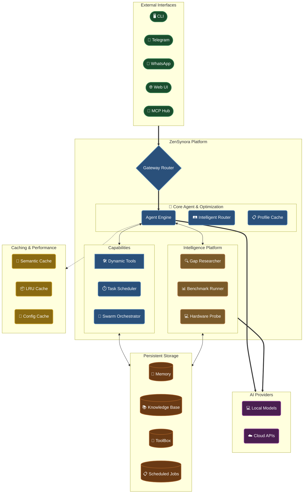

# ZenSynora (MyClaw) 🧬

**License:** AGPL-3.0 (open-source) | **Dual Licensing** available for enterprise.
Copyright © 2026 Adrian Petrescu. All rights reserved.

---

### 🛡️ Your Personal AI Agent, Everywhere.
A high-performance, privacy-first AI agent that runs locally or in the cloud. Seamlessly integrates with **Telegram**, **WhatsApp**, and the **Web**, featuring persistent memory, multi-agent swarms, and a dynamic tool-building ecosystem.

[](https://www.python.org/downloads/)
[](LICENSE)
[](https://github.com/adrianx26/zensynora/actions/workflows/ci.yml)
[](#option-2--docker-recommended-for-production)
[](CONTRIBUTING.md#testing)

> **"ZenSynora doesn't just execute tasks; it evolves with you, refining its internal models of your projects and its own capabilities."**

---

## ✨ Key Features

### 🧠 Core Intelligence
- **LLM Agnostic** — Native support for [Ollama](https://github.com/ollama/ollama), OpenAI, Anthropic, Gemini, Groq, and OpenRouter.
- **Persistent Memory** — SQLite-backed conversation history with per-user isolation and semantic retrieval.
- **Intelligent Routing** — Automatically upgrades to premium models for complex reasoning while using local models for simple tasks.

### 🛠️ Advanced Ecosystem
- **Natively Integrated Web UI** — Beautiful glassmorphism dashboard with real-time FastAPI WebSockets.
- **🐝 Agent Swarms** — Coordinate multiple agents using Parallel, Sequential, Hierarchical, or Voting strategies.
- **Full MCP Support** — Operates as both an MCP Client and Server, enabling compatibility with Cursor, Claude, and ClawHub.ai.
- **Dynamic Tool Building** — The agent can create, test, and register new Python tools at runtime in its secure **TOOLBOX**.

### 🏥 System Resilience
- **Medic Agent** — Self-healing system health monitoring, integrity verification, and change management with approval workflows.
- **Hardware Awareness** — Deep telemetry (CPU/GPU/NPU) with intelligence-driven optimization suggestions.

---

## 🏗️ Architecture

ZenSynora is built for modularity and performance, featuring a multi-layered optimization engine and a secure tool execution pipeline.



---

## 🚀 Quick Start

### Prerequisites
- Python 3.11+
- [Ollama](https://github.com/ollama/ollama) (for local models) or API keys for Cloud Providers.

### Option 1 — Easy Install (Recommended)

```bash
git clone https://github.com/adrianx26/zensynora.git
cd zensynora

# Install core with all providers and features
pip install -e ".[all]"

# Run onboarding wizard
zensynora onboard
```

### Option 2 — Docker (Production Ready)

```bash
cp .env.example .env
# Edit .env with your keys
docker compose up -d --build
```

---

## 🛠️ Usage & Commands

| Mode | Command | Description |
|------|---------|-------------|
| 🖥️ **Console** | `zensynora agent` | Interactive CLI chat |
| 📱 **Gateway** | `zensynora gateway` | Start Telegram/WhatsApp bots |
| 🌐 **Web UI** | `zensynora webui` | Launch the browser dashboard |
| 🛠️ **Onboard** | `zensynora onboard` | Initial configuration wizard |
| 📊 **Benchmark** | `zensynora benchmark` | Test model latency and accuracy |

### 🧩 Available Tools
- **Filesystem**: `read_file`, `write_file`, `download_file`
- **System**: `shell` (securely sandboxed), `hardware`
- **Knowledge**: `search_knowledge`, `write_to_knowledge`, `sync_knowledge_base`
- **Collaboration**: `delegate`, `swarm_create`, `swarm_assign`
- **Automation**: `schedule`, `list_schedules`, `cancel_schedule`

---

## 🧠 Advanced Capabilities

### 📚 Knowledge Base
ZenSynora utilizes a hybrid Markdown/SQLite storage system.
- **Search**: FTS5-powered full-text search across all notes.
- **Graph**: Automatic relation mapping between entities.
- **Research**: Background "Gap Researcher" fills information gaps using the Scrapling engine.

### 🐝 Agent Swarms
Enable complex collaboration between specialized agents.
- **Sequential**: Pipeline workflows (e.g., Draft -> Edit -> Publish).
- **Parallel**: Multi-perspective brainstorming.
- **Voting**: Consensus-driven decision making.

---

## 🔒 Security & Safety
Security is not an afterthought; it's the foundation of ZenSynora.
- **Command Sandboxing** — Strict allowlist/blocklist for shell execution.
- **Path Validation** — Prevents directory traversal attacks.
- **SSRF Protection** — Blocks access to private IP ranges in web tools.
- **Audit Logs** — Tamper-evident HMAC-SHA256 signed entries for every action.
- **MFA & Auth** — TOTP Multi-factor authentication for admin endpoints.

---

## 🗺️ Roadmap

- [x] **v0.4.1** — Security hardening, Async migration, and Performance overhaul.
- [ ] **Phase 8** — Plugin system, streaming tool execution, and webhook mode.
- [ ] **Phase 9** — Discord & Slack integration, Enterprise role-based access control.

---

## 🤝 Contributing
Contributions are what make the open-source community an amazing place to learn, inspire, and create.
1. Fork the Project
2. Create your Feature Branch (`git checkout -b feature/AmazingFeature`)
3. Commit your Changes (`git commit -m 'Add some AmazingFeature'`)
4. Push to the Branch (`git push origin feature/AmazingFeature`)
5. Open a Pull Request

---

## 📜 License
Distributed under the **AGPL-3.0 License**. See `LICENSE` for more information. Dual-licensing is available for commercial use.

---

**Developed by Adrian Petrescu.**
[GitHub](https://github.com/adrianx26) | [Website](https://zensynora.com) *(Coming Soon)*
