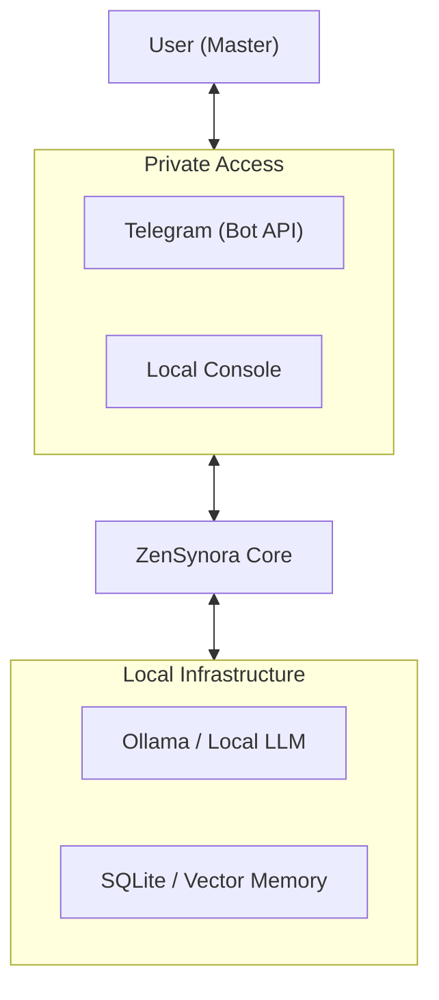
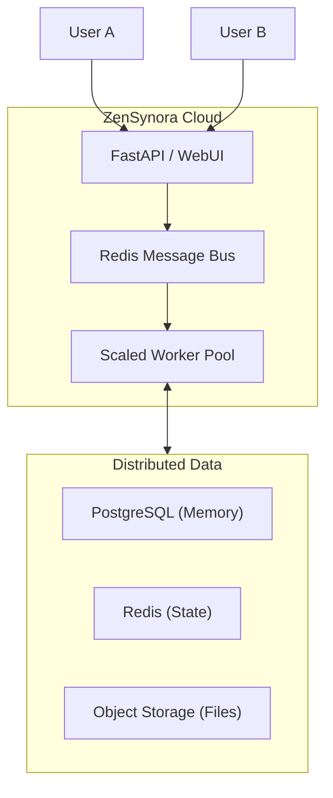

# Strategic Plan: ZenSynora Transformation

## Variant A: Federated Personal Intelligence

Focus on local-first, privacy-preserving personal AI.

## Variant B: Enterprise Agent Swarm

Focus on high-scale, multi-user, multi-agent collaboration.

