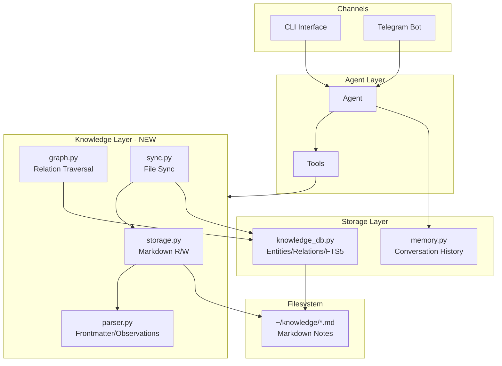

# Knowledge Integration Plan: MemoPad-Inspired Storage in ZenSynora

## Overview

This plan details an implementation **inspired by** [MemoPad's](https://github.com/adrianx26/memopad) Markdown + SQLite storage pattern, built directly into ZenSynora (MyClaw).

**Important:** We only READ from the MemoPad repository for reference - all implementation is new code in the ZenSynora codebase.

The implementation uses **SQLite exclusively** (no Postgres), enabling structured knowledge storage with persistent, editable notes and a knowledge graph while maintaining local-first principles.

---

## Architecture



---

## Data Model

### Markdown File Format

```markdown
---
title: "Project Phoenix"
permalink: project-phoenix
tags: [work, urgent]
created: 2026-03-08T10:00:00
updated: 2026-03-08T15:30:00
---

# Project Phoenix

Core initiative for Q2 2026.

## Observations
- [status] Active development phase #work
- [milestone] Backend API completed on March 5th
- [risk] Database migration needs testing

## Relations
- leads [[team-backend]]
- depends_on [[infrastructure-v2]]
- blocks [[mobile-app-v3]]
```

### SQLite Schema

```sql
-- Core entities table
CREATE TABLE IF NOT EXISTS entities (
    id INTEGER PRIMARY KEY,
    name TEXT UNIQUE NOT NULL,
    permalink TEXT UNIQUE NOT NULL,
    file_path TEXT NOT NULL,
    created_at TEXT NOT NULL,
    updated_at TEXT NOT NULL
);

-- Observations (facts about entities)
CREATE TABLE IF NOT EXISTS observations (
    id INTEGER PRIMARY KEY,
    entity_id INTEGER NOT NULL,
    category TEXT,
    content TEXT NOT NULL,
    tags TEXT, -- JSON array
    created_at TEXT NOT NULL,
    FOREIGN KEY (entity_id) REFERENCES entities(id) ON DELETE CASCADE
);

-- Relations between entities (knowledge graph)
CREATE TABLE IF NOT EXISTS relations (
    id INTEGER PRIMARY KEY,
    from_entity_id INTEGER NOT NULL,
    relation_type TEXT NOT NULL,
    to_entity_id INTEGER NOT NULL,
    created_at TEXT NOT NULL,
    FOREIGN KEY (from_entity_id) REFERENCES entities(id) ON DELETE CASCADE,
    FOREIGN KEY (to_entity_id) REFERENCES entities(id) ON DELETE CASCADE,
    UNIQUE(from_entity_id, relation_type, to_entity_id)
);

-- FTS5 for full-text search
CREATE VIRTUAL TABLE IF NOT EXISTS entities_fts USING fts5(
    name,
    content,
    content_rowid=id
);

-- Tags index
CREATE INDEX IF NOT EXISTS idx_observations_entity ON observations(entity_id);
CREATE INDEX IF NOT EXISTS idx_relations_from ON relations(from_entity_id);
CREATE INDEX IF NOT EXISTS idx_relations_to ON relations(to_entity_id);
```

---

## File Structure

```
myclaw/
├── myclaw/
│   ├── __init__.py
│   ├── agent.py              # Update: Add knowledge context injection
│   ├── config.py             # Update: Add knowledge_dir config
│   ├── gateway.py
│   ├── memory.py             # Update: Add knowledge extraction
│   ├── provider.py
│   ├── tools.py              # Update: Add knowledge tools
│   └── channels/
│   │   ├── __init__.py
│   │   └── telegram.py       # Update: Add knowledge commands
│   └── knowledge/            # NEW PACKAGE
│       ├── __init__.py
│       ├── db.py             # SQLite operations
│       ├── parser.py         # Markdown parsing
│       ├── storage.py        # File R/W operations
│       ├── graph.py          # Graph traversal
│       └── sync.py           # File-DB synchronization
├── onboard.py                # Update: Add knowledge wizard
└── tests/
    └── test_knowledge.py     # NEW
```

---

## Implementation Phases

### Phase 1: Foundation (Files: 4-6)

**1.1 Create Package Structure**
- Create `myclaw/knowledge/` directory
- Add `__init__.py` with exports

**1.2 Implement Markdown Parser** (`parser.py`)
```python
- parse_frontmatter(content) -> dict
- parse_observations(content) -> list[Observation]
- parse_relations(content) -> list[Relation]
- parse_note(file_path) -> Note object
```

**1.3 Database Layer** (`db.py`)
```python
class KnowledgeDB:
    - __init__(user_id: str)
    - create_entity(name, permalink, file_path) -> int
    - add_observation(entity_id, category, content, tags)
    - add_relation(from_id, relation_type, to_id)
    - search_fts(query) -> list[Entity]
    - get_related(entity_id, depth=1) -> list[Entity]
    - sync_entity_from_file(file_path) -> bool
```

**1.4 Configuration Updates**
- Add `knowledge_dir` to `AppConfig`
- Update `onboard.py` to create knowledge directory

### Phase 2: Storage & Sync (Files: 3)

**2.1 Storage Module** (`storage.py`)
```python
- write_note(entity_name, observations=[], relations=[], tags=[]) -> permalink
- read_note(permalink) -> Note
- delete_note(permalink) -> bool
- list_notes(tags=None) -> list[Note]
```

**2.2 Graph Module** (`graph.py`)
```python
- get_related_entities(permalink, depth=2) -> list[Entity]
- find_path(from_permalink, to_permalink) -> list[Relation]
- get_entity_network(permalink, max_depth=2) -> dict
```

**2.3 Sync Module** (`sync.py`)
```python
- sync_knowledge(watch=False) -> stats
- _scan_markdown_files() -> list[Path]
- _detect_changes() -> changes
- watch_and_sync()  # Background file watcher
```

### Phase 3: Tool Integration (Files: 2)

**3.1 Knowledge Tools** (add to `tools.py`)
```python
- write_to_knowledge(title, content, tags=[]) -> str
- search_knowledge(query, limit=10) -> str
- build_context(permalink, depth=2) -> str
- list_knowledge_tags() -> str
```

**3.2 Agent Updates** (`agent.py`)
- Auto-search knowledge before generating responses
- Inject relevant knowledge into system prompt
- Extract knowledge from conversations

### Phase 4: Multi-User & Channels (Files: 2)

**4.1 Multi-User Isolation**
- Per-user knowledge directories: `~/.myclaw/knowledge/{user_id}/`
- Per-user SQLite tables with prefix: `user_{id}_entities`
- OR: Separate DB files per user

**4.2 Telegram Commands** (`telegram.py`)
```
/knowledge search <query>
/knowledge write <title> | <content>
/knowledge read <permalink>
/knowledge related <permalink>
/knowledge tags
```

**4.3 CLI Commands** (`cli.py`)
```
python cli.py knowledge search "project"
python cli.py knowledge write --title "Note" --content "..."
python cli.py knowledge read project-phoenix
python cli.py knowledge sync
```

### Phase 5: Testing & Documentation (Files: 2)

**5.1 Tests** (`test_knowledge.py`)
- Parser tests
- DB operations tests
- Sync tests
- Tool integration tests

**5.2 Documentation**
- Update `README.md` with knowledge features
- Add example Markdown notes
- Document knowledge graph queries

---

## Key Design Decisions

### 1. SQLite-Only Approach
- **No Postgres**: MemoPad supports both, but we use SQLite exclusively
- **Per-user DBs**: Each user gets `knowledge_{user_id}.db`
- **WAL Mode**: Enabled for better concurrent access

### 2. File-First Storage
- Markdown files are the source of truth
- SQLite is an index for fast search/graph traversal
- Users can edit files directly (e.g., in Obsidian)

### 3. Observation Pattern
```markdown
- [category] Content #tag1 #tag2
```
- Categories group related facts
- Tags enable cross-cutting queries
- Flexible, human-readable format

### 4. Relation Pattern
```markdown
- relation_type [[TargetEntity]]
```
- WikiLinks for entity references
- Directed graph (from -> to)
- Multiple relation types per entity

---

## Security Considerations

1. **Path Validation**: All file paths validated against knowledge_dir
2. **SQL Injection**: Use parameterized queries exclusively
3. **User Isolation**: Strict per-user file and DB separation
4. **Content Sanitization**: Strip HTML/script from observations

---

## Performance Optimizations

1. **FTS5**: Full-text search with ranking
2. **Indexes**: All foreign keys and search fields indexed
3. **Lazy Loading**: Graph traversal stops at specified depth
4. **Caching**: Recent searches cached in memory

---

## Next Steps

1. ✅ Review and approve this plan
2. Switch to Code mode for implementation
3. Start with Phase 1 (Foundation)
4. Run tests after each phase
5. Document as we go
