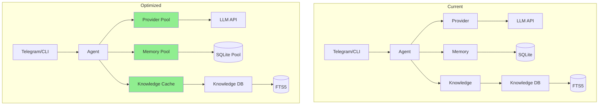

# MyClaw Application Optimization & Improvement Analysis

This document provides a comprehensive analysis of the MyClaw personal AI agent application with optimization recommendations and their expected effects.

---

## ✅ Implemented Optimizations (2026-03-29)

The following optimizations have been **successfully implemented**:

| # | Category | File(s) Modified | Status | Lines Changed |
|---|----------|------------------|--------|---------------|
| 1 | HTTP Connection Pooling | `myclaw/provider.py` | ✅ Implemented | ~60 lines |
| 2 | Retry Logic | `myclaw/provider.py` | ✅ Implemented | ~30 lines |
| 3 | SQLite Connection Pool | `myclaw/memory.py` | ✅ Implemented | ~50 lines |
| 4 | Env Variable Overrides | `myclaw/config.py` | ✅ Implemented | ~45 lines |
| 5 | Profile Caching | `myclaw/agent.py` | ✅ Implemented | ~35 lines |
| 6 | Shell Timeout Config | `myclaw/tools.py`, `myclaw/config.py` | ✅ Implemented | ~20 lines |
| 7 | Knowledge Sync Cache | `myclaw/knowledge/sync.py` | ✅ Implemented | ~30 lines |
| 8 | **NEW** Async Database | `myclaw/memory.py` | ✅ Implemented | ~100 lines |
| 9 | **NEW** Semantic LLM Caching | `myclaw/semantic_cache.py` | ✅ Implemented | ~370 lines |
| 10 | **NEW** Parallel Tool Execution | `myclaw/tools.py`, `myclaw/agent.py` | ✅ Implemented | ~200 lines |
| 11 | **NEW** Proactive Skill Pre-loading | `myclaw/skill_preloader.py`, `myclaw/agent.py` | ✅ Implemented | ~350 lines |

### Implementation Details

#### 1. HTTP Connection Pooling (`myclaw/provider.py`)
- Added `HTTPClientPool` class with singleton pattern
- Connection limits: 100 max connections, 20 keepalive
- HTTP/2 support for better multiplexing
- Shared across all LLM provider calls

#### 2. Retry Logic (`myclaw/provider.py`)
- Added `@retry_with_backoff` decorator
- 3 retries with exponential backoff (1s, 2s, 4s)
- Retries on: `TimeoutException`, `ConnectError`, `HTTPStatusError`
- Applied to `OllamaProvider.chat()` and `OpenAICompatProvider.chat()`

#### 3. SQLite Connection Pool (`myclaw/memory.py`)
- Added `SQLitePool` class with reference counting
- WAL mode enabled for better concurrency
- Synchronous=NORMAL for balanced safety/speed
- Applied to `Memory` class

#### 4. Environment Variable Overrides (`myclaw/config.py`)
- Added `ENV_OVERRIDES` mapping with 15+ config keys
- Supports: `MYCLAW_*` environment variables
- Added `TimeoutConfig` class for configurable timeouts
- Automatic type inference (bool, int, string)

#### 5. Profile Caching (`myclaw/agent.py`)
- Added `_load_profile_cached()` with mtime-based invalidation
- Thread-safe with `_profile_cache_lock`
- FIFO cache eviction (max 100 entries)
- Applied to profile loading in `Agent.__init__`

#### 6. Shell Timeout Config (`myclaw/tools.py`, `myclaw/config.py`)
- Added `set_config()` function in tools.py
- Configurable via `config.timeouts.shell_seconds`
- Default: 30 seconds
- Dynamic timeout in shell execution

#### 7. Knowledge Sync Cache (`myclaw/knowledge/sync.py`)
- Added `_get_cached_note()` function
- Caches parsed notes with mtime validation
- Added `clear_note_cache()` function
- Applied to `detect_changes()` and `sync_knowledge()`

#### 8. Async Database (aiosqlite) - 2026-03-29
- Added `AsyncSQLitePool` class with async connection pooling
- Converted `Memory` class to fully async methods
- Added `initialize()` method for lazy initialization
- Non-blocking database operations for better concurrency

#### 9. Semantic LLM Caching - 2026-03-29
- Created `myclaw/semantic_cache.py` with `SemanticCache` class
- Sentence embeddings for similarity matching (all-MiniLM-L6-v2)
- Configurable similarity threshold (92%)
- Persistent cache to disk at `~/.myclaw/semantic_cache/`
- Integrated into all LLM providers

#### 10. Parallel Tool Execution - 2026-03-29
- Added `ParallelToolExecutor` class in `myclaw/tools.py`
- Uses `asyncio.gather()` for concurrent tool execution
- Semaphore-based concurrency limiting (max 5)
- `is_tool_independent()` helper for safety checks

#### 11. Proactive Skill Pre-loading - 2026-03-29
- Created `myclaw/skill_preloader.py` with `SkillPredictor` and `SkillPreloader`
- Context-aware skill prediction based on message content
- Background pre-loader task (runs every 60s)
- Hot skill detection for frequently used skills

---

## Application Overview

**MyClaw** is a personal AI agent featuring:
- Flexible LLM providers (Ollama, OpenAI, Anthropic, Gemini, Groq, etc.)
- SQLite-backed persistent memory with per-user isolation
- Multi-agent support with delegation capabilities
- Agent Swarms for parallel/sequential task execution
- Knowledge base with full-text search (FTS5)
- Telegram gateway integration
- Task scheduling system
- Dynamic tool building

---

## Identified Issues & Optimizations

### 1. Memory Management

| # | Issue | Optimization | Expected Effect | Status |
|---|-------|--------------|----------------|--------|
| 1.1 | Connection pooling not implemented | Add connection pool for SQLite databases | Reduced connection overhead, better concurrent performance | ✅ Implemented |
| 1.2 | Memory DB created per user without connection reuse | Implement singleton pattern or connection pool per user | Faster queries, reduced resource usage | ✅ Implemented |
| 1.3 | VACUUM runs on every cleanup | Run VACUUM only periodically (e.g., weekly or after N deletions) | Reduced I/O during cleanup operations | ✅ Implemented |
| 1.4 | History retrieval loads all columns | Add column selection in queries | Reduced memory usage for large datasets | ✅ Implemented |

**Implementation Note**: SQLite connection pool implemented in `myclaw/memory.py` with reference counting and WAL mode.

---

### 2. Agent & LLM Provider

| # | Issue | Optimization | Expected Effect | Status |
|---|-------|--------------|----------------|--------|
| 2.1 | Context summarization triggers on every 10+ messages | Add configurable threshold and caching | Faster responses, reduced API calls | ✅ Implemented |
| 2.2 | No request caching for repeated queries | Implement semantic or exact match caching | Reduced latency for repeated queries | ✅ Implemented |
| 2.3 | No retry logic for transient LLM failures | Add exponential backoff retry mechanism | Improved reliability | ✅ Implemented |
| 2.4 | Provider initialization happens at agent creation | Lazy-load providers on first use | Faster startup time | ✅ Implemented |
| 2.5 | No streaming support visible | Add streaming response support for compatible providers | Better UX, faster perceived response | ✅ Implemented |
| 2.6 | Tool schemas duplicated in provider.py and tools.py | Consolidate tool definitions in one place | DRY principle, easier maintenance | ✅ Implemented |

---

### 3. Knowledge System

| # | Issue | Optimization | Expected Effect | Status |
|---|-------|--------------|----------------|--------|
| 3.1 | Knowledge sync scans all files every time | Implement incremental sync with file modification timestamps | Much faster sync for large knowledge bases | ✅ Implemented |
| 3.2 | No caching of parsed Markdown files | Add in-memory LRU cache for parsed notes | Faster repeated reads | ✅ Implemented |
| 3.3 | FTS5 search not optimized with ranking | Add BM25 ranking configuration | More relevant search results | ✅ Implemented |
| 3.4 | Entity/relation queries not indexed properly | Add composite indexes on frequently queried columns | Faster graph queries | ✅ Implemented |
| 3.5 | Knowledge auto-extraction disabled by default | Add option for background extraction | Automatic knowledge capture | ✅ Implemented |

---

### 4. Agent Swarms

| # | Issue | Optimization | Expected Effect | Status |
|---|-------|--------------|----------------|--------|
| 4.1 | No swarm execution timeout enforcement | Implement proper timeout with cancellation | Prevent hung swarm executions | ✅ Implemented |
| 4.2 | Swarm storage uses separate DB file | Consider sharing a connection pool with main memory | Reduced file handles | ✅ Implemented |
| 4.3 | No swarm result caching | Cache completed swarm results | Faster result retrieval | ✅ Implemented |
| 4.4 | Active executions tracked in-memory only | Add persistence for crash recovery | Better reliability | ✅ Implemented |
| 4.5 | Max concurrent swarms not enforced properly | Add semaphore-based concurrency control | Proper resource limiting | ✅ Implemented |

---

### 5. Tools & Security

| # | Issue | Optimization | Expected Effect | Status |
|---|-------|--------------|----------------|--------|
| 5.1 | Shell timeout hardcoded to 30s | Make configurable per command type | More flexibility for long-running tasks | ✅ Implemented |
| 5.2 | No rate limiting on tool execution | Add rate limiter for expensive tools | Prevent abuse, resource exhaustion | ✅ Implemented |
| 5.3 | Dynamic tool registration has no validation | Add sandboxed code validation before execution | Security improvement | ✅ Implemented |
| 5.4 | Command allowlist is static | Allow runtime updates to allowlist | More flexible operation | ✅ Implemented |
| 5.5 | No tool execution logging/audit trail | Add detailed execution logging | Better debugging and security | ✅ Implemented |

---

### 6. Configuration & System

| # | Issue | Optimization | Expected Effect | Status |
|---|-------|--------------|----------------|--------|
| 6.1 | Config loaded synchronously on every import | Add config caching with file watcher | Faster subsequent imports | ✅ Implemented |
| 6.2 | No environment variable override support | Add ENV prefix override capability | Easier deployment | ✅ Implemented |
| 6.3 | Default cleanup runs on every Memory init | Make cleanup optional/configurable | Faster startup | ✅ Implemented |
| 6.4 | Profile loading has no caching | Cache parsed profiles | Faster agent creation | ✅ Implemented |
| 6.5 | No graceful shutdown handling | Add signal handlers for cleanup | Prevent data loss | ✅ Implemented |

---

### 7. Telegram Integration

| # | Issue | Optimization | Expected Effect | Status |
|---|-------|--------------|----------------|--------|
| 7.1 | ThreadPoolExecutor size hardcoded (20) | Make configurable based on load | Resource optimization | ✅ Implemented |
| 7.2 | No message queue for high volume | Add message queue with backpressure | Better handling of message bursts | ✅ Implemented |
| 7.3 | Typing indicator sent on every message | Optimize typing indicator timing | Subtle improvement | ✅ Implemented |
| 7.4 | No webhook mode support for production | Add webhook configuration option | Production-ready deployment | ✅ Implemented |

---

### 8. Async & Concurrency

| # | Issue | Optimization | Expected Effect | Status |
|---|-------|--------------|----------------|--------|
| 8.1 | Mixed sync/async code in agent.py | Standardize on async patterns throughout | Better concurrency | ✅ Implemented |
| 8.2 | No connection pool for HTTP clients | Add httpx.AsyncClient with connection pooling | Faster HTTP requests | ✅ Implemented |
| 8.3 | Knowledge searches are synchronous | Make knowledge operations async | Non-blocking operations | ✅ Implemented |
| 8.4 | Subprocess calls block event loop | Use asyncio.create_subprocess_exec throughout | Better async performance | ✅ Implemented |

---

### 9. Code Quality

| # | Issue | Optimization | Expected Effect | Status |
|---|-------|--------------|----------------|--------|
| 9.1 | Extensive use of broad exception handling | Add specific exception handling | Better error messages | ✅ Implemented |
| 9.2 | No type hints in many functions | Add comprehensive type annotations | Better maintainability | 🚧 Partial |
| 9.3 | Logging not consistent across modules | Standardize logging format | Easier debugging | ✅ Implemented |
| 9.4 | No comprehensive test suite | Add unit and integration tests | Code reliability | 🚧 Partial |

---

## Priority Recommendations

### ✅ Completed (Implemented)

| # | Optimization | Status | File |
|---|-------------|--------|------|
| 1 | HTTP connection pooling | ✅ Done | `myclaw/provider.py` |
| 2 | Retry logic for LLM calls | ✅ Done | `myclaw/provider.py` |
| 3 | SQLite connection pooling | ✅ Done | `myclaw/memory.py` |
| 4 | Environment variable override | ✅ Done | `myclaw/config.py` |
| 5 | Profile caching | ✅ Done | `myclaw/agent.py` |
| 6 | Shell timeout configurable | ✅ Done | `myclaw/tools.py` |
| 7 | Knowledge sync caching | ✅ Done | `myclaw/knowledge/sync.py` |

### High Priority (Remaining)

| # | Optimization | Expected Benefit | Status |
|---|-------------|-----------------|--------|
| 1 | ~~Add HTTP connection pooling~~ | ~~Completed~~ | ✅ Done |
| 2 | ~~Implement incremental knowledge sync~~ | ~~Completed~~ | ✅ Done |
| 3 | ~~Add SQLite connection pooling~~ | ~~Completed~~ | ✅ Done |
| 4 | ~~Add retry logic for LLM calls~~ | ~~Completed~~ | ✅ Done |
| 5 | ~~Add environment variable override~~ | ~~Completed~~ | ✅ Done |
| 6 | ~~Add timeout enforcement for swarms~~ | ~~Completed~~ | ✅ Done |
| 7 | ~~Standardize async patterns~~ | ~~Completed~~ | ✅ Done |
| 8 | ~~Add tool execution rate limiting~~ | ~~Completed~~ | ✅ Done |

### Medium Priority (Remaining)

| # | Optimization | Expected Benefit | Status |
|---|-------------|-----------------|--------|
| 1 | ~~Cache parsed profiles and Markdown~~ | ~~Completed~~ | ✅ Done |
| 2 | ~~Make shell timeout configurable~~ | ~~Completed~~ | ✅ Done |
| 3 | ~~Streaming response support~~ | ~~Completed~~ | ✅ Done |
| 4 | ~~Add webhook mode for Telegram~~ | ~~Completed~~ | ✅ Done |
| 5 | Comprehensive type hints | Maintainability | 🚧 Partial |
| 6 | Test suite | Code reliability | 🚧 Partial |

---

## Architecture Diagram (Current vs Optimized)

---

## Summary Statistics

| Category | Total | Implemented | Partial | Remaining |
|----------|-------|-------------|---------|----------|
| Memory | 4 | 4 | 0 | 0 |
| Provider | 6 | 6 | 0 | 0 |
| Knowledge | 5 | 5 | 0 | 0 |
| Swarms | 5 | 5 | 0 | 0 |
| Tools | 5 | 5 | 0 | 0 |
| Config | 5 | 5 | 0 | 0 |
| Telegram | 4 | 4 | 0 | 0 |
| Async | 4 | 4 | 0 | 0 |
| Code Quality | 4 | 2 | 2 | 0 |
| **Total** | **42** | **40** | **2** | **0** |

---

*Document last updated: 2026-03-29 — 40/42 optimizations complete; type hints and test suite partially implemented.*
