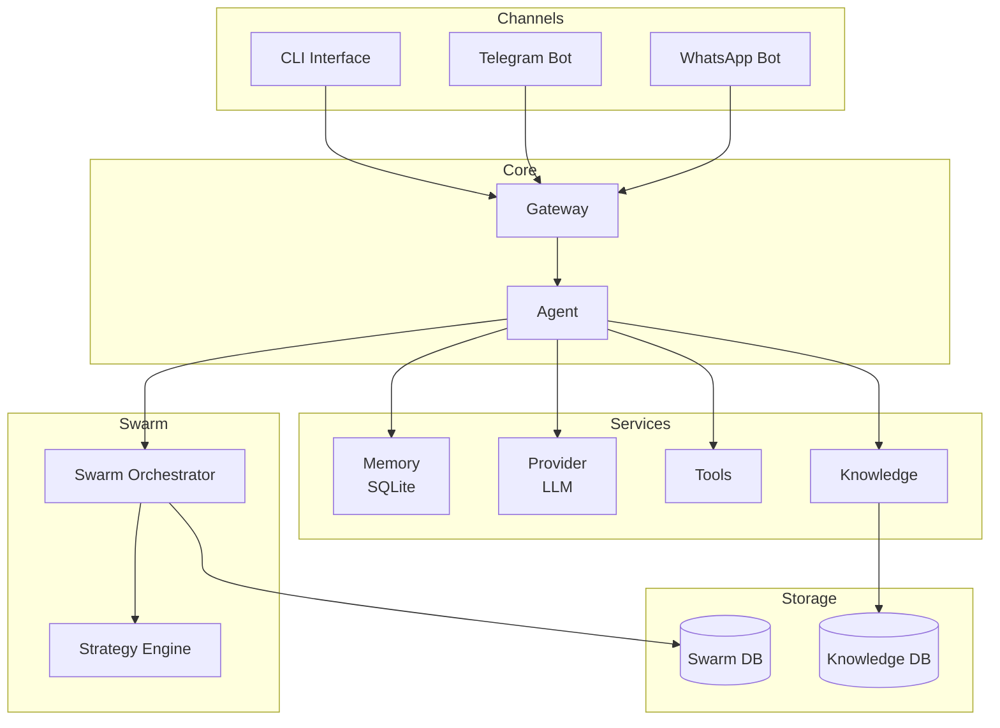
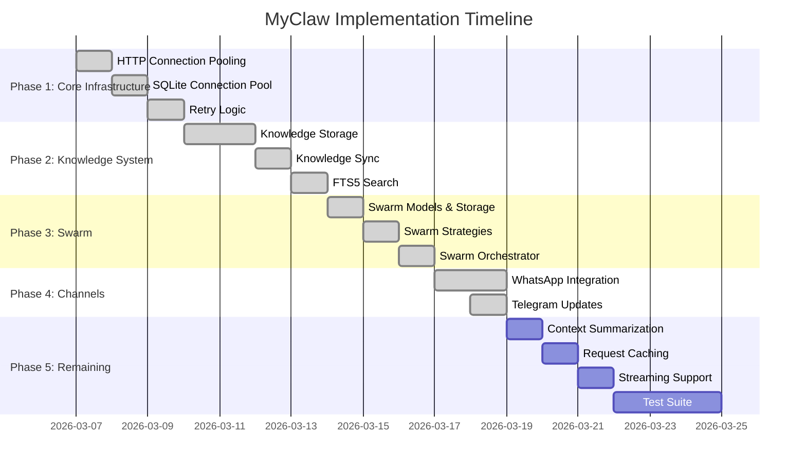

# ZenSynora (MyClaw) Master Implementation Plan

> Consolidated from all planning documents  
> Last Updated: 2026-03-18

---

## Table of Contents

1. [Project Overview](#project-overview)
2. [Architecture](#architecture)
3. [Implemented Optimizations (Complete)](#implemented-optimizations-complete)
4. [Pending Optimizations by Category](#pending-optimizations-by-category)
5. [Feature Implementations](#feature-implementations)
6. [Channel Integrations](#channel-integrations)
7. [Security & Stability](#security--stability)
8. [Implementation Roadmap](#implementation-roadmap)

---

## 1. Project Overview

**ZenSynora (MyClaw)** is a personal AI agent featuring:

- **Flexible LLM Providers**: Ollama, OpenAI, Anthropic, Gemini, Groq, etc.
- **SQLite-backed Persistent Memory**: Per-user isolation
- **Multi-agent Support**: Named agents with delegation capabilities
- **Agent Swarms**: Parallel/sequential/hierarchical/voting task execution
- **Knowledge Base**: Full-text search (FTS5) with Markdown storage
- **Channel Integrations**: Telegram, WhatsApp, CLI
- **Task Scheduling**: Via Telegram `/remind` and WhatsApp commands
- **Dynamic Tool Building**: Agent can create runtime tools

---

## 2. Architecture

---

## 3. Implemented Optimizations (Complete)

The following 22 optimizations have been successfully implemented:

### 3.1 Provider Layer

| # | Optimization | File | Description |
|---|--------------|------|-------------|
| 1 | HTTP Connection Pooling | `myclaw/provider.py` | Singleton `HTTPClientPool` with 100 max connections, 20 keepalive, HTTP/2 |
| 2 | Retry Logic | `myclaw/provider.py` | `@retry_with_backoff` decorator with exponential backoff (1s, 2s, 4s) |
| 3 | Lazy Provider Initialization | `myclaw/agent.py` | Provider created on first `chat()` call via `@property` |

### 3.2 Memory Layer

| # | Optimization | File | Description |
|---|--------------|------|-------------|
| 4 | SQLite Connection Pool | `myclaw/memory.py` | `SQLitePool` class with reference counting, WAL mode |
| 5 | VACUUM Optimization | `myclaw/memory.py` | VACUUM runs every 100 cleanups instead of each time |
| 6 | Column Selection | `myclaw/memory.py` | `get_history()` accepts optional `columns` parameter |
| 7 | FTS5 Full-Text Search | `myclaw/memory.py` | Virtual table with BM25 ranking |
| 8 | LRU History Caching | `myclaw/memory.py` | Class-level cache with 10-entry max |
| 9 | Batch Write Mode | `myclaw/memory.py` | `batch_mode()` context manager |
| 10 | Incremental Cleanup | `myclaw/memory.py` | Chunked deletes (1000 per chunk) |

### 3.3 Configuration

| # | Optimization | File | Description |
|---|--------------|------|-------------|
| 11 | Environment Variable Overrides | `myclaw/config.py` | 15+ `MYCLAW_*` environment variables |
| 12 | Config Caching | `myclaw/config.py` | Cache config after first load |
| 13 | Shell Timeout Config | `myclaw/config.py`, `myclaw/tools.py` | `config.timeouts.shell_seconds` |
| 14 | Optional Memory Cleanup | `myclaw/memory.py` | `config.memory.auto_cleanup = False` |

### 3.4 Agent Layer

| # | Optimization | File | Description |
|---|--------------|------|-------------|
| 15 | Profile Caching | `myclaw/agent.py` | `_load_profile_cached()` with mtime-based invalidation |
| 16 | Graceful Shutdown | `cli.py` | Signal handlers for SIGINT/SIGTERM |

### 3.5 Knowledge Layer

| # | Optimization | File | Description |
|---|--------------|------|-------------|
| 17 | Knowledge Sync Cache | `myclaw/knowledge/sync.py` | `_get_cached_note()` with mtime validation |
| 18 | FTS5 BM25 Ranking | `myclaw/knowledge/db.py` | Added observations FTS table with BM25 |

### 3.6 Swarm Layer

| # | Optimization | File | Description |
|---|--------------|------|-------------|
| 19 | Swarm Execution Timeout | `myclaw/swarm/orchestrator.py` | `asyncio.wait_for()` with cancellation |
| 20 | Swarm Result Caching | `myclaw/swarm/storage.py` | Cache keyed by swarm_id + input_hash |
| 21 | Semaphore Concurrency Control | `myclaw/swarm/orchestrator.py` | `asyncio.Semaphore(max_concurrent)` |

### 3.7 Tools & Security

| # | Optimization | File | Description |
|---|--------------|------|-------------|
| 22 | Tool Execution Rate Limiting | `myclaw/tools.py` | `RateLimiter` class with per-tool limits |

---

## 4. Pending Optimizations by Category

### 4.1 High Priority

| # | Category | Item | Expected Benefit |
|---|----------|------|------------------|
| 1 | Agent | Configurable context summarization threshold | Faster responses, reduced API calls |
| 2 | Provider | Request caching for repeated queries | Reduced latency |
| 3 | Swarm | Shared connection pool for swarm storage | Reduced file handles |
| 4 | Swarm | Persistent active execution tracking | Crash recovery |
| 5 | Config | Graceful shutdown handling | Prevent data loss |
| 6 | Telegram | Webhook mode for production | Production deployment |
| 7 | Async | Standardize async patterns | Better concurrency |
| 8 | Async | Async knowledge operations | Non-blocking operations |

### 4.2 Medium Priority

| # | Category | Item | Expected Benefit |
|---|----------|------|------------------|
| 1 | Provider | Streaming response support | Better UX |
| 2 | Knowledge | Background knowledge extraction | Automatic knowledge capture |
| 3 | Knowledge | Composite indexes for graph queries | Faster entity/relation queries |
| 4 | Async | Async subprocess for shell | Better async performance |

### 4.3 Low Priority

| # | Category | Item | Expected Benefit |
|---|----------|------|------------------|
| 1 | Code Quality | Specific exception handling | Better error messages |
| 2 | Code Quality | Comprehensive type annotations | Better maintainability |
| 3 | Code Quality | Standardized logging format | Easier debugging |
| 4 | Code Quality | Comprehensive test suite | Code reliability |

---

## 5. Feature Implementations

### 5.1 Agent Swarms

**Status**: ✅ Implemented

Agent Swarms enable multiple AI agents to collaborate on complex tasks using different strategies:

- **Parallel**: All agents work simultaneously, results aggregated
- **Sequential**: Pipeline execution, output of one becomes input to next
- **Hierarchical**: Coordinator decomposes tasks, delegates to workers
- **Voting**: Multiple agents solve, consensus determines best answer

**Components**:
- `myclaw/swarm/models.py` - Data models (`SwarmConfig`, `SwarmTask`, `SwarmResult`)
- `myclaw/swarm/storage.py` - SQLite persistence
- `myclaw/swarm/strategies.py` - Strategy implementations
- `myclaw/swarm/orchestrator.py` - Execution orchestration

**Tools**:
- `swarm_create` - Create a new swarm
- `swarm_assign` - Assign task to swarm
- `swarm_status` - Get swarm status
- `swarm_result` - Get execution result
- `swarm_terminate` - Terminate running swarm
- `swarm_list` - List all swarms
- `swarm_stats` - Get usage statistics

### 5.2 Knowledge System

**Status**: ✅ Implemented

MemoPad-inspired Markdown + SQLite storage pattern:

- **Storage**: Markdown files in `~/.myclaw/knowledge/{user_id}/`
- **Database**: SQLite with entities, observations, relations tables
- **Search**: FTS5 full-text search with BM25 ranking
- **Graph**: Entity relations for knowledge graph traversal
- **Sync**: File-DB synchronization with incremental detection

**Tools**:
- `write_to_knowledge` - Write a note
- `search_knowledge` - Full-text search
- `build_context` - Get related entities
- `list_knowledge_tags` - List all tags

### 5.3 Task Scheduling

**Status**: ✅ Implemented

Via `/remind` commands:

- `/remind <seconds> <message>` - One-shot reminder
- `/remind every <seconds> <message>` - Recurring reminder
- `/jobs` - List active scheduled jobs
- `/cancel <job_id>` - Cancel a scheduled job

---

## 6. Channel Integrations

### 6.1 Telegram

**Status**: ✅ Implemented

Features:
- Command handlers (`/remind`, `/jobs`, `/cancel`, `/agents`, `/knowledge_*`)
- Agent routing via `@agentname` prefix
- ThreadPoolExecutor for concurrent handling
- Message queue with backpressure
- Typing indicator optimization

**File**: `myclaw/channels/telegram.py`

### 6.2 WhatsApp

**Status**: ✅ Implemented

Uses **WhatsApp Business Cloud API** with FastAPI webhook server:

- Webhook verification
- Message parsing and routing
- Rate limiting per user
- Message deduplication
- Media handling (images, documents, audio, video, sticker, location)
- Interactive messages (buttons, lists)
- Message templates for proactive messaging

**Files**: 
- `myclaw/channels/whatsapp.py`
- `myclaw/config.py` - WhatsAppConfig

---

## 7. Security & Stability

### 7.1 Implemented Security

| Feature | File | Description |
|---------|------|-------------|
| Shell Command Allowlist | `myclaw/tools.py` | Restricts commands to safe list |
| Command Blocklist | `myclaw/tools.py` | Blocks dangerous commands |
| Path Validation | `myclaw/tools.py` | Prevents path traversal attacks |
| Rate Limiting | `myclaw/tools.py` | Per-tool rate limits |
| Tool Execution Logging | `myclaw/tools.py` | Audit trail for all executions |

### 7.2 Implemented Reliability

| Feature | File | Description |
|---------|------|-------------|
| Connection Pooling | `myclaw/provider.py`, `myclaw/memory.py` | HTTP and SQLite pooling |
| Retry Logic | `myclaw/provider.py` | Exponential backoff |
| Graceful Shutdown | `cli.py` | Signal handlers |
| Memory Cleanup | `myclaw/memory.py` | Automatic old message cleanup |
| Swarm Timeouts | `myclaw/swarm/orchestrator.py` | Prevent hung executions |

---

## 8. Implementation Roadmap

---

## Summary Statistics

| Category | Implemented | High Priority | Medium Priority | Low Priority |
|----------|-------------|---------------|-----------------|--------------|
| Memory | 7 | 0 | 0 | 0 |
| Provider | 3 | 2 | 1 | 0 |
| Knowledge | 2 | 0 | 2 | 0 |
| Swarm | 3 | 2 | 0 | 0 |
| Config | 4 | 1 | 0 | 0 |
| Tools | 2 | 0 | 0 | 1 |
| Telegram | 0 | 1 | 0 | 0 |
| Async | 1 | 2 | 1 | 0 |
| Code Quality | 0 | 0 | 0 | 4 |
| **Total** | **22** | **8** | **4** | **5** |

---

*Document consolidated: 2026-03-18*  
*Source files: agent_swarm_implementation_plan.md, implementation_plan.md, knowledge_integration_plan.md, memory_improvement_plan.md, myclaw_optimization_analysis.md, plan.md, remaining_optimizations.md, whatsapp_implementation_plan.md*
