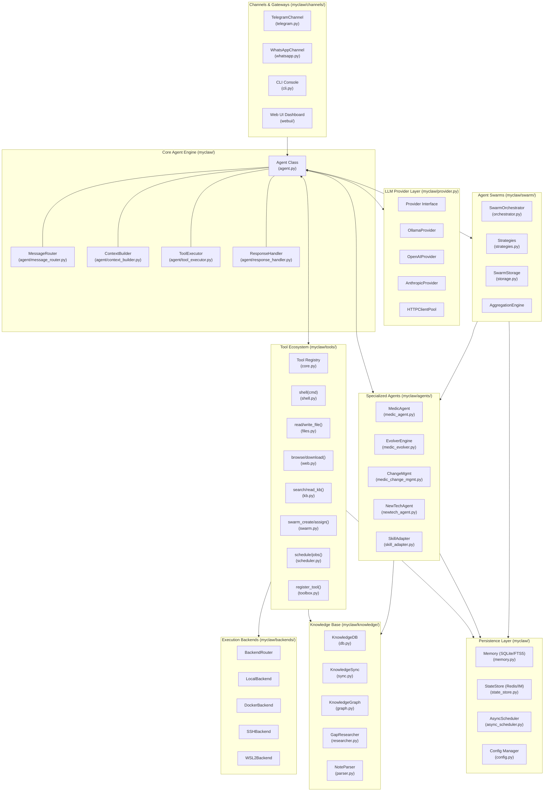
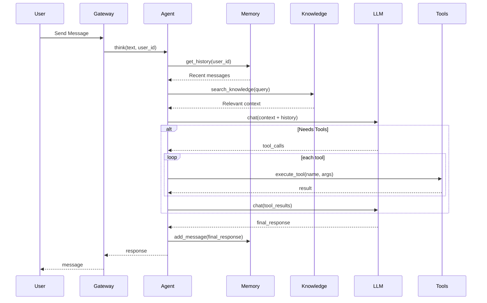
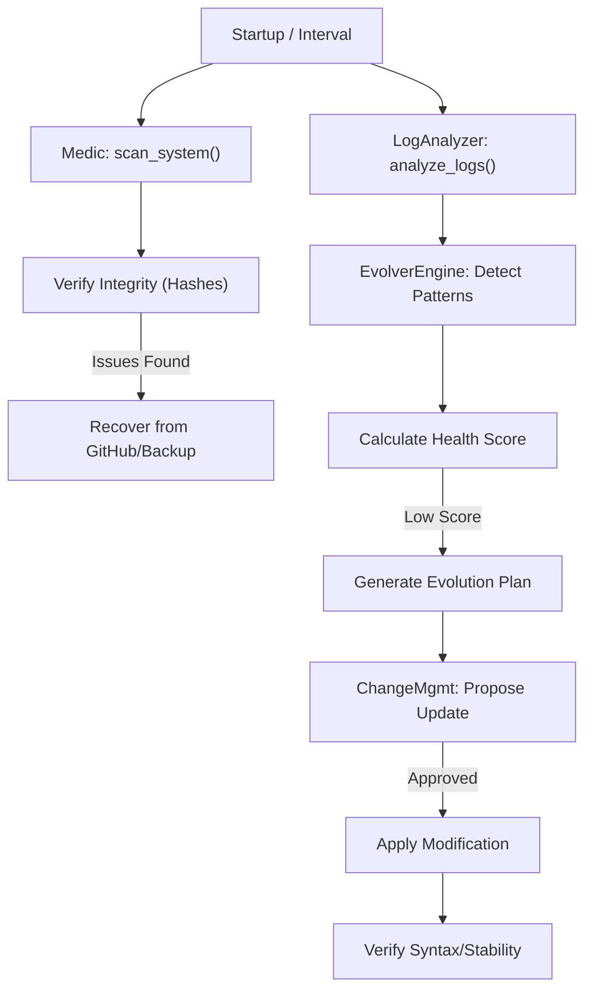
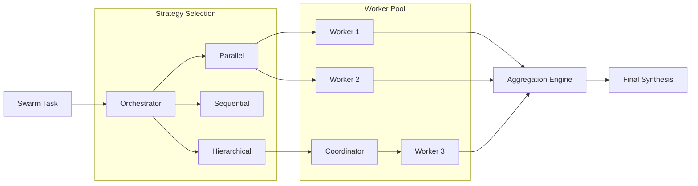

# ZenSynora Comprehensive System Diagram

This document provides a highly detailed view of the ZenSynora (MyClaw) architecture, including all major modules, classes, and primary functions.

## 🗺️ Master Component Map

## 🛠️ Functional Logic Flows

### 1. User Query Processing (`Agent.think`)

### 2. Specialized Medic Self-Healing Loop

### 3. Agent Swarm Execution

## 📂 Module & Function Registry

| Module | Primary Class | Key Functions |
|--------|---------------|---------------|
| `myclaw.agent` | `Agent` | `think()`, `chat()`, `_run_tool_calls()` |
| `myclaw.memory` | `Memory` | `get_history()`, `add_message()`, `search_history()` |
| `myclaw.provider` | `LLMProvider` | `chat()`, `chat_stream()`, `count_tokens()` |
| `myclaw.state_store` | `StateStore` | `get()`, `set()`, `delete()`, `increment()` |
| `myclaw.async_scheduler` | `AsyncScheduler` | `add_job()`, `remove_job()`, `run_forever()` |
| `myclaw.knowledge.db` | `KnowledgeDB` | `search_notes()`, `write_note()`, `get_relations()` |
| `myclaw.swarm.orchestrator`| `SwarmOrchestrator`| `create_swarm()`, `execute_task()`, `terminate()` |
| `myclaw.agents.medic_agent` | `MedicAgent` | `check_health()`, `verify_integrity()`, `recover_file()` |
| `myclaw.backends.discover` | `N/A` | `discover_backends()`, `get_default_backend()` |

---
*Last Updated: 2026-04-21*
*Generated by: ZenSynora Architecture Review*
