# ZenSynora Architecture Diagram

## System Overview

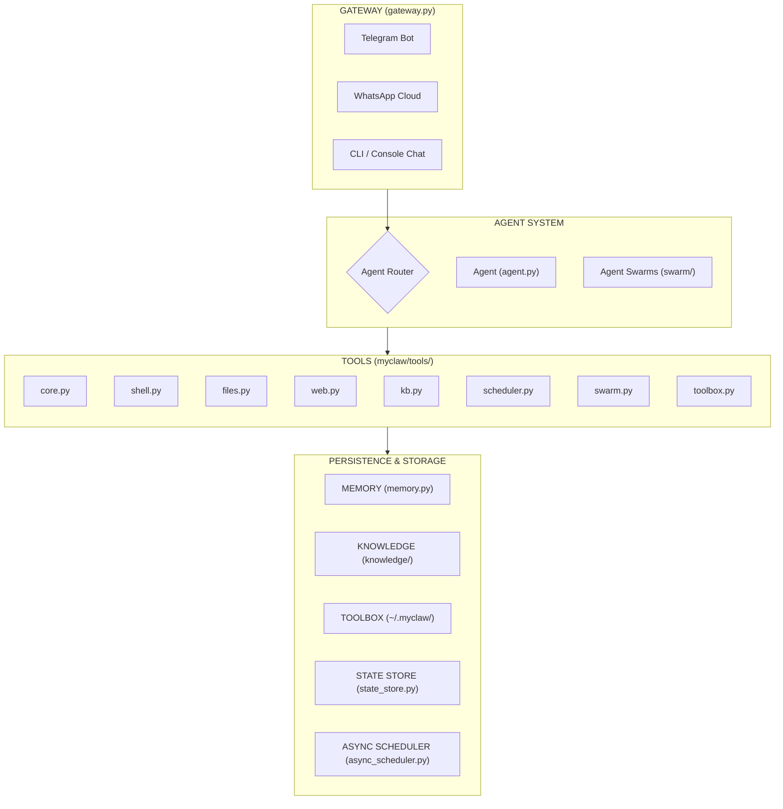

## New Tool Categories (Evolution)

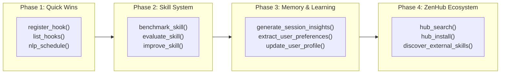

## Agent Package (myclaw/agents/)

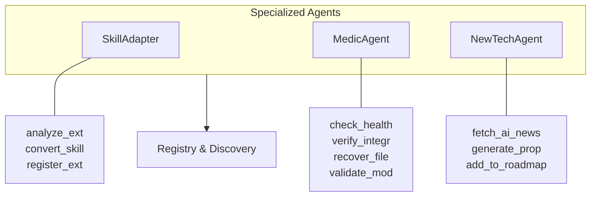

## Backends Package (myclaw/backends/)

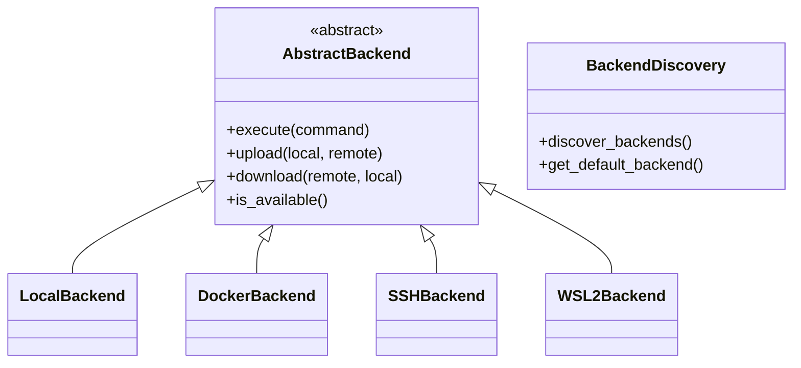

## Data Flow: Request Processing

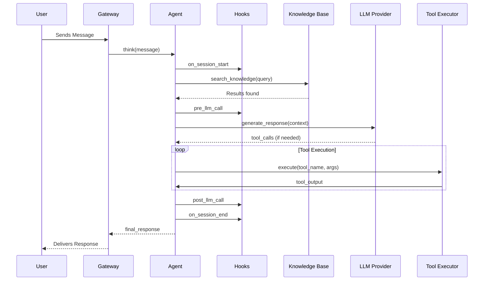

## Tool Execution Pipeline

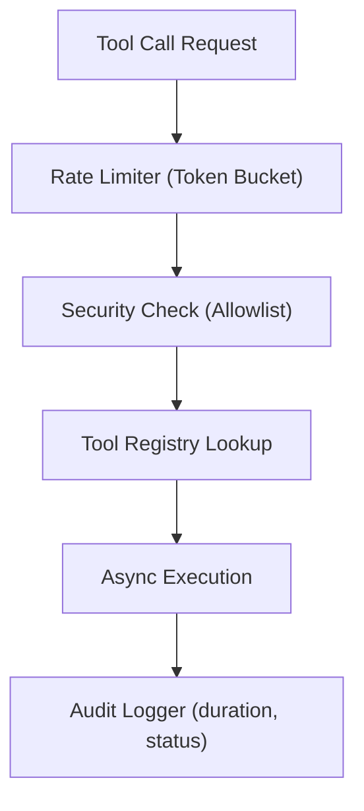

## Error Handling: Browse Tool

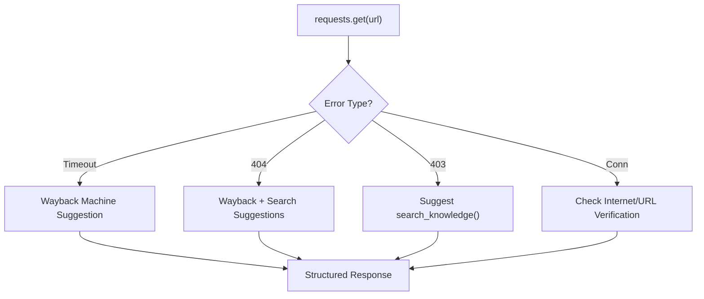

## Knowledge Gap Handling

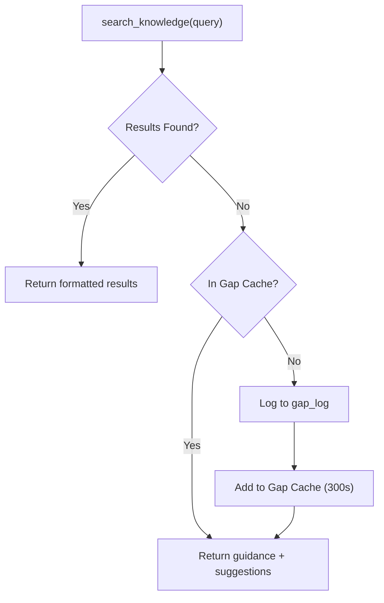

## Skill Lifecycle

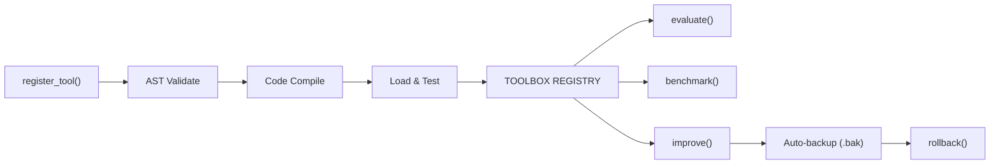

## User Profile System

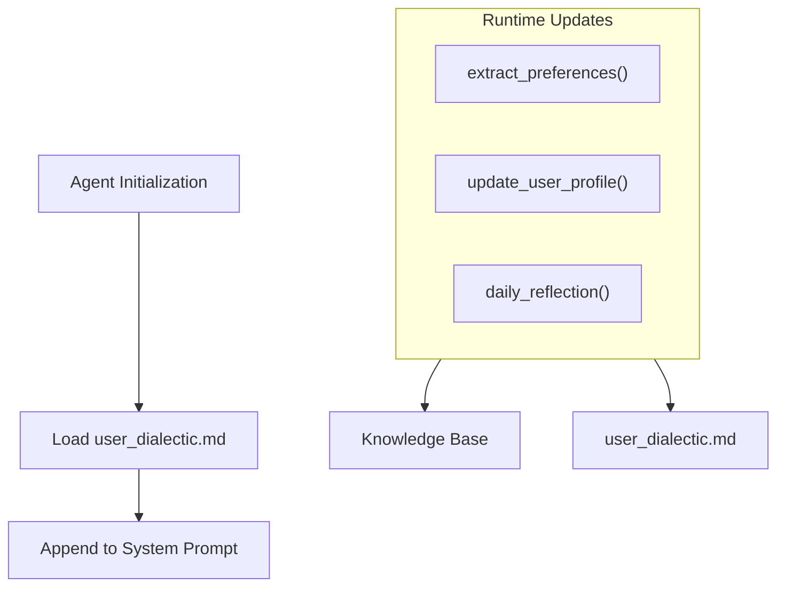

## ZenHub Registry

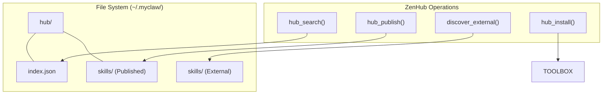

## File Structure Summary (myclaw/)

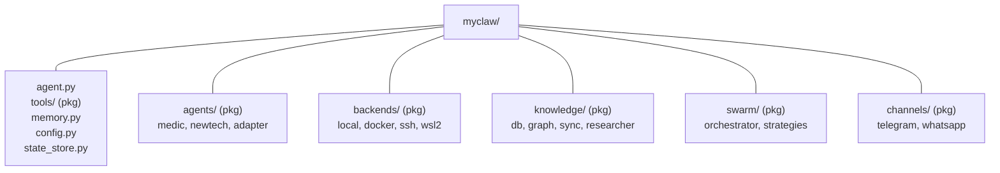

## Model Context Protocol (MCP)

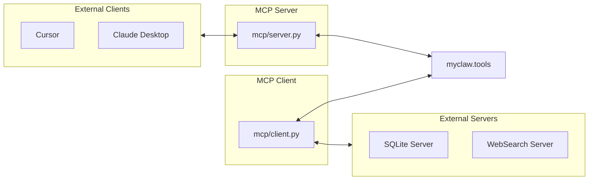

*Generated: 2026-04-21*
*Last Updated: 2026-04-21 (Mermaid redesign, package structure update)*
*Part of: ZenSynora Full Implementation*
