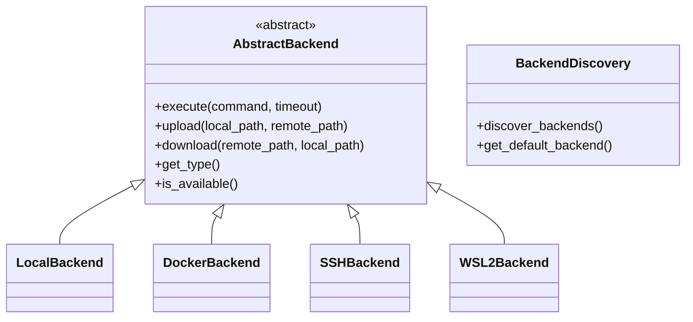

# ZenSynora Backends Guide

## Overview

ZenSynora supports multiple terminal backends for execution across different environments:

- **Local** - Direct shell execution on local system
- **Docker** - Execution within Docker containers
- **SSH** - Remote execution via SSH connection
- **WSL2** - Linux execution via WSL2

## Architecture



## Usage

### Backend Discovery

```python
from myclaw.backends.discover import discover_backends, get_default_backend

# Discover all available backends
available = discover_backends()
for backend in available:
    print(f"Available: {backend.get_type()}")

# Get default backend
default = get_default_backend()
print(f"Default: {default.get_type()}")
```

### Using a Specific Backend

```python
from myclaw.backends import LocalBackend, DockerBackend, SSHBackend, WSL2Backend

# Local execution
local = LocalBackend()
result = await local.execute("ls -la")

# Docker execution
docker = DockerBackend({"container": "zensynora"})
result = await docker.execute("python script.py")

# SSH execution
ssh = SSHBackend({"host": "server.com", "user": "admin", "key_path": "~/.ssh/id_rsa"})
result = await ssh.execute("ls")

# WSL2 execution
wsl2 = WSL2Backend()
result = await wsl2.execute("ls /home")
```

## Configuration

### config.py

```python
backends = {
    "default_backend": "local",
    "docker": {
        "container": "zensynora",
        "image": "zensynora:latest"
    },
    "ssh": {
        "host": "",
        "user": "",
        "port": 22,
        "key_path": ""
    },
    "wsl2": {
        "distro": "Ubuntu"
    }
}
```

## Backend Details

### LocalBackend

Direct shell execution on the local system.

**Requirements:**
- Python 3.9+
- Shell (bash/powershell)

**Features:**
- Fast execution
- No network required
- Access to local filesystem

### DockerBackend

Execution within Docker containers.

**Requirements:**
- Docker installed
- Docker daemon running

**Configuration:**
```python
docker_config = {
    "container": "zensynora",
    "image": "zensynora:latest",
    "network": "bridge"
}
```

### SSHBackend

Remote execution via SSH.

**Requirements:**
- SSH server access
- SSH key or password

**Configuration:**
```python
ssh_config = {
    "host": "server.com",
    "user": "admin",
    "port": 22,
    "key_path": "~/.ssh/id_rsa"
}
```

### WSL2Backend

Linux execution via WSL2.

**Requirements:**
- WSL2 installed
- Python in WSL2

**Configuration:**
```python
wsl2_config = {
    "distro": "Ubuntu",  # WSL2 distribution name
    "python_path": "python3"  # Python executable in WSL2
}
```

## API Reference

### AbstractBackend

```python
class AbstractBackend:
    def __init__(self, config: dict = None)
    async def execute(command: str, timeout: int = 30) -> Tuple[str, int]
    async def upload(local_path: str, remote_path: str) -> bool
    async def download(remote_path: str, local_path: str) -> bool
    def get_type() -> str
    def is_available() -> bool
    def get_info() -> dict
```

### BackendRegistry

```python
class BackendRegistry:
    @classmethod
    def register(backend: AbstractBackend) -> None
    @classmethod
    def get_all() -> List[AbstractBackend]
    @classmethod
    def get_available() -> List[AbstractBackend]
    @classmethod
    def get_by_type(backend_type: str) -> Optional[AbstractBackend]
    @classmethod
    @classmethod
    def clear() -> None
```

## Troubleshooting

### Backend not available

**Cause:** Required software not installed.

**Solution:** Install Docker/WSL2/configure SSH as needed.

### Connection timeout

**Cause:** Network issue or server unreachable.

**Solution:** Check network connectivity and server status.

### Permission denied

**Cause:** Insufficient permissions.

**Solution:** Check file permissions and SSH key access.

## Best Practices

1. **Use local for development** - Faster iteration
2. **Use Docker for consistency** - Reproducible environments
3. **Use SSH for remote servers** - Access remote resources
4. **Use WSL2 for Linux tools** - Best of both worlds

---

*Generated: 2026-03-29*
*Part of: ZenSynora Phase 4 Implementation*
