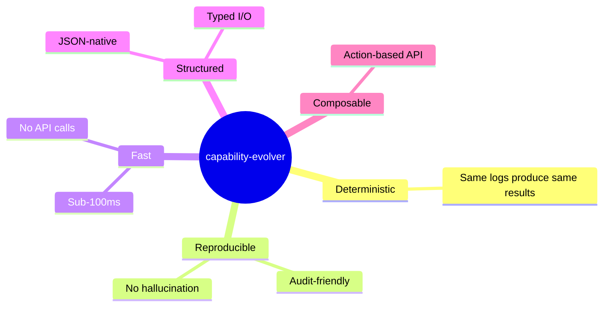
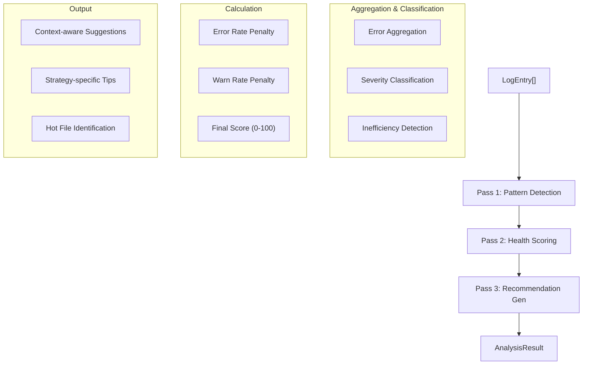
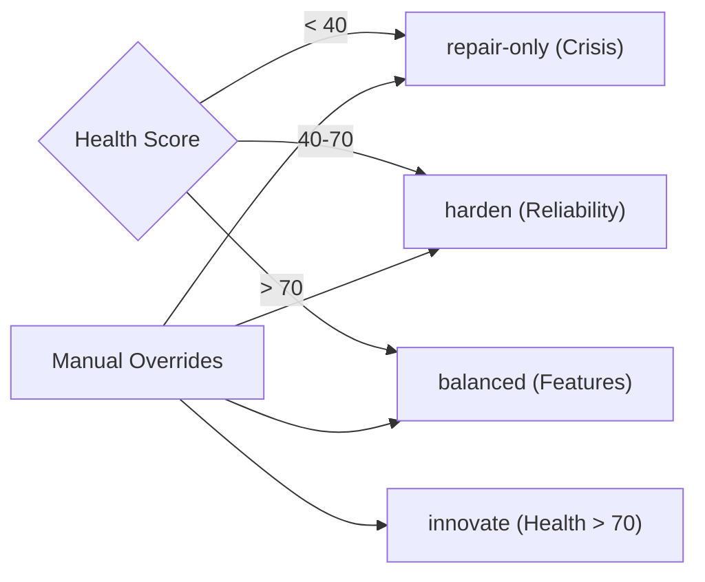
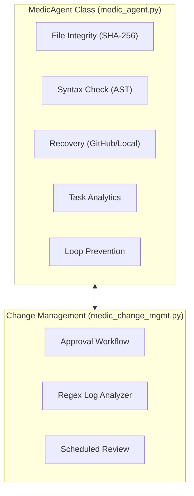
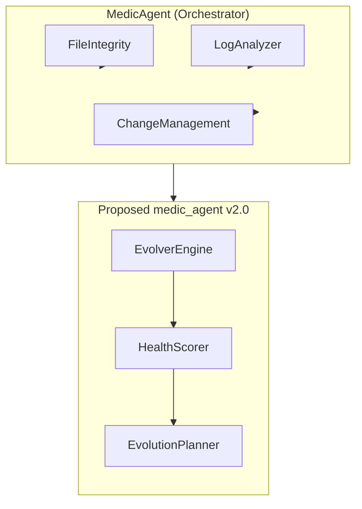

# Comprehensive Analysis: capability-evolver x medic_agent Cross-Reference

**Date:** 2026-04-21  
**Analyst:** Technical Documentation & Architecture Review  
**Scope:** Architectural pattern extraction, gap analysis, and integration roadmap  

---

## Table of Contents

1. [Executive Summary](#1-executive-summary)
2. [capability-evolver Architectural Deep Dive](#2-capability-evolver-architectural-deep-dive)
3. [medic_agent Current State Analysis](#3-medic_agent-current-state-analysis)
4. [Gap Analysis & Integration Points](#4-gap-analysis--integration-points)
5. [Architectural Recommendations](#5-architectural-recommendations)
6. [Implementation Strategies](#6-implementation-strategies)
7. [Concrete Code Examples](#7-concrete-code-examples)
8. [Prioritized Roadmap](#8-prioritized-roadmap)

---

## 1. Executive Summary

The **capability-evolver** project (github.com/kennyzir/capability-evolver) is a deterministic, pure-logic meta-skill for AI agent self-improvement. It analyzes structured runtime logs through a multi-pass analysis engine, computes health scores, detects patterns (errors, regressions, inefficiencies), and generates prioritized improvement proposals via configurable evolution strategies.

The **medic_agent** in ZenSynora is a system health monitoring and recovery agent with file integrity checking, error detection, change management, and basic log analysis capabilities.

### Key Finding
> **The medic_agent has solid foundational infrastructure but lacks the deterministic analysis engine, health scoring system, and structured evolution framework that capability-evolver demonstrates. Integrating these patterns would elevate medic_agent from a passive monitoring tool to an active self-improvement system.**

### Integration Value Matrix

| Capability | medic_agent | capability-evolver | Integration Priority |
|------------|-------------|-------------------|---------------------|
| File Integrity | ✅ SHA-256 hashes | ❌ | N/A |
| Syntax Validation | ✅ AST parsing | ❌ | N/A |
| Health Scoring | ❌ | ✅ 0-100 algorithm | **Critical** |
| Pattern Detection | ⚠️ Regex only | ✅ Multi-pass engine | **Critical** |
| Evolution Strategies | ❌ | ✅ 5 strategies | **High** |
| Error Cascades | ❌ | ✅ Time-window analysis | **High** |
| Regression Detection | ❌ | ✅ Statistical analysis | **Medium** |
| Inefficiency Detection | ❌ | ✅ Slow-op detection | **Medium** |
| Change Management | ✅ Full workflow | ❌ | N/A (extend) |
| Task Analytics | ✅ Basic stats | ❌ (consumes data) | **Medium** |

---

## 2. capability-evolver Architectural Deep Dive

### 2.1 Core Design Philosophy



### 2.2 Type System Architecture

capability-evolver uses a strongly-typed interface design that could be mapped to Python TypedDicts or dataclasses:

```typescript
// Core type hierarchy from handler.ts
LogEntry          → timestamp, level, message, context?, stack?
PatternEntry      → type, severity, description, occurrences, first_seen, last_seen, affected_files[]
AnalysisResult    → patterns[], health_score, recommendations[], summary{}
EvolutionProposal → evolution_id, strategy, recommendations[], risk_assessment{}, estimated_improvement
```

**Key Insight:** The type system enforces a clear data flow: `LogEntry[] → AnalysisResult → EvolutionProposal`. Each stage enriches the data without mutation side effects.

### 2.3 Multi-Pass Analysis Engine



### 2.4 Evolution Strategy Framework



### 2.5 Pattern Classification Taxonomy

| Type | Trigger | Severity Logic | Example |
|------|---------|---------------|---------|
| `error` | Single occurrence | count-based | One-off exception |
| `regression` | ≥3 occurrences | count-based | Repeated timeout |
| `inefficiency` | info + slow regex | frequency-based | Multiple slow DB queries |
| `drift` | (reserved) | N/A | Behavioral drift (future) |

### 2.6 Key Algorithms

#### Health Score Calculation
```typescript
// From handler.ts lines ~280-285
const healthScore = Math.max(0, Math.round(
  100 
  - (errorCount / Math.max(totalLogs, 1)) * 100 
  - (warnCount / Math.max(totalLogs, 1)) * 30
));
```

**Properties:**
- Bounded: [0, 100]
- Errors have 3.3× weight of warnings (100 vs 30 multiplier)
- Uses `Math.max(totalLogs, 1)` to prevent division by zero
- Rounded to integer for reproducibility

#### Pattern Severity Classification
```typescript
// From handler.ts lines ~265-270
const severity = data.count >= 10 ? 'critical' 
               : data.count >= 5 ? 'high' 
               : data.count >= 2 ? 'medium' 
               : 'low';
```

**Properties:**
- Logarithmic escalation (thresholds at 2, 5, 10)
- Deterministic — no ML or statistical variance
- Directly tied to business impact

---

## 3. medic_agent Current State Analysis

### 3.1 Architecture Overview



### 3.2 Strengths

1. **Comprehensive file integrity system** — SHA-256 hashing with registry persistence
2. **Multi-source recovery** — GitHub (curl) and local backup recovery paths
3. **Full change management lifecycle** — plan → approve → execute → rollback → audit
4. **Security validation** — AST-based forbidden import/call detection
5. **Integration points** — Gateway startup hook, config injection
6. **VirusTotal integration** — External malware scanning

### 3.3 Current Limitations

1. **No health scoring** — Cannot quantify "how healthy" the system is
2. **Naive log analysis** — Simple regex matching without pattern aggregation or severity classification
3. **No pattern detection** — Cannot identify repeated errors, cascades, or regressions
4. **Static analytics** — Task analytics are basic counts; no trend analysis or failure pattern detection
5. **No evolution framework** — Change management creates plans but doesn't generate recommendations from analysis
6. **No severity system** — All issues treated equally
7. **No time-window analysis** — Cannot distinguish clustered vs. distributed errors
8. **No strategy system** — Change management has priorities but no strategic evolution direction

### 3.4 Code Quality Observations

**Positive:**
- Clean separation between `MedicAgent` and `ChangeManagementSystem`
- Proper use of `async/await` for I/O operations
- Type hints throughout
- Consistent error handling with logger integration

**Areas for Improvement:**
- Global `config` variable (line 34) creates tight coupling
- `LoopDetector.check()` (line 545-551) has a bug — increments are never recorded, always returns `count=0`
- `subprocess.run(['curl', ...])` is platform-dependent (Windows doesn't have curl by default)
- File I/O is synchronous and blocking
- No timeout handling for file operations
- Missing input validation on public methods

---

## 4. Gap Analysis & Integration Points

### 4.1 Missing: Deterministic Health Scoring

**Current State:** medic_agent can check integrity and detect errors but produces qualitative output ("valid: 8, modified: 0").

**Gap:** No unified quantitative health metric that combines file integrity, error rates, task success, and log anomalies into a single score.

**Integration Point:** Add a `calculate_health_score()` method that aggregates:
- File integrity ratio (valid / total)
- Syntax error count
- Task success rate
- Log anomaly rate
- Recent failure trend

### 4.2 Missing: Pattern Detection Engine

**Current State:** `LogAnalyzer` uses 13 regex patterns to flag anomalies line-by-line.

**Gap:** No aggregation of similar errors, no classification into types (regression vs. inefficiency), no severity scoring based on frequency.

**Integration Point:** Replace regex-only approach with capability-evolver's Map-based aggregation:
```python
error_map: Dict[str, {count, first_seen, last_seen, files}] = {}
# Aggregate by message prefix, then classify
```

### 4.3 Missing: Evolution Strategy Framework

**Current State:** `ChangeManagementSystem` has `ChangePriority` (critical/high/medium/low) and `ChangeType` (config/code/security/patch/hotfix).

**Gap:** No strategic direction for improvements. A system with health score 95 should receive different recommendations than one with score 35.

**Integration Point:** Add `EvolutionStrategy` enum and auto-selection logic:
```python
if health_score < 40: strategy = "repair-only"
elif health_score < 70: strategy = "harden"
else: strategy = "balanced"
```

### 4.4 Missing: Error Cascade Detection

**Current State:** No detection of dependency chain failures.

**Gap:** If `auth-service.py` fails and then `payment-api.py` fails within a time window, medic_agent doesn't connect these events.

**Integration Point:** Add time-window correlation analysis:
```python
# If module A errors followed by module B errors within 60s → cascade
cascades = detect_cascades(logs, time_window_seconds=60)
```

### 4.5 Missing: Structured Recommendation Generation

**Current State:** `LogAnalyzer.should_trigger_change()` returns a boolean + reason string.

**Gap:** No structured, actionable recommendations with priority, category, affected files, and suggested approach.

**Integration Point:** Adopt capability-evolver's recommendation structure:
```python
@dataclass
class Recommendation:
    priority: Literal["immediate", "high", "medium", "low"]
    category: Literal["error-handling", "performance", "stability", "architecture", "monitoring"]
    description: str
    affected_files: List[str]
    suggested_approach: str
```

### 4.6 Missing: Inefficiency Detection

**Current State:** No detection of performance issues from logs.

**Gap:** Slow operations, timeouts, and retries are invisible unless they produce errors.

**Integration Point:** Add regex-based slow-op detection to `LogAnalyzer`:
```python
slow_ops = logs.filter(
    level="info" and regex_match(r"(\d{4,})ms|slow|timeout", message)
)
```

---

## 5. Architectural Recommendations

### 5.1 Refactor: Introduce `EvolverEngine` Class

Create a new core class that encapsulates capability-evolver's analysis patterns:



### 5.2 Refactor: Decouple Config from Global State

**Current:**
```python
config = None  # Global

def set_config(cfg):
    global config
    config = cfg
```

**Recommended:**
```python
@dataclass
class MedicConfig:
    enabled: bool = True
    enable_hash_check: bool = True
    repo_url: str = DEFAULT_REPO_URL
    scan_on_startup: bool = False
    max_loop_iterations: int = 100
    evolution_strategy: str = "auto"
    health_threshold_critical: int = 40
    health_threshold_warning: int = 70
    maintenance_window_start: Optional[int] = None
    maintenance_window_end: Optional[int] = None
```

### 5.3 Refactor: Async File I/O

**Current:**
```python
# Blocking synchronous I/O
path.write_text(content, encoding="utf-8")
content = path.read_text(encoding="utf-8")
```

**Recommended:**
```python
import aiofiles

async def read_file_async(path: Path) -> str:
    async with aiofiles.open(path, 'r', encoding='utf-8') as f:
        return await f.read()

async def write_file_async(path: Path, content: str) -> None:
    async with aiofiles.open(path, 'w', encoding='utf-8') as f:
        await f.write(content)
```

---

## 6. Implementation Strategies

### 6.1 Phase 1: Foundation — Health Scoring & Pattern Detection

**Approach:**
1. Create `myclaw/agents/medic_evolver.py` with `EvolverEngine` class
2. Keep existing `MedicAgent` unchanged but add composition

### 6.2 Phase 2: Integration — Connect to Change Management

**Approach:**
1. Extend `ChangeManagementSystem` to accept `EvolutionProposal` as input
2. Auto-generate change plans from detected patterns

### 6.3 Phase 3: Enhancement — Advanced Analytics

**Approach:**
1. Implement time-window correlation for cascade detection
2. Add health score history tracking

### 6.4 Phase 4: Optimization — Performance & Polish

**Approach:**
1. Migrate file I/O to async (aiofiles)
2. Add LRU cache for hash calculations

---

## 7. Prioritized Roadmap

### Critical Priority (Implement First)

| # | Feature | Files | Effort | Impact |
|---|---------|-------|--------|--------|
| 1 | **Fix LoopDetector.check() bug** | `medic_agent.py` | 1h | High — currently broken |
| 2 | **Create EvolverEngine** | `medic_evolver.py` (new) | 1d | Critical — core analysis |
| 3 | **Add health scoring to MedicAgent** | `medic_agent.py` | 4h | Critical — unified metric |

### High Priority (Week 2)

| # | Feature | Files | Effort | Impact |
|---|---------|-------|--------|--------|
| 4 | **Integrate evolver with LogAnalyzer** | `medic_change_mgmt.py` | 1d | High — better diagnostics |
| 5 | **Add evolution strategies to change mgmt** | `medic_change_mgmt.py` | 6h | High — strategic direction |

---

*End of Analysis*
