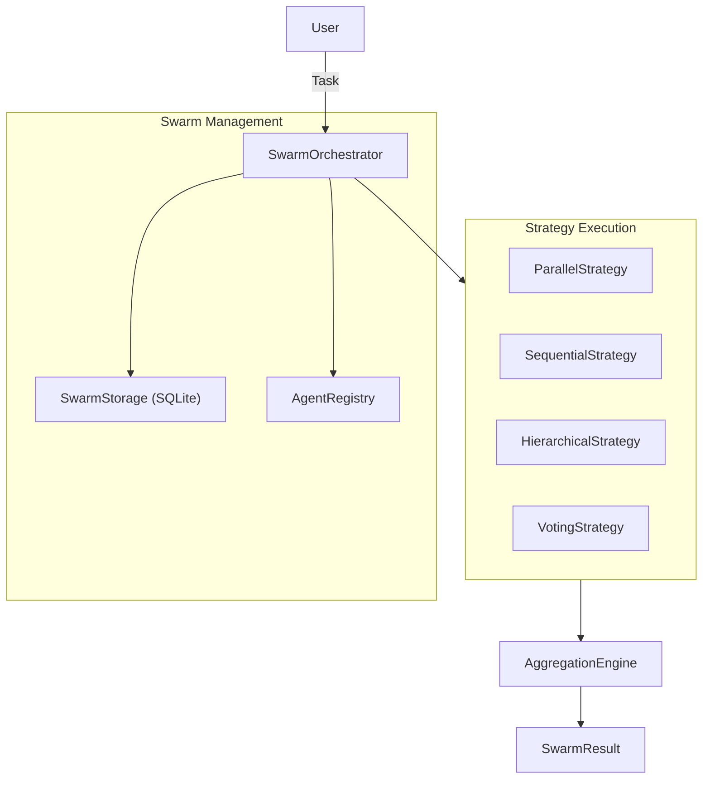
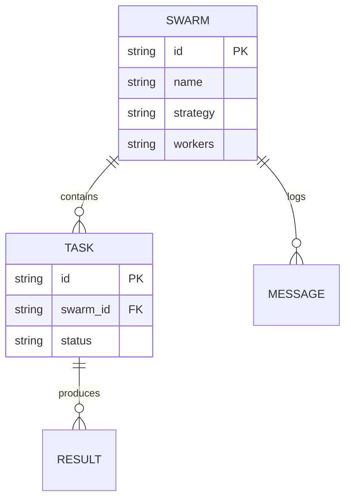

# Agent Swarm Implementation Plan

## Architecture

```mermaid
flowchart TD
    User -->|Task| Orchestrator
    
    subgraph SwarmSystem ["Swarm Management"]
        Orchestrator["SwarmOrchestrator"]
        Storage["SwarmStorage (SQLite)"]
        Registry["AgentRegistry"]
    end
    
    subgraph Execution ["Strategy Execution"]
        Parallel["ParallelStrategy"]
        Sequential["SequentialStrategy"]
        Hierarchical["HierarchicalStrategy"]
        Voting["VotingStrategy"]
    end
    
    Orchestrator --> Storage
    Orchestrator --> Registry
    Orchestrator --> Execution
    
    Execution --> Aggregator["AggregationEngine"]
    Aggregator --> Result["SwarmResult"]
```

## Database Schema

```mermaid
erDiagram
    SWARM ||--o{ TASK : contains
    TASK ||--o{ RESULT : produces
    SWARM ||--o{ MESSAGE : logs
    
    SWARM {
        string id PK
        string name
        string strategy
        string workers
    }
    TASK {
        string id PK
        string swarm_id FK
        string status
    }
```
