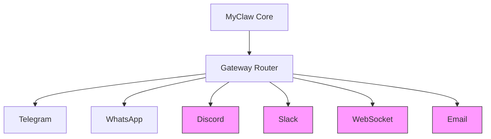

# MyClaw Future Updates & Add-ons Proposal

> **Generated:** 2026-03-19  
> **Last Verified:** 2026-04-15  
> **Application:** MyClaw (ZenSynora) - Personal AI Agent  
> **Mode:** Architect - Strategic Planning

---

## Executive Summary

MyClaw is a mature, feature-rich personal AI agent with robust support for multiple LLM providers, multi-channel communication (Telegram, WhatsApp), persistent memory, knowledge management, and agent swarms. This document identifies strategic opportunities for future enhancements across seven key categories.

---

## Current State Assessment

### ✅ Implemented Features (35+ Optimizations Complete)

| Category | Features |
|----------|----------|
| **Providers** | Ollama, LM Studio, llama.cpp, OpenAI, Anthropic, Gemini, Groq, OpenRouter |
| **Channels** | CLI, Telegram Bot, WhatsApp Business Cloud API |
| **Memory** | SQLite persistence, FTS5 search, context summarization, per-user isolation |
| **Tools** | Shell, file I/O, web browsing, downloads, delegation, scheduling |
| **Knowledge** | Markdown notes, FTS5 indexing, graph relations, observations |
| **Swarms** | Parallel, sequential, hierarchical, voting strategies |
| **Security** | Command allowlist/blocklist, path validation, rate limiting, audit logs |
| **Performance** | Connection pooling, caching, streaming, lazy initialization |

### 🔄 Partially Implemented

- Streaming responses (basic support exists, tool calls not yet supported in streaming mode)
- Webhook mode for Telegram (production-ready)

### ❌ Not Yet Implemented

- Discord/Slack integration (mentioned in ../ANALYSIS.md as pending)
- Comprehensive test suite (marked as LOW PRIORITY in ../tasktodo.md)

---

## Proposed Future Updates

### 1. 📱 New Channel Integrations

#### Priority: HIGH

| Channel | Description | Complexity |
|---------|-------------|------------|
| **Discord Bot** | Full-featured Discord bot with slash commands, modal interactions, thread support | Medium |
| **Slack App** | Slack app with Slack-specific features (shortcuts, modals, workflow) | Medium |
| **WebSocket Gateway** | Real-time bidirectional communication for web apps | Low |
| **Matrix Protocol** | Decentralized messaging via Matrix | Medium |
| **Signal** | Privacy-focused messaging platform | High |
| **Email (IMAP/SMTP)** | Email-based agent interaction | Medium |

#### Mermaid: Channel Architecture Expansion



---

### 2. 🤖 Advanced AI Capabilities

#### Priority: HIGH

#### 2.1 Multimodal Support
- **Image understanding** - Process images sent via any channel
- **Vision-capable tools** - OCR, image analysis, chart interpretation
- **Provider support**: Anthropic Claude Vision, OpenAI GPT-4V, Gemini Vision

#### 2.2 Voice I/O
- **Speech-to-text** - Voice message transcription (Whisper integration)
- **Text-to-speech** - Voice response generation
- **Real-time voice** - Voice conversations via WebRTC

#### 2.3 Enhanced Tool Calling
- **Streaming tool execution** - Currently streaming returns chunks but tool calls not supported
- **Parallel tool execution** - Execute multiple independent tools simultaneously
- **Tool retry logic** - Automatic retry with exponential backoff for failed tools

---

### 3. 🧠 Enhanced Memory & Knowledge

#### Priority: MEDIUM

#### 3.1 Long-term Memory System
- **Semantic memory** - Store important facts with importance scoring
- **Automatic fact extraction** - Extract and store facts from conversations
- **Memory decay** - Low-importance memories fade over time
- **Memory consolidation** - Periodic summarization and merging

#### 3.2 Knowledge Graph Enhancements
- **Entity linking** - Auto-link related entities across notes
- **Temporal reasoning** - Time-based relationships and queries
- **Visualization** - Generate knowledge graph diagrams
- **Export formats** - GraphML, JSON-LD for external tools

#### 3.3 RAG (Retrieval-Augmented Generation)
- **Document ingestion** - PDF, DOCX, txt parsing
- **Chunking strategies** - Configurable text chunking
- **Vector embeddings** - Semantic search via embeddings (optional)

---

### 4. 🎨 Developer Experience

#### Priority: HIGH

#### 4.1 REST API Server
- **Expose agent capabilities** via RESTful API
- **Authentication** - API keys, OAuth2
- **Rate limiting** - Per-client rate limits
- **Swagger docs** - Auto-generated API documentation

#### 4.2 Plugin System
```
myclaw/
├── plugins/
│   ├── __init__.py
│   ├── calendar.py      # Calendar integration plugin
│   ├── email.py        # Email plugin
│   └── custom.py       # Template for custom plugins
```
- **Plugin interface** - Standardized plugin API
- **Hot reloading** - Load/unload plugins without restart
- **Plugin marketplace** - Community-shared plugins

#### 4.3 Web Dashboard
- **Agent management UI** - Create/edit agents visually
- **Conversation history** - Browse and search past conversations
- **Knowledge base editor** - Rich markdown editor
- **Settings & configuration** - Web-based config editor

---

### 5. 🔐 Security & Compliance

#### Priority: MEDIUM

#### 5.1 Enhanced Security
- **Data encryption** - Encrypt sensitive data at rest (AES-256)
- **Secret management** - Integration with HashiCorp Vault, AWS Secrets Manager
- **Input sanitization** - LLM prompt injection prevention
- **Audit logging** - Comprehensive audit trail with log export

#### 5.2 Access Control
- **Role-based access** - Admin, power user, standard user roles
- **Channel-specific permissions** - Different access per channel
- **Tool permissions** - Granular tool access control per role

---

### 6. 📅 Productivity Features

#### Priority: MEDIUM

| Feature | Description | Integration |
|---------|-------------|-------------|
| **Calendar** | Schedule management, meeting prep | Google Calendar, CalDAV |
| **Email** | Send/receive emails | IMAP/SMTP |
| **RSS/Atom** | News feed aggregation | Feedparser |
| **Reminders** | Enhanced reminder system | System notifications |
| **Task Management** | Todo list integration | Todoist, Things, local |

---

### 7. ⚙️ System Integration

#### Priority: LOW-MEDIUM

| Feature | Platform | Description |
|---------|----------|-------------|
| **System Tray** | Windows/macOS/Linux | Background operation with tray icon |
| **Desktop Notifications** | All | Native OS notifications |
| **Global Shortcuts** | All | Trigger agent via keyboard shortcut |
| **File Watcher** | All | Auto-process files in directory |
| **Home Assistant** | Smart home | Home Assistant integration |

---

## Implementation Roadmap

### Phase 1: Quick Wins (1-2 Sprints)
- [ ] Streaming tool execution
- [ ] Discord bot (basic)
- [ ] REST API server
- [ ] Image understanding (multimodal)

### Phase 2: Core Enhancements (2-4 Sprints)
- [ ] Plugin system
- [ ] Voice I/O
- [ ] Long-term memory
- [ ] Web dashboard (MVP)

### Phase 3: Ecosystem Expansion (4-6 Sprints)
- [ ] Slack integration
- [ ] Email integration
- [ ] Calendar integration
- [ ] Knowledge graph visualization

### Phase 4: Advanced Features (Ongoing)
- [ ] Vector embeddings for RAG
- [ ] Signal integration
- [ ] Matrix protocol
- [ ] Advanced encryption

---

## Recommendations

### Top 5 Priorities

1. **REST API Server** - Enables programmatic access, web UI integration, third-party integrations
2. **Discord Bot** - Popular platform, requested in ../ANALYSIS.md
3. **Streaming Tool Execution** - Improves UX significantly
4. **Plugin System** - Extensibility for future integrations
5. **Multimodal Support** - Image understanding is increasingly expected

### Resource Considerations

- **Team size**: 1-2 developers recommended
- **Timeline**: 3-6 months for Phase 1-2
- **External services**: API keys for Discord, Slack (free tier sufficient)
- **Infrastructure**: No additional server requirements for basic deployment

---

## Risk Assessment

| Risk | Likelihood | Impact | Mitigation |
|------|------------|--------|------------|
| Provider API changes | Medium | Medium | Abstract provider layer, version pinning |
| Channel API rate limits | High | Low | Implement robust rate limiting |
| Security vulnerabilities | Low | High | Regular audits, input validation |
| Feature bloat | Medium | Medium | Prioritize based on user feedback |

---

## Conclusion

MyClaw is well-architected with 35+ optimizations already implemented. The focus for future development should be:

1. **Opening the platform** via REST API and plugins
2. **Expanding reach** via new channels (Discord, Slack)
3. **Enhancing capabilities** via multimodal and streaming

These priorities maintain the core strengths while making the platform more accessible and powerful for users and developers alike.

---

*Document generated for MyClaw (ZenSynora) strategic planning*