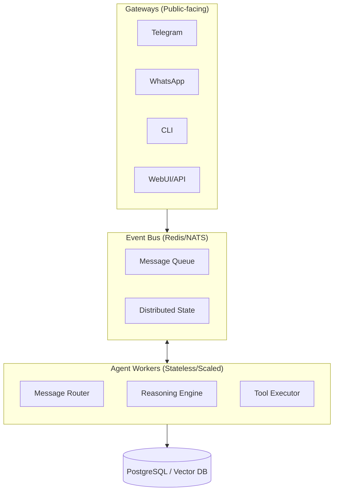
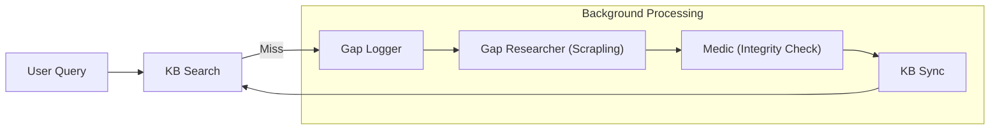
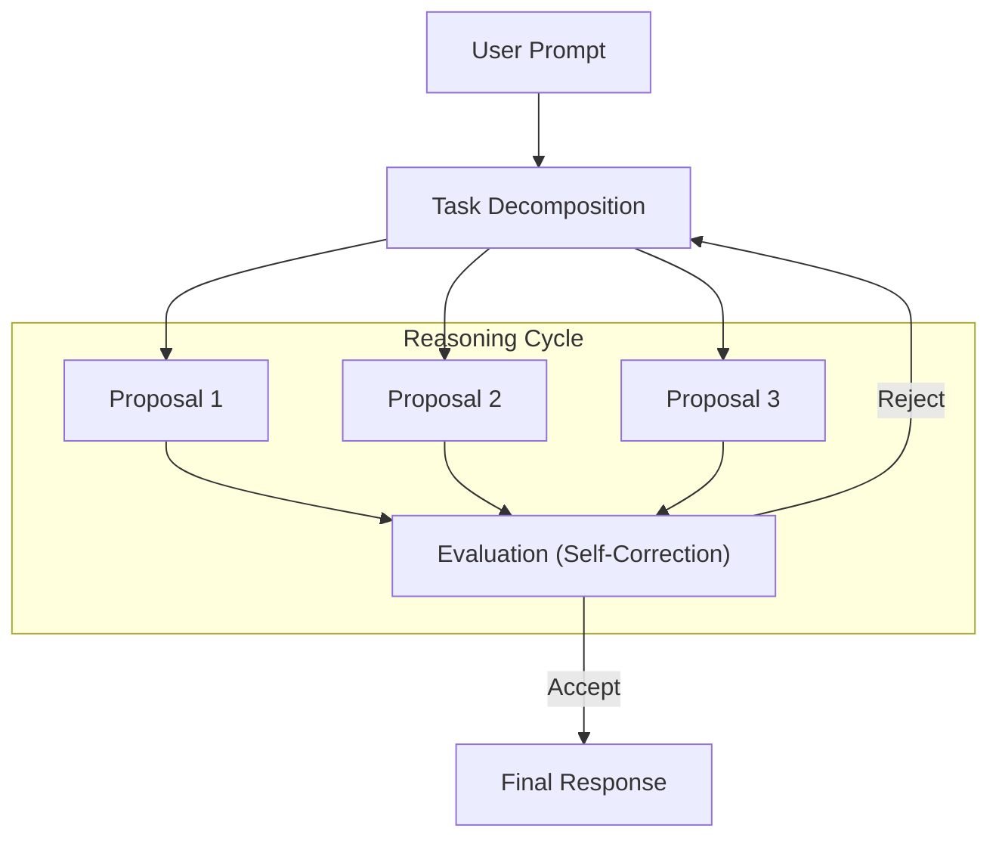
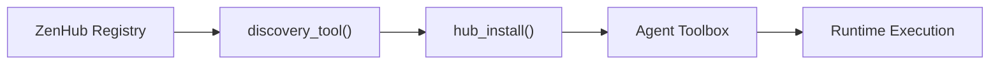

# Future Updates Proposal: MyClaw Architecture Evolution

## Overview

As MyClaw transitions into ZenSynora, the architecture must evolve to support high-scale multi-user environments, advanced reasoning patterns, and proactive system evolution. This document proposes architectural updates for Phases 8 and 9.

## 1. Event-Driven Core

Transition from the current direct function call model to an asynchronous event-driven core using a high-performance message bus.

### Proposed Architecture

### Benefits
- **Horizontal Scalability**: Spin up more worker processes as load increases.
- **Resilience**: Messages persist in the bus if workers crash.
- **Asynchronous Processing**: Long-running reasoning tasks don't block the gateway.

## 2. Proactive "Self-Healing" Knowledge Loop

Integration of the `GapResearcher` with the `MedicAgent` to create a system that automatically identifies and fills knowledge gaps.

## 3. Advanced Reasoning Trajectories

Implementing "Tree of Thought" or "Chain of Note" reasoning directly into the `Agent.think()` process.

## 4. Multi-Tenant Memory Isolation

Strict cryptographic isolation of user data for multi-user cloud deployments.

- **Encrypted-at-Rest SQLite**: Per-user encryption keys.
- **Contextual Namespacing**: Automatic prefixing of all KB and history queries with `user_id`.
- **Stateless Tool Execution**: Per-request ephemeral Docker containers for shell operations.

## 5. Plugin Marketplace (ZenHub)

A standardized interface for distributing and installing "Skills" (Toolbox tools) and "Agent Profiles".

## Implementation Timeline

| Update | Target Version | Complexity |
|--------|----------------|------------|
| Event-Driven Core | v0.6.0 | High |
| Proactive Loop | v0.5.0 | Medium |
| Advanced Reasoning | v0.5.5 | High |
| Multi-Tenant Isolation | v0.7.0 | High |
| ZenHub | v0.4.5 | Medium |

---
*Last Updated: 2026-04-21*
*Status: Proposal*
