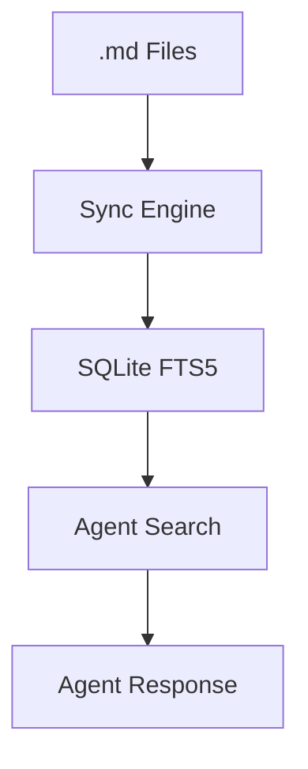

# Knowledge Integration Plan

## Overview
Integration of Markdown-first knowledge storage with SQLite FTS5 indexing.

## Diagram

## Status
- [x] Initial design
- [x] FTS5 Implementation
- [x] Relation mapping
- [x] Integration with `Agent.think()`
