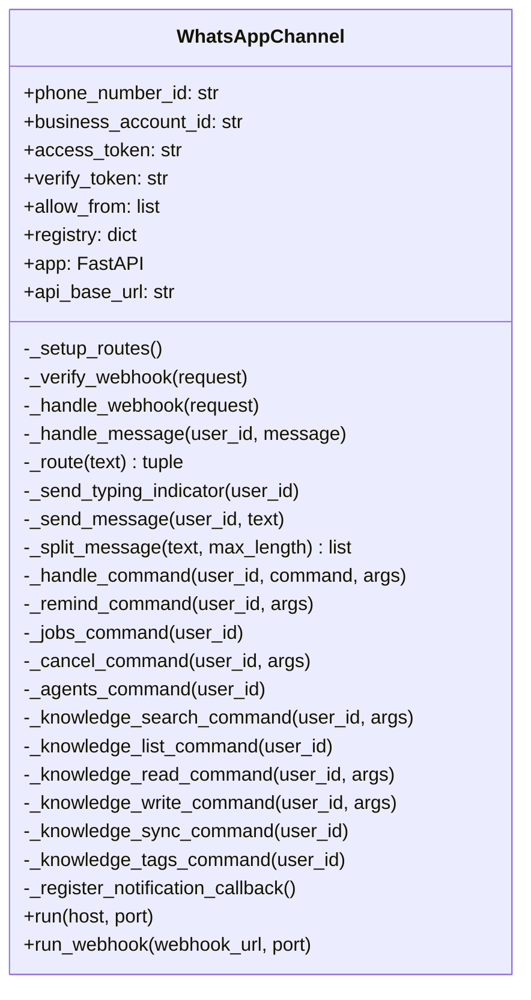

# WhatsApp Channel Implementation Plan

## Overview

This document describes the implementation of WhatsApp as a communication channel for the MyClaw agent framework, mirroring the existing Telegram channel functionality. The implementation uses the **WhatsApp Business Cloud API** (Meta Graph API) with a **FastAPI webhook server** to receive and respond to messages.

## Architecture

```mermaid
flowchart TD
    A[WhatsApp User] -->|Sends message| B[Meta Cloud API]
    B -->|Webhook POST| C[FastAPI Server - /webhook]
    C -->|Parse payload| D[WhatsAppChannel._handle_webhook]
    D -->|Text message| E{Command or Agent?}
    E -->|/command| F[Command Handler]
    E -->|@agent or plain text| G[Agent Router]
    G -->|agent.think| H[MyClaw Agent]
    H -->|Response| I[WhatsApp Cloud API - Send Message]
    I -->|Delivered| A
    F -->|Result| I

    J[Meta Cloud API] -->|GET /webhook| K[Webhook Verification]
    K -->|hub.challenge| J
```

## Technology Choice: WhatsApp Business Cloud API

### Why Cloud API over third-party libraries

| Approach | Pros | Cons |
|----------|------|------|
| **WhatsApp Business Cloud API** | Official, reliable, free tier, no bans | Requires Meta Business account, webhook server |
| Twilio WhatsApp API | Easy setup, good docs | Paid per message, adds middleman |
| whatsapp-web.js / Baileys | No business account needed | Unofficial, risk of bans, fragile |
| Green API | Simple REST API | Paid, third-party dependency |

**Decision**: WhatsApp Business Cloud API — it is the official, free, and most reliable approach. It uses the same webhook pattern as many other integrations and fits naturally into the existing MyClaw architecture.

### Dependencies Added

- `fastapi>=0.100.0` — ASGI web framework for the webhook server
- `uvicorn>=0.23.0` — ASGI server to run FastAPI
- `requests` — already in requirements, used for sending messages to the Cloud API

## Files Modified / Created

### Created

| File | Purpose |
|------|---------|
| [`myclaw/channels/whatsapp.py`](myclaw/channels/whatsapp.py) | WhatsApp channel implementation with webhook server, message handling, agent routing, and all commands |

### Modified

| File | Changes |
|------|---------|
| [`myclaw/config.py`](myclaw/config.py) | Added `WhatsAppConfig` model, added `whatsapp` to `ChannelsConfig`, added env var overrides for WhatsApp credentials |
| [`myclaw/gateway.py`](myclaw/gateway.py) | Added WhatsApp channel import and startup logic |
| [`myclaw/tools/`](myclaw/tools/) | Added `set_notification_callback()` for channel-agnostic scheduled job notifications; updated `_create_job_internal` to use callback when available |
| [`requirements.txt`](requirements.txt) | Added `fastapi>=0.100.0` and `uvicorn>=0.23.0` |

## Configuration

### Config JSON Structure

Add to `~/.myclaw/config.json`:

```json
{
  "channels": {
    "whatsapp": {
      "enabled": true,
      "phone_number_id": "YOUR_PHONE_NUMBER_ID",
      "business_account_id": "YOUR_BUSINESS_ACCOUNT_ID",
      "access_token": "YOUR_PERMANENT_ACCESS_TOKEN",
      "verify_token": "YOUR_CUSTOM_VERIFY_TOKEN",
      "allowFrom": ["1234567890"]
    }
  }
}
```

### Environment Variable Overrides

| Config Key | Environment Variable |
|------------|---------------------|
| `channels.whatsapp.phone_number_id` | `MYCLAW_WHATSAPP_PHONE_NUMBER_ID` |
| `channels.whatsapp.business_account_id` | `MYCLAW_WHATSAPP_BUSINESS_ACCOUNT_ID` |
| `channels.whatsapp.access_token` | `MYCLAW_WHATSAPP_ACCESS_TOKEN` |
| `channels.whatsapp.verify_token` | `MYCLAW_WHATSAPP_VERIFY_TOKEN` |

## WhatsApp Business Setup Guide

### Step 1: Create a Meta Developer Account

1. Go to [developers.facebook.com](https://developers.facebook.com)
2. Create a developer account if you do not have one
3. Create a new App — select **Business** type
4. Add the **WhatsApp** product to your app

### Step 2: Get API Credentials

1. In the WhatsApp section of your app, go to **API Setup**
2. Note your **Phone Number ID** and **WhatsApp Business Account ID**
3. Generate a **Permanent Access Token**:
   - Go to **System Users** in Business Settings
   - Create a system user with admin access
   - Generate a token with `whatsapp_business_messaging` permission

### Step 3: Configure Webhook

1. Set up a publicly accessible server (use ngrok for development)
2. In the WhatsApp app settings, go to **Configuration** > **Webhook**
3. Set the callback URL to `https://your-domain.com/webhook`
4. Set the verify token to match your `verify_token` in config
5. Subscribe to the `messages` webhook field

### Step 4: Development with ngrok

For local development:

```bash
# Start ngrok tunnel
ngrok http 8000

# Use the HTTPS URL from ngrok as your webhook URL
# Example: https://abc123.ngrok.io/webhook
```

## Implementation Details

### WhatsAppChannel Class

The [`WhatsAppChannel`](myclaw/channels/whatsapp.py:33) class mirrors the [`TelegramChannel`](myclaw/channels/telegram.py:33) structure:



### Message Flow

1. **Webhook Verification**: Meta sends a GET request with `hub.verify_token` and `hub.challenge`. The server validates the token and returns the challenge.

2. **Incoming Messages**: Meta sends a POST request with the message payload. The handler:
   - Extracts the sender's WhatsApp ID (`wa_id`)
   - Checks if the sender is in `allowFrom`
   - Parses `/commands` or routes to agents via `@agentname` prefix
   - Sends the response back via the Cloud API

3. **Message Splitting**: WhatsApp has a 4096-character limit per message. Long responses are automatically split at newlines or spaces.

### Supported Commands

All commands from Telegram are supported with `/` prefix:

| Command | Description |
|---------|-------------|
| `/remind <seconds> <message>` | Schedule a one-shot reminder |
| `/remind every <seconds> <message>` | Schedule a recurring reminder |
| `/jobs` | List all active scheduled jobs |
| `/cancel <job_id>` | Cancel a scheduled job |
| `/agents` | List available named agents |
| `/knowledge_search <query>` | Search the knowledge base |
| `/knowledge_list` | List all knowledge notes |
| `/knowledge_read <permalink>` | Read a specific note |
| `/knowledge_write <title> \| <content>` | Create a new note |
| `/knowledge_sync` | Sync knowledge base |
| `/knowledge_tags` | List all tags |

### Agent Routing

Same as Telegram — prefix messages with `@agentname`:

```
@coder write a binary search function
@default what is the weather today
```

### Notification System

The implementation adds a channel-agnostic notification callback to [`tools.py`](myclaw/tools/):

- [`set_notification_callback(callback)`](myclaw/tools/:66) — registers an async callback function
- [`_create_job_internal()`](myclaw/tools/:564) — updated to try the callback first, then fall back to Telegram's `context.bot.send_message`

This ensures scheduled jobs can send results back to WhatsApp users without depending on Telegram's bot object.

## Remaining Work

### High Priority — ✅ COMPLETED

- [x] Add `/help` command listing all available commands
- [x] Handle media messages (images, documents, audio, video, sticker, location)
- [x] Add message deduplication (`_MessageDeduplicator` with LRU cache + TTL)
- [x] Add webhook signature verification (`X-Hub-Signature-256` via `_verify_signature()`)

### Medium Priority — ✅ COMPLETED

- [x] Add rate limiting (`_RateLimiter` token-bucket per user, 10 tokens, 0.5/s refill)
- [x] Add health check endpoint (`GET /health`)
- [x] Support WhatsApp interactive messages (buttons, lists) — [`_send_interactive_buttons()`](myclaw/channels/whatsapp.py:433), [`_send_interactive_list()`](myclaw/channels/whatsapp.py:471)
- [x] Support WhatsApp message templates for proactive messaging — [`send_template_message()`](myclaw/channels/whatsapp.py:518)

### Low Priority

- [x] Add message read receipts — [`_mark_as_read()`](myclaw/channels/whatsapp.py:348)
- [x] Add metrics/monitoring for message throughput — [`_Metrics`](myclaw/channels/whatsapp.py:92) class, available at `GET /health`
- [x] Support WhatsApp Business Profile management — [`get_business_profile()`](myclaw/channels/whatsapp.py:573) (placeholder, Meta API limited)
- [ ] WhatsApp Flows for structured interactions — requires Meta Business Manager setup, not purely code

## Testing

### Manual Testing Checklist

1. Start the server: `python cli.py agent` with WhatsApp enabled in config
2. Verify webhook: Meta should successfully verify the webhook URL
3. Send a text message from an allowed number
4. Test `/agents` command
5. Test `@agentname` routing
6. Test `/remind 10 hello` scheduling
7. Test `/knowledge_search` and other knowledge commands
8. Test long message splitting (send a query that produces a long response)
9. Test message from a non-allowed number (should be ignored)

### Automated Testing

Tests should be added to `tests/` covering:

- Webhook verification (GET /webhook)
- Message parsing from webhook payload
- Command parsing
- Agent routing
- Message splitting
- Access control (allowFrom filtering)

## Security Considerations

1. **Access Control**: Only phone numbers in `allowFrom` can interact with the bot
2. **Webhook Verification**: The verify token prevents unauthorized webhook registration
3. **Signature Verification**: TODO — validate `X-Hub-Signature-256` header on incoming webhooks
4. **Token Security**: Access token is stored as `SecretStr` in Pydantic config
5. **Environment Variables**: All sensitive values can be set via environment variables instead of config file
