# Exception Handling Implementation

> Document created: 2026-03-19

## Overview

This document describes the comprehensive exception handling implementation added to the MyClaw framework. This addresses the "Specific exception handling" item from the Low Priority category in the planA.md implementation roadmap.

## Changes Made

### 1. Enhanced Exception Hierarchy (`myclaw/exceptions.py`)

The exception module was expanded from 8 exception classes to 35+ specific exception classes organized in a clear hierarchy:

```mermaid
graph TD
    Base["MyClawError (base)"] --> Config["ConfigurationError"]
    Base --> Prov["ProviderError"]
    Base --> Tool["ToolExecutionError"]
    Base --> Mem["MemoryError"]
    Base --> KB["KnowledgeBaseError"]
    Base --> Route["AgentRoutingError"]
    Base --> Swarm["SwarmError"]
    Base --> Chan["ChannelError"]

    Config --> CVE["ConfigValidationError"]
    Config --> CNE["ConfigNotFoundError"]

    Prov --> PNE["ProviderNotFoundError"]
    Prov --> PTE["ProviderTimeoutError"]
    Prov --> PCE["ProviderConnectionError"]
    Prov --> PAE["ProviderAuthenticationError"]
    Prov --> PRE["ProviderRateLimitError"]

    Tool --> RLE["RateLimitExceededError"]
    Tool --> TNE["ToolNotFoundError"]
    Tool --> TVE["ToolValidationError"]
    Tool --> TPE["ToolPermissionError"]

    Mem --> MCE["MemoryConnectionError"]
    Mem --> MQE["MemoryQueryError"]
    Mem --> MCLE["MemoryCleanupError"]

    KB --> KNE["KnowledgeNotFoundError"]
    KB --> KPE["KnowledgeParseError"]
    KB --> KSE["KnowledgeSyncError"]

    Route --> ANE["AgentNotFoundError"]
    Route --> ANAE["AgentNotAvailableError"]

    Swarm --> SNE["SwarmNotFoundError"]
    Swarm --> STE["SwarmTimeoutError"]
    Swarm --> SVE["SwarmValidationError"]
    Swarm --> SCE["SwarmConcurrencyError"]

    Chan --> CHNE["ChannelNotFoundError"]
    Chan --> CHAE["ChannelAuthenticationError"]
    Chan --> CHWE["ChannelWebhookError"]
```



### 2. Enhanced Exception Features

All exceptions now include:
- **Custom message**: Detailed error description
- **Details dictionary**: Context-specific information (provider name, timeout values, file paths, etc.)
- **Rich `__str__` method**: Shows both message and details

Example usage:
```python
# Before
raise ValueError("openai.api_key is not set in config.")

# After
raise ProviderAuthenticationError(
    "openai.api_key is not set in config.",
    provider="openai"
)
# Output: "openai.api_key is not set in config. (provider=openai)"
```

### 3. Files Updated

| File | Changes |
|------|---------|
| `myclaw/exceptions.py` | Expanded from 8 to 35+ exception classes |
| `myclaw/tools/` | Updated to use `ToolValidationError`, `ToolPermissionError` |
| `myclaw/provider.py` | Updated to use `ProviderTimeoutError`, `ProviderConnectionError`, `ProviderAuthenticationError`, `ProviderNotFoundError` |
| `myclaw/swarm/orchestrator.py` | Updated to use `SwarmError`, `SwarmNotFoundError`, `SwarmConcurrencyError`, `AgentNotFoundError` |
| `myclaw/swarm/models.py` | Updated to use `SwarmValidationError` |
| `myclaw/memory.py` | Updated to use `MemoryError` |
| `myclaw/knowledge/storage.py` | Updated to use `KnowledgeBaseError`, `KnowledgeParseError` |
| `myclaw/knowledge/db.py` | Updated to use `KnowledgeNotFoundError` |

## Benefits

1. **Better Error Messages**: Exceptions now include context-specific details for easier debugging
2. **Structured Error Handling**: Catch specific exceptions instead of generic ones
3. **Improved Debugging**: Details dictionary provides additional context (timeouts, paths, etc.)
4. **Consistent Error Format**: All MyClaw exceptions follow the same structure

## Usage Examples

### Catching Specific Exceptions

```python
from myclaw.exceptions import (
    ProviderError,
    ProviderTimeoutError,
    ProviderAuthenticationError
)

try:
    response = await provider.chat(messages)
except ProviderAuthenticationError as e:
    logger.error(f"API key issue: {e.message}")
    # Handle missing/invalid API key
except ProviderTimeoutError as e:
    logger.warning(f"Request timed out after {e.details.get('timeout_seconds')}s")
    # Retry with longer timeout
except ProviderError as e:
    logger.error(f"Provider error: {e.message}")
    # Handle generic provider error
```

### Raising Exceptions with Details

```python
from myclaw.exceptions import SwarmConcurrencyError

raise SwarmConcurrencyError(
    f"Maximum concurrent swarms ({max}) reached.",
    max_concurrent=max,
    current_count=current
)
```

## Backward Compatibility

The changes maintain backward compatibility:
- All new exceptions inherit from existing base classes (`MyClawError`, `ProviderError`, etc.)
- Code catching `ValueError`, `RuntimeError` etc. will still work (but should be updated)
- Error messages remain human-readable

## Testing

Run the test suite to verify:

```bash
python -m pytest tests/ -v
```
