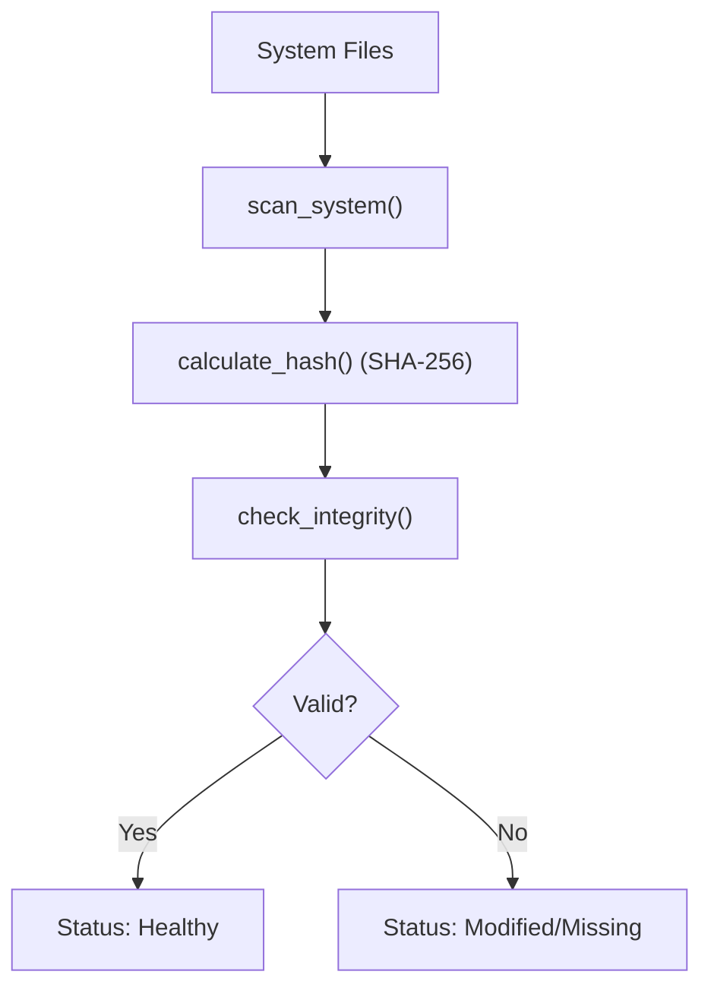
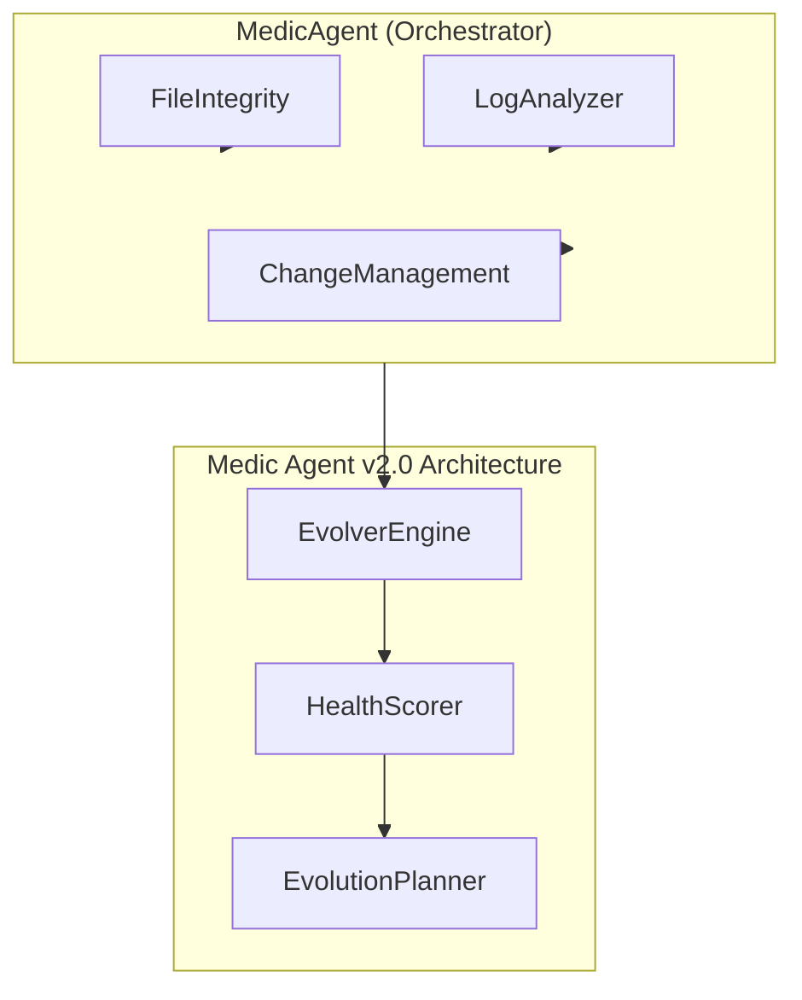

# ZenSynora Medic Agent Guide

## Overview

The Medic Agent is ZenSynora's system health monitoring and recovery system. It provides:
- File integrity verification using SHA-256 hashing
- Error detection in Python files
- Recovery from GitHub or local backups
- Task execution analytics
- Infinite loop prevention
- VirusTotal malware scanning
- Local backup management

## Installation & Configuration

### Prerequisites

- Python 3.9+
- ZenSynora core installed
- Network access (for GitHub recovery)

### Configuration

Add to your `config.py`:

```python
medic = {
    "enabled": True,
    "enable_hash_check": True,
    "repo_url": "https://github.com/YOUR_USERNAME/zensynora",
    "scan_on_startup": True,
    "max_loop_iterations": 100,
}
```

### Startup Health Check

When both `medic.enabled` and `medic.scan_on_startup` are `True`, gateway startup runs a Medic health scan before channels are started.

- Trigger point: `myclaw.gateway.start()`
- Behavior: logs `"Starting health check..."` and scan results
- Failure mode: graceful degradation (exceptions are logged, startup continues)

Example startup config:

```json
{
  "medic": {
    "enabled": true,
    "scan_on_startup": true
  }
}
```

## Usage

### 1. Check System Health

Check overall system health status:

```python
from myclaw.agents.medic_agent import check_system_health

result = check_system_health()
print(result)
```

**Output Example:**
```
🏥 ZenSynora Health Report

Timestamp: 2026-03-29T12:00:00Z

File Integrity:
  Valid: 8
  Modified: 0
  Missing: 0

Task Analytics:
  - shell_execution: 50 runs, 95.0% success, 0.32s avg
  - file_operation: 25 runs, 100.0% success, 0.15s avg

Status: ✅ Healthy
```

### 2. Verify File Integrity

Verify files against recorded hashes:

```python
from myclaw.agents.medic_agent import verify_file_integrity

# Check specific file
result = verify_file_integrity("myclaw/agent.py")

# Check all tracked files
result = verify_file_integrity()
```

**Output:**
```
📋 Integrity Check for all files

Valid: 8
Modified: 0
Missing: 0
```

### 3. Scan Files for Baseline

Scan files and record their hashes:

```python
from myclaw.agents.medic_agent import scan_files

# Scan default files
result = scan_files()

# Scan specific files
result = scan_files("myclaw/agent.py,myclaw/tools.py,myclaw/config.py")
```

**Output:**
```
📊 Scan complete:
  Scanned: 8 files
  Errors: 0
  Registry updated: True
```

### 4. Recover Corrupted/Missing File

Recover a file from GitHub:

```python
from myclaw.agents.medic_agent import recover_file
import asyncio

result = asyncio.run(recover_file("myclaw/agent.py"))
print(result)
```

**Output:**
```
✅ File recovered from GitHub: myclaw/agent.py
New hash: abc123...
```

### 5. Validate Modification

Validate code before applying:

```python
from myclaw.agents.medic_agent import validate_modification

code = """
import os
def hello():
    return "Hello"
"""

result = validate_modification(code, "new_module.py")
print(result)
```

**Output:**
```
✅ Modification validated for new_module.py
```

### 6. Detect Errors in File

Detect syntax errors in a Python file:

```python
from myclaw.agents.medic_agent import detect_errors_in_file

result = detect_errors_in_file("myclaw/agent.py")
print(result)
```

**Output:**
```
✅ myclaw/agent.py: No syntax errors found
```

### 7. Record Task Execution

Record task for analytics:

```python
from myclaw.agents.medic_agent import record_task_execution

result = record_task_execution("shell_execution", 0.325, True)
print(result)
```

**Output:**
```
✅ Task 'shell_execution' recorded: 0.33s
```

### 8. Get Task Analytics

Get task execution statistics:

```python
from myclaw.agents.medic_agent import get_task_analytics

result = get_task_analytics()
print(result)
```

**Output:**
```
📊 Task Analytics

  • shell_execution
    Runs: 50 | Success: 95.0% | Avg: 0.32s
  • file_operation
    Runs: 25 | Success: 100.0% | Avg: 0.15s

Total entries: 75
```

### 9. Enable/Disable Hash Check

Toggle hash checking:

```python
from myclaw.agents.medic_agent import enable_hash_check

result = enable_hash_check(False)
print(result)
```

**Output:**
```
ℹ️ Hash checking disabled (config update pending restart)
```

### 10. Prevent Infinite Loop

Check loop prevention status:

```python
from myclaw.agents.medic_agent import prevent_infinite_loop

result = prevent_infinite_loop()
print(result)
```

**Output:**
```
✅ Loop prevention active. Calls: 12/50
```

## Data Flow



## API Reference

### MedicAgent Class

```python
class MedicAgent:
    def __init__(self, repo_url: str = DEFAULT_REPO_URL)
    def calculate_hash(file_path: str) -> Optional[str]
    def check_integrity(file_path: Optional[str] = None) -> Dict
    def scan_system(files: Optional[List[str]] = None) -> Dict
    def detect_errors(file_path: str) -> Dict
    def validate_modification(proposed_change: str, target_file: str) -> Dict
    async fetch_from_github(file_path: str, branch: str = "main") -> Optional[str]
    async recover_from_github(file_path: str, branch: str = "main") -> Dict
    def record_task(task_name: str, duration: float, success: bool = True) -> None
    def get_task_analytics() -> Dict
    def detect_loop(pattern: str, max_iterations: int = 100) -> bool
    def check_execution(execution_id: str, max_calls: int = 50) -> Dict
    def handle_timeout(execution_id: str, timeout_seconds: int = 30) -> Dict
    def get_health_report() -> str
    # v2.0 — Evolver Engine
    def analyze_logs_deterministic(logs: List[Dict]) -> Dict
    def generate_evolution_plan(logs: List[Dict], strategy: str = "auto", target_file: str = "") -> Dict
    def get_unified_health_score() -> Dict
```

### Tool Functions

| Function | Description |
|----------|-------------|
| `check_system_health()` | Check overall system health |
| `verify_file_integrity()` | Verify files against recorded hashes |
| `recover_file()` | Recover file from GitHub |
| `get_health_report()` | Get formatted health report |
| `validate_modification()` | Validate code before applying |
| `record_task_execution()` | Record task for analytics |
| `get_task_analytics()` | Get task statistics |
| `enable_hash_check()` | Enable/disable hash checking |
| `scan_files()` | Scan and record file hashes |
| `detect_errors_in_file()` | Detect syntax errors |
| `prevent_infinite_loop()` | Get loop prevention status |
| `analyze_logs_deterministic()` | Deterministic log pattern analysis (v2.0) |
| `generate_evolution_plan()` | Generate structured improvement proposal (v2.0) |
| `get_unified_health_score()` | Unified 0-100 health score (v2.0) |
| `get_detailed_health_report()` | Detailed health report with components (v2.0) |

## Troubleshooting

### Error: No integrity registry found

**Cause:** First time running integrity check without baseline.

**Solution:** Run `scan_files()` first to create baseline.

### Error: Failed to fetch from GitHub

**Cause:** Network issue or invalid repo URL.

**Solution:** Verify repo URL in config and check network connectivity.

### Error: Validation failed

**Cause:** Proposed code contains forbidden imports or syntax errors.

**Solution:** Review the issues list and fix the code.

### Error: Permission denied

**Cause:** Cannot write to medic directory.

**Solution:** Check permissions for `~/.myclaw/medic/`.

## Best Practices

1. **Scan after installation** - Run `scan_files()` after initial setup
2. **Regular health checks** - Schedule periodic health checks
3. **Review analytics** - Check task analytics weekly
4. **Backup configuration** - Keep backup repo URL configured
5. **Monitor loop prevention** - Watch for repeated patterns
6. **Create local backups** - Use `create_backup()` for important files
7. **VirusTotal scans** - Scan suspicious files before execution
8. **Deterministic log analysis** — Use `analyze_logs_deterministic()` for pattern detection and health scoring
9. **Evolution planning** — Use `generate_evolution_plan()` to get structured improvement recommendations
10. **Unified health score** — Use `get_unified_health_score()` for a 0-100 system grade

## v2.0 — Evolver Engine Features

### Overview

The Medic Agent v2.0 integrates a **deterministic analysis engine** inspired by [capability-evolver](https://github.com/kennyzir/capability-evolver). This engine performs pure-logic log analysis — no LLM required — producing reproducible, auditable results in sub-100ms.

### 11. Analyze Logs Deterministically

Analyze structured logs to detect patterns, compute health scores, and generate recommendations:

```python
from myclaw.agents.medic_agent import analyze_logs_deterministic

logs = [
    {"timestamp": "2025-01-15T10:00:00Z", "level": "error", "message": "ETIMEDOUT", "context": "payment-api.ts"},
    {"timestamp": "2025-01-15T10:01:00Z", "level": "error", "message": "ETIMEDOUT", "context": "payment-api.ts"},
    {"timestamp": "2025-01-15T10:02:00Z", "level": "error", "message": "ETIMEDOUT", "context": "payment-api.ts"},
]

result = analyze_logs_deterministic(logs)
print(result)
```

**Output Example:**
```
{
  "patterns": [
    {
      "type": "regression",
      "severity": "high",
      "description": "ETIMEDOUT",
      "occurrences": 3,
      "affected_files": ["payment-api.ts"]
    }
  ],
  "health_score": 25,
  "recommendations": ["Critical patterns detected — prioritize immediate fixes"],
  "summary": {"total_logs": 3, "error_count": 3, "warn_count": 0}
}
```

### 12. Generate Evolution Plan

Generate a structured improvement proposal based on log analysis:

```python
from myclaw.agents.medic_agent import generate_evolution_plan

logs = [
    {"timestamp": "now", "level": "error", "message": "DB timeout", "context": "db.py"},
    {"timestamp": "now", "level": "error", "message": "DB timeout", "context": "db.py"},
]

proposal = generate_evolution_plan(logs, strategy="harden")
print(proposal)
```

**Strategies:**
| Strategy | Auto-Trigger | Best For |
|----------|-------------|----------|
| `auto` | Health < 40 → repair-only | Let the engine decide |
| `balanced` | — | Equal weight reliability + features |
| `innovate` | Health > 70 only | Healthy systems ready to grow |
| `harden` | Health 40-70 | Systems with frequent failures |
| `repair-only` | Health < 40 | Systems in crisis |

### 13. Get Unified Health Score

Get a comprehensive 0-100 health score combining all subsystems:

```python
from myclaw.agents.medic_agent import get_unified_health_score

health = get_unified_health_score()
print(health)
```

**Output Example:**
```
{
  "overall_score": 85,
  "grade": "B",
  "components": {
    "integrity": 25,
    "tasks": 24,
    "logs": 18,
    "syntax": 18
  },
  "trend": "stable",
  "history": [...]
}
```

### 14. Enhanced Log Analysis (Change Management)

```python
from myclaw.agents.medic_change_mgmt import analyze_system_logs_enhanced

report = analyze_system_logs_enhanced(since_minutes=60)
print(report)
```

### Pattern Types

| Type | Trigger | Severity Logic | Example |
|------|---------|---------------|---------|
| `error` | Single occurrence | count-based | One-off exception |
| `regression` | 3+ occurrences | count-based | Repeated timeout |
| `inefficiency` | Slow ops (>999ms) | frequency-based | Slow DB query |
| `cascade` | A errors → B errors | time-window | Auth fails → Payment fails |

### Architecture



## Additional Features

### Local Backup

```python
from myclaw.agents.medic_agent import create_backup, list_backups

# Create backup
result = create_backup("myclaw/agent.py")

# List all backups
result = list_backups()
```

### VirusTotal Check

```python
from myclaw.agents.medic_agent import check_file_virustotal

# Check file (requires API key in config)
result = check_file_virustotal("myclaw/agent.py")
# Or with API key parameter
result = check_file_virustotal("myclaw/agent.py", api_key="YOUR_VT_API_KEY")
```

---

*Generated: 2026-03-29*
*Part of: ZenSynora Phase 2 + Future Implementations*
