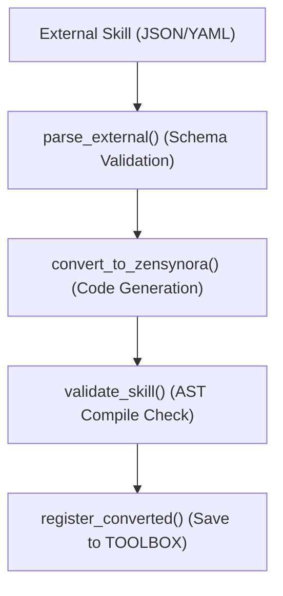

# ZenSynora Skill Adapter Guide

## Overview

The Skill Adapter enables ZenSynora to analyze, convert, and integrate skills from external standards (particularly agentskills.io open standard) into the ZenSynora TOOLBOX system.

## Installation & Configuration

### Prerequisites

- Python 3.9+
- ZenSynora core installed
- Network access (for fetching external skills)

### Configuration

Add to your `config.py`:

```python
SKILL_ADAPTER_ENABLED = True
EXTERNAL_SKILL_SOURCES = ["agentskills.io"]
ALLOW_EXTERNAL_REGISTRATION = True
```

## Usage

### 1. Analyze External Skill

Analyze a skill from URL or file path:

```python
from myclaw.agents.skill_adapter import analyze_external_skill

result = analyze_external_skill(
    skill_url="https://example.com/skill.json",
    style="json"
)
print(result)
```

**Output Example:**
```
📋 External Skill Analysis

Name: my_custom_skill
Source: agentskills.io
Version: 1.0.0
Description: A skill that does something useful
Tags: utility, automation
Parameters: 2
  - input: str
  - options: dict
Has Implementation: Yes
Convertible: Yes
```

### 2. Convert Skill to ZenSynora Format

Convert an external skill to ZenSynora format:

```python
from myclaw.agents.skill_adapter import convert_skill

result = convert_skill(
    skill_source='{"name": "hello_world", "description": "Says hello", "function": "def execute(): return \"Hello!\"", "version": "1.0.0"}',
    target_format="zensynora"
)
print(result)
```

**Output:**
```
✅ Skill converted successfully!
File: ~/.myclaw/TOOLBOX/hello_world.py
Name: hello_world
```

### 3. List Compatible Skills

List all external skills currently in the TOOLBOX:

```python
from myclaw.agents.skill_adapter import list_compatible_skills

result = list_compatible_skills()
print(result)
```

**Output:**
```
📦 Compatible External Skills:

  • hello_world (v1.0.0) - agentskills.io
  • data_processor (v2.1.0) - external
```

### 4. Register External Skill File

Register a Python skill file directly:

```python
from myclaw.agents.skill_adapter import register_external_skill

result = register_external_skill(skill_path="/path/to/skill.py")
print(result)
```

**Output:**
```
✅ Skill 'skill' registered from /path/to/skill.py
```

## External Skill Format

### JSON Format (agentskills.io)

```json
{
  "name": "skill_name",
  "description": "What the skill does",
  "parameters": [
    {"name": "param1", "type": "string", "required": true},
    {"name": "param2", "type": "int", "required": false}
  ],
  "function": "def execute(param1, param2=''):\n    return f'{param1} {param2}'",
  "tags": ["utility", "automation"],
  "version": "1.0.0",
  "author": "skill_author"
}
```

### YAML Format

```yaml
name: skill_name
description: What the skill does
tags:
  - utility
  - automation
version: 1.0.0
function: |
  def execute(param):
      return f"Result: {param}"
```

## Data Flow



## Troubleshooting

### Error: Invalid JSON

**Cause:** The skill source contains invalid JSON.

**Solution:** Verify the JSON syntax using a JSON validator.

### Error: File not found

**Cause:** The specified skill file path doesn't exist.

**Solution:** Check the file path and ensure the file exists.

### Error: Invalid Python syntax

**Cause:** The converted skill contains invalid Python code.

**Solution:** Manually review the skill function and fix syntax errors.

### Error: Permission denied

**Cause:** Cannot write to TOOLBOX directory.

**Solution:** Check file permissions for `~/.myclaw/TOOLBOX/`.

## API Reference

### SkillAdapter Class

```python
class SkillAdapter:
    def __init__(self)
    def parse_external_skill(skill_data, source="json") -> Optional[Dict]
    def convert_to_zensynora(external_skill) -> str
    def generate_wrapper(skill_name, func_code) -> str
    def register_converted_skill(skill_code, metadata) -> bool
    def discover_external(url=None) -> List[Dict]
    def validate_skill(skill_code) -> tuple[bool, str]
    def list_compatible() -> List[Dict]
```

### Tool Functions

| Function | Description |
|----------|-------------|
| `analyze_external_skill()` | Analyze and report on external skill |
| `convert_skill()` | Convert external skill to ZenSynora format |
| `list_compatible_skills()` | List all compatible external skills |
| `register_external_skill()` | Register a skill file in TOOLBOX |

## Examples

### Example 1: Fetch and Convert from URL

```python
url = "https://raw.githubusercontent.com/example/skills/main/json_parsers.json"
result = convert_skill(url)
```

### Example 2: Batch Import from Directory

```python
import os
from pathlib import Path
from myclaw.agents.skill_adapter import convert_skill

skill_dir = Path("~/external_skills").expanduser()
for skill_file in skill_dir.glob("*.json"):
    result = convert_skill(str(skill_file))
    print(f"Converted: {skill_file.name}")
```

### Example 3: Check Skill Compatibility

```python
from myclaw.agents.skill_adapter import analyze_external_skill

skill_path = "my_skill.json"
analysis = analyze_external_skill(skill_path)
print(analysis)
```

## Best Practices

1. **Always analyze before converting** - Review the skill details first
2. **Validate after conversion** - Test the converted skill in TOOLBOX
3. **Use descriptive names** - Follow Python naming conventions
4. **Add tags** - Categorize skills for easy discovery
5. **Version your skills** - Track changes and updates

---

*Generated: 2026-03-29*
*Part of: ZenSynora Phase 1 Implementation*
