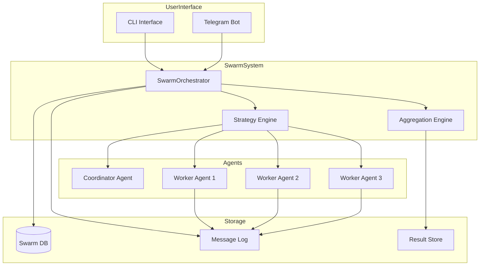

# Agent Swarm Implementation Plan

## Overview

This document outlines the complete implementation of **Agent Swarms** for MyClaw - a powerful multi-agent coordination system that enables multiple AI agents to collaborate on complex tasks.

## What are Agent Swarms?

Agent Swarms are a pattern where multiple specialized AI agents work together to solve problems that are too complex for a single agent. The swarm operates under different strategies:

- **Parallel**: All agents work on the same task simultaneously, results are aggregated
- **Sequential**: Agents work in a pipeline, each transforming the previous output
- **Hierarchical**: A coordinator agent decomposes tasks and delegates to workers
- **Voting**: Multiple agents solve the same problem, consensus determines the best answer

## Architecture



## Components

### 1. Data Models (`myclaw/swarm/models.py`)

```python
@dataclass
class SwarmConfig:
    """Configuration for a swarm instance."""
    name: str
    strategy: SwarmStrategy  # parallel, sequential, hierarchical, voting
    coordinator: str  # Agent name
    workers: List[str]  # Agent names
    aggregation_method: AggregationMethod
    max_iterations: int = 1
    timeout_seconds: int = 300

@dataclass
class SwarmTask:
    """A task assigned to the swarm."""
    id: str
    description: str
    input_data: Dict[str, Any]
    status: TaskStatus  # pending, running, completed, failed
    created_at: datetime
    completed_at: Optional[datetime]

@dataclass
class SwarmResult:
    """Result from a swarm execution."""
    swarm_id: str
    aggregation_method: AggregationMethod
    individual_results: Dict[str, str]  # agent_name -> result
    final_result: str
    confidence_score: float
    execution_time_seconds: float
```

### 2. Storage Layer (`myclaw/swarm/storage.py`)

SQLite schema for persistent swarm state:

```sql
-- Active swarms
CREATE TABLE swarms (
    id TEXT PRIMARY KEY,
    name TEXT NOT NULL,
    strategy TEXT NOT NULL,
    status TEXT DEFAULT 'pending',
    coordinator_agent TEXT NOT NULL,
    worker_agents TEXT,  -- JSON array
    aggregation_method TEXT,
    created_at TEXT,
    completed_at TEXT,
    user_id TEXT
);

-- Individual tasks within swarms
CREATE TABLE swarm_tasks (
    id TEXT PRIMARY KEY,
    swarm_id TEXT REFERENCES swarms(id),
    description TEXT NOT NULL,
    assigned_agent TEXT,
    status TEXT DEFAULT 'pending',
    input_data TEXT,
    output_data TEXT,
    started_at TEXT,
    completed_at TEXT
);

-- Inter-agent messages
CREATE TABLE swarm_messages (
    id INTEGER PRIMARY KEY AUTOINCREMENT,
    swarm_id TEXT REFERENCES swarms(id),
    from_agent TEXT,
    to_agent TEXT,  -- NULL for broadcast
    message_type TEXT,
    content TEXT,
    timestamp TEXT
);

-- Final results
CREATE TABLE swarm_results (
    id INTEGER PRIMARY KEY AUTOINCREMENT,
    swarm_id TEXT REFERENCES swarms(id),
    aggregation_method TEXT,
    individual_results TEXT,
    final_result TEXT,
    confidence_score REAL,
    created_at TEXT
);
```

### 3. Strategy Implementations (`myclaw/swarm/strategies.py`)

#### Parallel Strategy
All workers receive the same task, execute simultaneously, results aggregated.

```python
class ParallelStrategy:
    async def execute(self, task: SwarmTask, workers: List[Agent]) -> SwarmResult:
        # Run all workers concurrently
        tasks = [worker.think(task.description) for worker in workers]
        results = await asyncio.gather(*tasks, return_exceptions=True)
        
        # Aggregate using configured method
        return self.aggregator.aggregate(results)
```

#### Sequential Strategy
Workers execute in sequence, output of one becomes input to next.

```python
class SequentialStrategy:
    async def execute(self, task: SwarmTask, workers: List[Agent]) -> SwarmResult:
        current_input = task.description
        results = {}
        
        for worker in workers:
            result = await worker.think(current_input)
            results[worker.name] = result
            current_input = result  # Pass to next agent
            
        return self.aggregator.aggregate(results)
```

#### Hierarchical Strategy
Coordinator decomposes task, assigns to workers, synthesizes final result.

```python
class HierarchicalStrategy:
    async def execute(self, task: SwarmTask, coordinator: Agent, workers: List[Agent]) -> SwarmResult:
        # Step 1: Coordinator creates plan
        plan = await coordinator.think(f"Create execution plan for: {task.description}")
        subtasks = self.parse_plan(plan)
        
        # Step 2: Assign to workers
        worker_results = await self.assign_and_execute(subtasks, workers)
        
        # Step 3: Coordinator synthesizes final result
        synthesis_prompt = f"Synthesize these results: {worker_results}"
        final_result = await coordinator.think(synthesis_prompt)
        
        return SwarmResult(final_result=final_result, ...)
```

#### Voting Strategy
All workers solve the same problem, consensus determines best answer.

```python
class VotingStrategy:
    async def execute(self, task: SwarmTask, workers: List[Agent]) -> SwarmResult:
        # Get solutions from all workers
        solutions = await asyncio.gather(*[
            worker.think(task.description) for worker in workers
        ])
        
        # Count votes (could use another agent as judge)
        votes = self.count_votes(solutions)
        winner = max(votes, key=votes.get)
        confidence = votes[winner] / len(workers)
        
        return SwarmResult(
            final_result=winner,
            confidence_score=confidence,
            individual_results=dict(zip([w.name for w in workers], solutions))
        )
```

### 4. Aggregation Methods

1. **Consensus**: Most common answer wins
2. **Best Pick**: Use quality scoring (could involve another LLM call)
3. **Concatenation**: Combine all outputs with separators
4. **Synthesis**: Use LLM to summarize and synthesize all results

### 5. Swarm Tools

Added to `myclaw/tools.py`:

```python
async def swarm_create(
    name: str,
    strategy: str,  # parallel, sequential, hierarchical, voting
    workers: List[str],
    coordinator: str = None,
    aggregation: str = "synthesis"
) -> str:
    """Create a new swarm with specified configuration."""
    
async def swarm_assign(swarm_id: str, task: str, context: dict = None) -> str:
    """Assign a task to a swarm for execution."""
    
async def swarm_status(swarm_id: str) -> str:
    """Get current status of a swarm execution."""
    
async def swarm_result(swarm_id: str) -> str:
    """Get the final aggregated result from a swarm."""
    
async def swarm_terminate(swarm_id: str) -> str:
    """Force terminate a running swarm."""
    
async def swarm_list(status: str = None) -> str:
    """List all swarms, optionally filtered by status."""
    
async def swarm_message(swarm_id: str, message: str, to_agent: str = None) -> str:
    """Send a message to agents in a swarm (for inter-agent communication)."""
```

## Configuration

New config section in `config.json`:

```json
{
  "swarm": {
    "enabled": true,
    "max_concurrent_swarms": 3,
    "default_strategy": "parallel",
    "default_aggregation": "synthesis",
    "timeout_seconds": 300,
    "swarm_memory_limit": 50
  }
}
```

## Usage Examples

### Example 1: Parallel Research Swarm

```
User: Create a swarm named "research_team" with strategy parallel using agents researcher1, researcher2, researcher3

Agent: Swarm "research_team" created with ID: swarm_abc123
- Strategy: parallel
- Workers: researcher1, researcher2, researcher3
- Aggregation: synthesis

User: Assign task to swarm_abc123: "Research the latest AI developments in 2024"

Agent: Task assigned to swarm_abc123. All 3 agents are now working in parallel...
[After completion]
Agent: Swarm completed! Here's the synthesized result:
[Combined insights from all 3 researchers]
```

### Example 2: Sequential Pipeline

```
User: Create a swarm "content_pipeline" with strategy sequential using agents outline_writer, content_writer, editor

Agent: Swarm "content_pipeline" created with ID: swarm_def456

User: Assign task: "Write an article about Python async programming"

Agent: Executing sequential pipeline:
1. outline_writer created outline
2. content_writer wrote article based on outline
3. editor refined and polished content

Final result: [Polished article]
```

### Example 3: Hierarchical Problem Solving

```
User: Create a swarm "code_review" with strategy hierarchical, coordinator=lead_dev, workers=[reviewer1, reviewer2, reviewer3]

Agent: Swarm created.

User: Assign task: "Review this code for security issues: [code]"

Agent: Lead developer analyzed and delegated:
- reviewer1: Check SQL injection vulnerabilities
- reviewer2: Check authentication issues  
- reviewer3: Check input validation

Lead developer synthesized findings:
[Consolidated security report]
```

## Integration Points

### With Existing Systems

1. **Agent Registry**: Uses existing `_agent_registry` from `tools.py`
2. **Memory System**: Each agent uses its own memory; swarm has shared message log
3. **Knowledge Base**: Swarm results can be saved to knowledge base
4. **Scheduling**: Swarms can be scheduled for future execution
5. **Tools**: Agents in swarms can use all existing tools

### Tool Schema Additions

Provider schemas updated to include swarm tools:

```python
{
    "type": "function",
    "function": {
        "name": "swarm_create",
        "description": "Create a new agent swarm for collaborative task execution",
        "parameters": {
            "type": "object",
            "properties": {
                "name": {"type": "string", "description": "Name for the swarm"},
                "strategy": {"type": "string", "enum": ["parallel", "sequential", "hierarchical", "voting"]},
                "workers": {"type": "array", "items": {"type": "string"}},
                "coordinator": {"type": "string"},
                "aggregation": {"type": "string", "enum": ["consensus", "best_pick", "concatenation", "synthesis"]}
            },
            "required": ["name", "strategy", "workers"]
        }
    }
}
```

## Error Handling

1. **Agent Not Found**: Return error if specified agent doesn't exist in registry
2. **Swarm Limit Exceeded**: Reject new swarm if max_concurrent_swarms reached
3. **Timeout**: Terminate swarm if execution exceeds timeout_seconds
4. **Partial Failure**: Continue with available agents if some fail
5. **Circular Delegation**: Prevent infinite loops with depth tracking

## Security Considerations

1. **User Isolation**: Swarms are isolated by user_id
2. **Resource Limits**: Max concurrent swarms per user
3. **Timeout Protection**: All swarm operations have timeouts
4. **Audit Logging**: All swarm activities logged for review

## Future Enhancements

1. **Dynamic Agent Discovery**: Auto-select agents based on task type
2. **Learning**: Track which strategies work best for different tasks
3. **Visualization**: Web UI showing swarm execution flow
4. **Cross-Swarm Communication**: Allow swarms to delegate to other swarms
5. **Swarm Templates**: Pre-configured swarms for common tasks

## Implementation Timeline

| Phase | Components | Status |
|-------|------------|--------|
| 1 | Core models and storage | Not Started |
| 2 | Strategy implementations | Not Started |
| 3 | Orchestrator and tools | Not Started |
| 4 | Config and provider updates | Not Started |
| 5 | Testing and documentation | Not Started |
