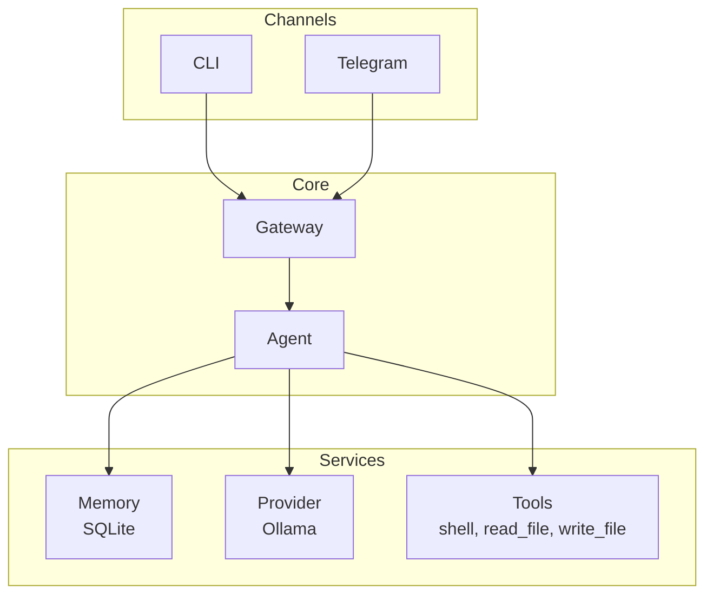
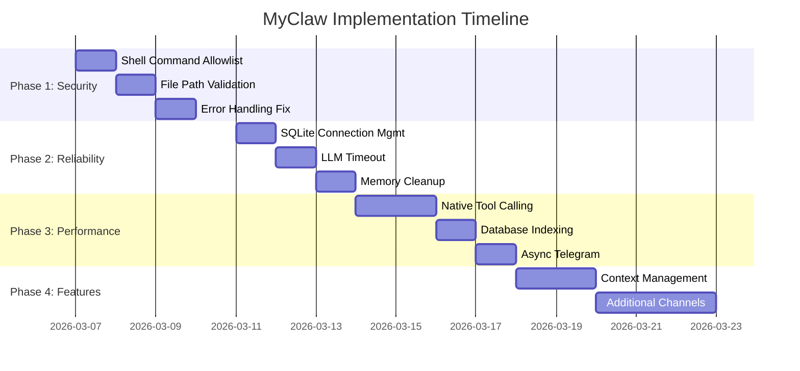

# MyClaw Application - Detailed Improvement Plan

## Project Overview

MyClaw is a personal AI agent that combines:
- **Ollama** (local LLM - llama3.2) for AI conversations
- **Telegram** integration for messaging
- **SQLite** memory for persistent conversations
- **Tool system** for shell commands and file operations

---

## Current Architecture



---

## Priority 1: Critical Security & Stability Fixes

### 1.1 Restrict Shell Command Execution
**File:** [`myclaw/tools.py:8`](myclaw/tools.py:8)

**Current Issue:** Agent can execute ANY shell command with no restrictions.

**Recommendation:**
- Implement command allowlist (e.g., `ls`, `cat`, `grep`, `find`)
- Add command blocklist for dangerous commands (`rm`, `del`, `format`, `powershell`)
- Add approval workflow for certain commands
- Implement timeout limits (already has 30s, good)

**Implementation:**
```python
ALLOWED_COMMANDS = {'ls', 'dir', 'cat', 'type', 'find', 'grep', 'findstr'}
BLOCKED_COMMANDS = {'rm', 'del', 'format', 'rd', 'rmdir', 'powershell'}

def shell(cmd: str) -> str:
    first_cmd = cmd.strip().split()[0].lower()
    if first_cmd in BLOCKED_COMMANDS:
        return f"Error: Command '{first_cmd}' is blocked for security"
    if first_cmd not in ALLOWED_COMMANDS:
        return f"Error: Command '{first_cmd}' not allowed. Use: {ALLOWED_COMMANDS}"
    # ... rest of implementation
```

### 1.2 Restrict File Access to Workspace
**File:** [`myclaw/tools.py:16-27`](myclaw/tools.py:16)

**Current Issue:** Path traversal attacks possible with `../` in file paths.

**Recommendation:**
- Validate all paths stay within workspace directory
- Reject paths with `..` or absolute paths

**Implementation:**
```python
def validate_path(path: str) -> Path:
    workspace = Path.home() / ".myclaw" / "workspace"
    target = (workspace / path).resolve()
    if not str(target).startswith(str(workspace)):
        raise ValueError("Path traversal detected")
    return target
```

### 1.3 Fix Silent Error Handling
**File:** [`myclaw/agent.py:41-42`](myclaw/agent.py:41)

**Current Issue:** Bare `except: pass` silently swallows errors.

**Recommendation:**
- Log errors properly
- Return meaningful error messages to user
- Never silently ignore exceptions

---

## Priority 2: Reliability Improvements

### 2.1 Add SQLite Connection Management
**File:** [`myclaw/memory.py`](myclaw/memory.py)

**Current Issue:** Connection never closed, leads to resource leaks.

**Recommendation:**
```python
class Memory:
    def __init__(self):
        # ... existing code
        self.conn.row_factory = sqlite3.Row  # Add named column access
    
    def close(self):
        self.conn.close()
    
    def __enter__(self):
        return self
    
    def __exit__(self, *args):
        self.close()
```

### 2.2 Add Timeout to LLM Calls
**File:** [`myclaw/provider.py:17`](myclaw/provider.py:17)

**Current Issue:** No timeout - Ollama could hang forever.

**Recommendation:**
```python
r = requests.post(f"{self.base_url}/api/chat", json=payload, timeout=30)
```

### 2.3 Implement Memory Cleanup
**File:** [`myclaw/memory.py`](myclaw/memory.py)

**Current Issue:** Database grows indefinitely.

**Recommendation:**
- Add automatic cleanup for messages older than N days
- Add message limit with automatic summarization
- Add database vacuuming

```python
def cleanup(self, days=30):
    cutoff = datetime.now() - timedelta(days=days)
    self.conn.execute("DELETE FROM messages WHERE timestamp < ?", (cutoff.isoformat(),))
    self.conn.execute("VACUUM")
```

---

## Priority 3: Performance Optimizations

### 3.1 Use Native Ollama Tool Calling
**File:** [`myclaw/provider.py`](myclaw/provider.py)

**Current Issue:** Fragile regex-based tool parsing.

**Recommendation:** Use Ollama's native function calling since v0.1.20.

### 3.2 Add Database Indexing
**File:** [`myclaw/memory.py`](myclaw/memory.py)

**Recommendation:**
```python
self.conn.execute("CREATE INDEX IF NOT EXISTS idx_timestamp ON messages(timestamp)")
```

### 3.3 Async Enhancement for Telegram
**File:** [`myclaw/channels/telegram.py`](myclaw/channels/telegram.py)

**Current Issue:** Synchronous LLM call blocks the async handler.

**Recommendation:** Run agent in thread pool:
```python
import asyncio
from concurrent.futures import ThreadPoolExecutor

loop = asyncio.get_event_loop()
response = await loop.run_in_executor(None, self.agent.think, text)
```

---

## Priority 4: Feature Improvements

### 4.1 Conversation Context Management
- Add sliding window for recent messages
- Implement message summarization for old conversations
- Add session management per user (for Telegram multi-user)

### 4.2 Add Multiple Channel Support
- Discord integration
- Slack integration  
- WebSocket endpoint for web UI

### 4.3 Configuration Validation
- Add Pydantic schemas for config validation
- Add config migration support
- Add environment variable support

---

## Implementation Roadmap



---

## File Summary

| File | Current Issues | Priority |
|------|---------------|----------|
| [`myclaw/tools.py`](myclaw/tools.py) | Shell commands unrestricted, path traversal | P1 |
| [`myclaw/agent.py`](myclaw/agent.py) | Silent error handling | P1 |
| [`myclaw/memory.py`](myclaw/memory.py) | No connection cleanup, unbounded growth | P2 |
| [`myclaw/provider.py`](myclaw/provider.py) | No timeout, fragile tool parsing | P2/P3 |
| [`myclaw/channels/telegram.py`](myclaw/channels/telegram.py) | Synchronous blocking | P3 |
| [`myclaw/config.py`](myclaw/config.py) | No validation | P4 |

---

## Recommendations Summary

1. **Immediate (This Week):** Fix security issues (shell commands, file access, error handling)
2. **Short-term (This Month):** Add reliability (connection management, timeout, cleanup)
3. **Medium-term (Next Month):** Performance improvements and native tool calling
4. **Long-term:** Feature additions (multi-channel, context management)
